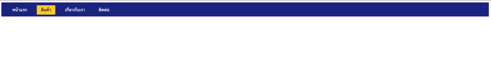
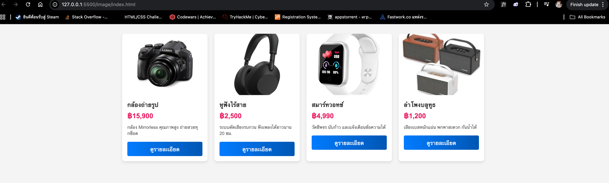
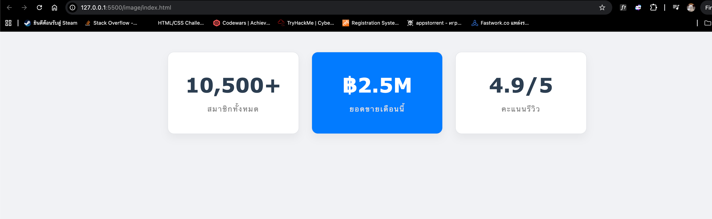
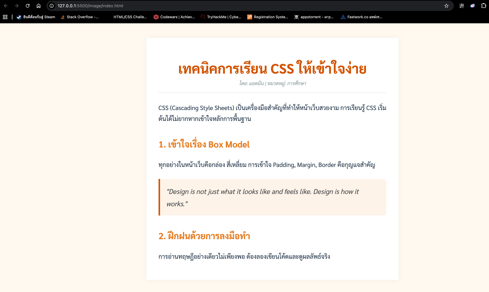
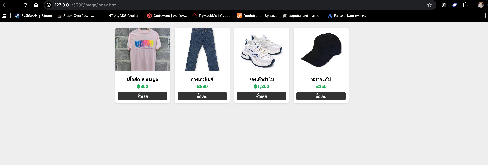
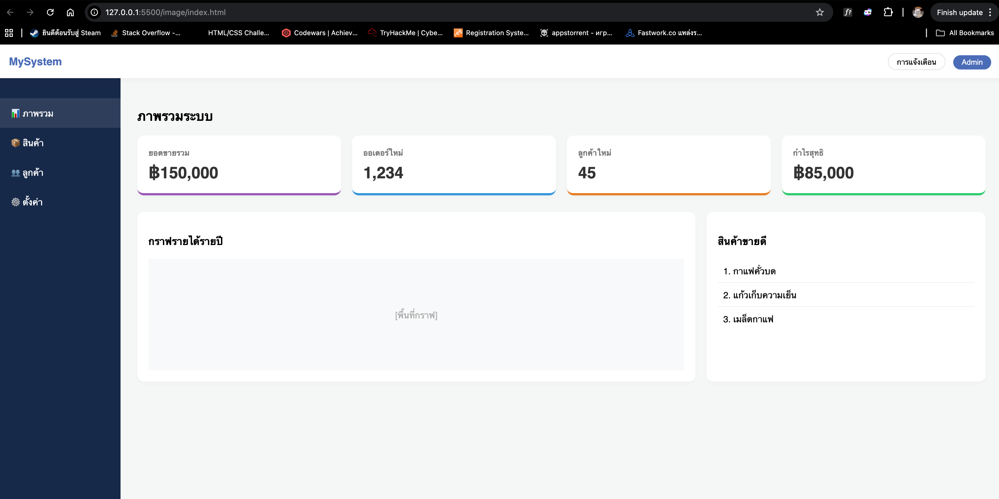

# ใบงานการทดลอง: พื้นฐานการจัดการรูปแบบเว็บไซต์ด้วย CSS
[](#การทดลองที่-1-ทำความรู้จักกับ-css)
## การทดลองที่ 1: ทำความรู้จักกับ CSS

### 1.1 วิธีการใช้งาน CSS
CSS สามารถใช้งานได้ 3 วิธี:

1. **Inline CSS**:
```html
<p style="color: blue; font-size: 16px;">ข้อความสีน้ำเงิน</p>
```

2. **Internal CSS**:
```html
<head>
    <style>
        p {
            color: blue;
            font-size: 16px;
        }
    </style>
</head>
```

3. **External CSS**:
```html
<head>
    <link rel="stylesheet" href="style.css">
</head>
```

### ตัวอย่างการใช้งาน: การสร้างปุ่มสไตล์ต่างๆ

```html
<!-- ไฟล์ index.html -->
<!DOCTYPE html>
<html>
<head>
    <title>ตัวอย่างปุ่ม CSS</title>
    <!-- Internal CSS -->
    <style>
        .btn-primary {
            background-color: #007bff;
            color: white;
            padding: 10px 20px;
            border: none;
            border-radius: 5px;
            cursor: pointer;
        }
    </style>
    <!-- External CSS -->
    <link rel="stylesheet" href="css/buttons.css">
</head>
<body>
    <!-- Inline CSS -->
    <button style="background-color: #dc3545; color: white; padding: 10px 20px;">ปุ่มแบบ Inline</button>
    
    <!-- Internal CSS -->
    <button class="btn-primary">ปุ่มแบบ Internal</button>
    
    <!-- External CSS -->
    <button class="btn-success">ปุ่มแบบ External</button>
</body>
</html>
```

```css
/* สร้างไฟล์ buttons.css ในโฟลเดอร์ css */
.btn-success {
    background-color: #28a745;
    color: white;
    padding: 10px 20px;
    border: none;
    border-radius: 5px;
    cursor: pointer;
}
```
[](#การทดลองที่-2-selectors-ใน-CSS)
## การทดลองที่ 2: Selectors ใน CSS
CSS Selector คือวิธีการระบุหรือเลือกองค์ประกอบ (elements) ที่เราต้องการจัดรูปแบบใน HTML โดยมีประเภทหลัก ๆ ดังนี้:

1. **Element Selector** - เลือกโดยใช้ชื่อ element
```css
p { color: red; }  /* เลือกทุก <p> elements */
h1 { color: blue; }  /* เลือกทุก <h1> elements */
```

2. **Class Selector** - เลือกโดยใช้ชื่อ class (ขึ้นต้นด้วย .)
```css
.menu { color: green; }  /* เลือก elements ที่มี class="menu" */
.highlight { background: yellow; }
```

3. **ID Selector** - เลือกโดยใช้ ID (ขึ้นต้นด้วย #)
```css
#header { background: black; }  /* เลือก element ที่มี id="header" */
#logo { width: 100px; }
```

4. **Descendant Selector** - เลือก elements ที่เป็นลูกหลาน
```css
div p { color: blue; }  /* เลือก <p> ที่อยู่ภายใน <div> */
```

5. **Child Selector** - เลือก elements ที่เป็นลูกโดยตรง (>)
```css
div > p { color: red; }  /* เลือก <p> ที่เป็นลูกโดยตรงของ <div> */
```

6. **Pseudo-class** - เลือกสถานะพิเศษ
```css
a:hover { color: red; }  /* เมื่อเมาส์ชี้ */
input:focus { border: blue; }  /* เมื่อได้รับการโฟกัส */
```

7. **Multiple Selector** - เลือกหลายอย่างพร้อมกัน
```css
h1, h2, h3 { color: purple; }
```

8. **Universal Selector** - เลือกทุก elements (*)
```css
* { margin: 0; padding: 0; }
```

9. **Attribute Selector** - เลือกตาม attribute
```css
input[type="text"] { border: 1px solid gray; }
```

10. **Adjacent Sibling Selector** - เลือกธาตุที่อยู่ถัดไป (+)
```css
h1 + p { margin-top: 20px; }
```

ความสำคัญของ Selector:
- ช่วยให้เราสามารถกำหนดสไตล์ให้กับ elements ที่ต้องการได้อย่างเฉพาะเจาะจง
- ช่วยในการจัดการและบำรุงรักษาโค้ด CSS
- ทำให้สามารถสร้างรูปแบบที่ซับซ้อนได้
- ช่วยลดการเขียนโค้ดซ้ำซ้อน
  
### 2.1 ประเภทของ Selectors
```css
/* Element Selector */
p {
    color: blue;
}

/* Class Selector */
.highlight {
    background-color: yellow;
}

/* ID Selector */
#header {
    font-size: 24px;
}

/* Descendant Selector */
div p {
    margin: 10px;
}

/* Child Selector */
div > p {
    padding: 5px;
}
```

### ตัวอย่างการใช้งาน: การสร้างเมนูนำทาง

```html
<!DOCTYPE html>
<html>
<head>
    <style>
        /* การใช้ Element Selector */
        nav {
            background-color: #333;
            padding: 15px;
        }

        /* การใช้ Descendant Selector */
        nav ul {
            list-style: none;
            margin: 0;
            padding: 0;
            display: flex;
        }

        /* การใช้ Child Selector */
        nav > ul > li {
            margin: 0 10px;
        }

        /* การใช้ Class Selector */
        .menu-item {
            color: white;
            text-decoration: none;
            padding: 5px 10px;
        }

        /* การใช้ Pseudo-class */
        .menu-item:hover {
            background-color: #555;
            border-radius: 3px;
        }

        /* การใช้ ID Selector */
        #active {
            background-color: #007bff;
            border-radius: 3px;
        }
    </style>
</head>
<body>
    <nav>
        <ul>
            <li><a href="#" class="menu-item" id="active">หน้าแรก</a></li>
            <li><a href="#" class="menu-item">สินค้า</a></li>
            <li><a href="#" class="menu-item">เกี่ยวกับเรา</a></li>
            <li><a href="#" class="menu-item">ติดต่อ</a></li>
        </ul>
    </nav>
</body>
</html>
```
### แบบฝึกหัด
1. แก้ไขโค้ดโปรแกรมเดิม ให้ใช้งาน CSS แบบ External CSS
2. แก้ไขให้เมนูถูกเลือกที่ สินค้า
3. เปลี่ยนสีพื้นหลังของเมนู

### ผลการทดลอง
```html
<!DOCTYPE html>
<html>
<head>
    <title>เมนูนำทาง</title>
    <link rel="stylesheet" href="menu.css">
    <style>
        nav {
    background-color: #1a237e; 
    padding: 15px;
}

nav ul {
    list-style: none;
    margin: 0;
    padding: 0;
    display: flex;
}

nav > ul > li {
    margin: 0 10px;
}

.menu-item {
    color: white;
    text-decoration: none;
    padding: 8px 15px;
    transition: 0.3s;
}

.menu-item:hover {
    background-color: rgba(255, 255, 255, 0.2);
    border-radius: 3px;
}

#active {
    background-color: #ffca28;
    color: #333;
    border-radius: 3px;
    font-weight: bold;
}
    </style>
</head>
<body>
    <nav>
        <ul>
            <li><a href="#" class="menu-item">หน้าแรก</a></li>
            <li><a href="#" class="menu-item" id="active">สินค้า</a></li>
            <li><a href="#" class="menu-item">เกี่ยวกับเรา</a></li>
            <li><a href="#" class="menu-item">ติดต่อ</a></li>
        </ul>
    </nav>
</body>
</html>
```



[](#การทดลองที่-3-การจัดการสีและพื้นหลัง)
## การทดลองที่ 3: การจัดการสีและพื้นหลัง

### 3.1 การกำหนดสีและพื้นหลัง
```css
/* สีพื้นฐาน */
color: red;
color: #FF0000;
color: rgb(255, 0, 0);
color: rgba(255, 0, 0, 0.5);

/* พื้นหลัง */
background-color: #f0f0f0;
background-image: url('image.jpg');
background-size: cover;
```

### ตัวอย่างการใช้งาน: การสร้างการ์ดสินค้า

```html
<!DOCTYPE html>
<html>
<head>
    <style>
        .product-card {
            width: 300px;
            border-radius: 8px;
            overflow: hidden;
            box-shadow: 0 2px 4px rgba(0,0,0,0.1);
            background-color: white;
        }

        .product-image {
            width: 100%;
            height: 200px;
            background-image: url('product.jpg');
            background-size: cover;
            background-position: center;
        }

        .product-info {
            padding: 15px;
        }

        .product-title {
            color: #333;
            font-size: 18px;
            margin-bottom: 10px;
        }

        .product-price {
            color: #007bff;
            font-size: 24px;
            font-weight: bold;
        }

        .product-description {
            color: #666;
            font-size: 14px;
            line-height: 1.5;
        }

        .product-button {
            display: block;
            background: linear-gradient(to right, #007bff, #0056b3);
            color: white;
            text-align: center;
            padding: 10px;
            text-decoration: none;
            margin-top: 15px;
            border-radius: 4px;
        }

        .product-button:hover {
            background: linear-gradient(to right, #0056b3, #003980);
        }
    </style>
</head>
<body>
    <div class="product-card">
        <div class="product-image"></div>
        <div class="product-info">
            <h2 class="product-title">สินค้าตัวอย่าง</h2>
            <p class="product-price">฿1,999</p>
            <p class="product-description">
                รายละเอียดสินค้าตัวอย่าง ที่มีความน่าสนใจและน่าใช้งาน
            </p>
            <a href="#" class="product-button">เพิ่มลงตะกร้า</a>
        </div>
    </div>
</body>
</html>
```

### แบบฝึกหัด
1. แก้ไขโค้ดโปรแกรมเดิม ให้ใช้งาน CSS แบบ External CSS
2. แก้ไขให้แสดงรูปสินค้า โดยให้รูปสินค้าเก็บอยู่ในโฟลเดอร์ images
3. เพิ่มเติมให้มี card แสดงข้อมูลสินค้า 4 รูป

### ผลการทดลอง
```html
<!DOCTYPE html>
<html>
<head>
    <title>รายการสินค้า</title>
    <style>
        body {
    background-color: #f4f4f4;
    font-family: Arial, sans-serif;
}

.container {
    display: flex;
    flex-wrap: wrap;
    justify-content: center;
    gap: 20px;
    padding: 20px;
}

.product-card {
    width: 250px; /* ปรับขนาดให้พอดีเมื่อมีหลายการ์ด */
    border-radius: 8px;
    overflow: hidden;
    box-shadow: 0 4px 8px rgba(0,0,0,0.1);
    background-color: white;
    transition: transform 0.2s;
}

.product-card:hover {
    transform: translateY(-5px);
}

.product-image {
    width: 100%;
    height: 180px;
    background-color: #ddd; /* สีสำรองกรณีไม่มีรูป */
    background-size: cover;
    background-position: center;
}

.product-info {
    padding: 15px;
}

.product-title {
    color: #333;
    font-size: 18px;
    margin: 0 0 10px;
}

.product-price {
    color: #e91e63; /* เปลี่ยนสีราคา */
    font-size: 20px;
    font-weight: bold;
    margin: 5px 0;
}

.product-description {
    color: #666;
    font-size: 13px;
    line-height: 1.4;
    margin-bottom: 15px;
}

.product-button {
    display: block;
    background: linear-gradient(to right, #007bff, #0056b3);
    color: white;
    text-align: center;
    padding: 10px;
    text-decoration: none;
    border-radius: 4px;
}

.product-button:hover {
    background: linear-gradient(to right, #0056b3, #003980);
}
    </style>
</head>
<body>
    <div class="container">
        
        <div class="product-card">
            <div class="product-image" style="background-image: url('images/product1.jpg');"></div>
            <div class="product-info">
                <h2 class="product-title">กล้องถ่ายรูป</h2>
                <p class="product-price">฿15,900</p>
                <p class="product-description">กล้อง Mirrorless คุณภาพสูง ถ่ายสวยทุกช็อต</p>
                <a href="#" class="product-button">ดูรายละเอียด</a>
            </div>
        </div>

        <div class="product-card">
            <div class="product-image" style="background-image: url('images/product2.jpg');"></div>
            <div class="product-info">
                <h2 class="product-title">หูฟังไร้สาย</h2>
                <p class="product-price">฿2,500</p>
                <p class="product-description">ระบบตัดเสียงรบกวน ฟังเพลงได้ยาวนาน 20 ชม.</p>
                <a href="#" class="product-button">ดูรายละเอียด</a>
            </div>
        </div>

        <div class="product-card">
            <div class="product-image" style="background-image: url('images/product3.jpg');"></div>
            <div class="product-info">
                <h2 class="product-title">สมาร์ทวอทช์</h2>
                <p class="product-price">฿4,990</p>
                <p class="product-description">วัดชีพจร นับก้าว และแจ้งเตือนข้อความได้</p>
                <a href="#" class="product-button">ดูรายละเอียด</a>
            </div>
        </div>

        <div class="product-card">
            <div class="product-image" style="background-image: url('images/product4.jpg');"></div>
            <div class="product-info">
                <h2 class="product-title">ลำโพงบลูทูธ</h2>
                <p class="product-price">฿1,200</p>
                <p class="product-description">เสียงเบสหนักแน่น พกพาสะดวก กันน้ำได้</p>
                <a href="#" class="product-button">ดูรายละเอียด</a>
            </div>
        </div>

    </div>
</body>
</html>
```


[](#การทดลองที่-4-การจัดการขนาดและระยะห่าง)
## การทดลองที่ 4: การจัดการขนาดและระยะห่าง

### 4.1 หน่วยวัดและ Box Model
```css
/* หน่วยวัด */
width: 100px;
width: 50%;
font-size: 1.2rem;
height: 100vh;

/* Box Model */
padding: 10px;
margin: 15px;
border: 1px solid black;
```

### ตัวอย่างการใช้งาน: การสร้างส่วนแสดงสถิติ

```html
<!DOCTYPE html>
<html>
<head>
    <style>
        .stats-container {
            display: flex;
            justify-content: space-around;
            max-width: 1200px;
            margin: 2rem auto;
            padding: 0 1rem;
        }

        .stat-box {
            flex: 1;
            margin: 0 15px;
            padding: 2rem;
            text-align: center;
            background-color: white;
            border-radius: 8px;
            box-shadow: 0 2px 4px rgba(0,0,0,0.1);
        }

        .stat-number {
            font-size: 2.5rem;
            font-weight: bold;
            color: #007bff;
            margin-bottom: 0.5rem;
        }

        .stat-label {
            font-size: 1rem;
            color: #666;
            text-transform: uppercase;
            letter-spacing: 1px;
        }

        /* Responsive Design */
        @media (max-width: 768px) {
            .stats-container {
                flex-direction: column;
            }

            .stat-box {
                margin: 1rem 0;
            }
        }
    </style>
</head>
<body>
    <div class="stats-container">
        <div class="stat-box">
            <div class="stat-number">1,234</div>
            <div class="stat-label">ผู้ใช้งาน</div>
        </div>
        <div class="stat-box">
            <div class="stat-number">5.6K</div>
            <div class="stat-label">ยอดขาย</div>
        </div>
        <div class="stat-box">
            <div class="stat-number">98%</div>
            <div class="stat-label">ความพึงพอใจ</div>
        </div>
    </div>
</body>
</html>
```

### แบบฝึกหัด
1. แก้ไขโค้ดโปรแกรมเดิม ให้ใช้งาน CSS แบบ External CSS
2. ปรับแต่ง ขนาดต่าง ๆ ของ Box model, ขนาดและฟอนต์ตัวหนังสือ, สี


### ผลการทดลอง
```html
<!DOCTYPE html>
<html>
<head>
    <title>สถิติเว็บไซต์</title>
    <link rel="stylesheet" href="stats.css">
</head>
<body>
    <div class="stats-container">
        <div class="stat-box">
            <div class="stat-number">10,500+</div>
            <div class="stat-label">สมาชิกทั้งหมด</div>
        </div>
        <div class="stat-box active">
            <div class="stat-number">฿2.5M</div>
            <div class="stat-label">ยอดขายเดือนนี้</div>
        </div>
        <div class="stat-box">
            <div class="stat-number">4.9/5</div>
            <div class="stat-label">คะแนนรีวิว</div>
        </div>
    </div>
</body>
</html>
```
```css
body {
    background-color: #f0f2f5;
    font-family: 'Verdana', sans-serif;
}

.stats-container {
    display: flex;
    justify-content: center;
    max-width: 1000px;
    margin: 3rem auto;
    padding: 0 1rem;
    gap: 30px;
}

.stat-box {
    flex: 1;
    padding: 3rem 2rem;
    text-align: center;
    background-color: white;
    border-radius: 15px;
    box-shadow: 0 10px 20px rgba(0,0,0,0.05);
    border: 1px solid #e1e4e8;
}

.stat-box.active {
    background-color: #007bff;
    color: white;
}

.stat-number {
    font-size: 3rem;
    font-weight: 800;
    color: #2c3e50;
    margin-bottom: 1rem;
}

.stat-box.active .stat-number {
    color: white;
}

.stat-label {
    font-size: 1.1rem;
    color: #888;
    letter-spacing: 2px;
}

.stat-box.active .stat-label {
    color: #e0e0e0;
}
```


[](#การทดลองที่-5-การจัดการข้อความและฟอนต์)
## การทดลองที่ 5: การจัดการข้อความและฟอนต์

### 5.1 การจัดการข้อความและฟอนต์
```css
/* การจัดการข้อความ */
text-align: center;
text-decoration: none;
text-transform: uppercase;
line-height: 1.5;

/* การจัดการฟอนต์ */
font-family: 'Arial', sans-serif;
font-size: 16px;
font-weight: bold;
```

### ตัวอย่างการใช้งาน: การสร้างบทความบล็อก

```html
<!DOCTYPE html>
<html>
<head>
    <style>
        .blog-post {
            max-width: 800px;
            margin: 2rem auto;
            padding: 0 1rem;
            font-family: 'Sarabun', sans-serif;
        }

        .post-header {
            text-align: center;
            margin-bottom: 2rem;
        }

        .post-title {
            font-size: 2.5rem;
            color: #333;
            margin-bottom: 0.5rem;
            line-height: 1.2;
        }

        .post-meta {
            color: #666;
            font-size: 0.9rem;
            text-transform: uppercase;
            letter-spacing: 1px;
        }

        .post-content {
            font-size: 1.1rem;
            line-height: 1.8;
            color: #444;
        }

        .post-content p {
            margin-bottom: 1.5rem;
        }

        .post-content h2 {
            font-size: 1.8rem;
            color: #333;
            margin: 2rem 0 1rem;
        }

        blockquote {
            font-style: italic;
            border-left: 4px solid #007bff;
            margin: 1.5rem 0;
            padding-left: 1rem;
            color: #555;
        }

        @media (max-width: 768px) {
            .post-title {
                font-size: 2rem;
            }
        }
    </style>
</head>
<body>
    <article class="blog-post">
        <header class="post-header">
            <h1 class="post-title">วิธีการเขียนบทความที่น่าสนใจ</h1>
            <div class="post-meta">โพสต์เมื่อ 1 มกราคม 2025 | โดย ผู้เขียน</div>
        </header>
        
        <div class="post-content">
            <p>เนื้อหาบทความที่ดีควรมีความน่าสนใจและเป็นประโยชน์ต่อผู้อ่าน การเขียนบทความให้น่าอ่านนั้นมีหลักการสำคัญหลายประการ</p>

            <h2>1. การเลือกหัวข้อที่น่าสนใจ</h2>
            <p>หัวข้อที่ดีควรตรงกับความสนใจของกลุ่มเป้าหมาย และมีประโยชน์ต่อผู้อ่าน</p>

            <blockquote>
                "การเขียนที่ดีไม่ได้เกิดจากพรสวรรค์เพียงอย่างเดียว แต่เกิดจากการฝึกฝนอย่างสม่ำเสมอ"
            </blockquote>

            <h2>2. การจัดโครงสร้างเนื้อหา</h2>
            <p>เนื้อหาที่ดีควรมีการจัดลำดับที่เป็นระบบ เข้าใจง่าย และมีความต่อเนื่อง</p>
        </div>
    </article>
</body>
</html>
```
### แบบฝึกหัด
1. แก้ไขโค้ดโปรแกรมเดิม ให้ใช้งาน CSS แบบ External CSS
2. ปรับแต่งรูปแบบ สีและขนาด font

### ผลการทดลอง
```html
<!DOCTYPE html>
<html>
<head>
    <title>บทความ: การเขียนโค้ด</title>
    <link rel="stylesheet" href="blog.css">
    <link href="https://fonts.googleapis.com/css2?family=Sarabun:wght@300;400;700&display=swap" rel="stylesheet">
</head>
<body>
    <article class="blog-post">
        <header class="post-header">
            <h1 class="post-title">เทคนิคการเรียน CSS ให้เข้าใจง่าย</h1>
            <div class="post-meta">โดย: แอดมิน | หมวดหมู่: การศึกษา</div>
        </header>
        
        <div class="post-content">
            <p>CSS (Cascading Style Sheets) เป็นเครื่องมือสำคัญที่ทำให้หน้าเว็บสวยงาม การเรียนรู้ CSS เริ่มต้นได้ไม่ยากหากเข้าใจหลักการพื้นฐาน</p>

            <h2>1. เข้าใจเรื่อง Box Model</h2>
            <p>ทุกอย่างในหน้าเว็บคือกล่อง สี่เหลี่ยม การเข้าใจ Padding, Margin, Border คือกุญแจสำคัญ</p>

            <blockquote>
                "Design is not just what it looks like and feels like. Design is how it works."
            </blockquote>

            <h2>2. ฝึกฝนด้วยการลงมือทำ</h2>
            <p>การอ่านทฤษฎีอย่างเดียวไม่เพียงพอ ต้องลองเขียนโค้ดและดูผลลัพธ์จริง</p>
        </div>
    </article>
</body>
</html>
```
```css
body {
    background-color: #fff9f0;
}

.blog-post {
    max-width: 750px;
    margin: 3rem auto;
    padding: 40px;
    background-color: white;
    box-shadow: 0 0 20px rgba(0,0,0,0.05);
    font-family: 'Sarabun', sans-serif;
}

.post-header {
    text-align: center;
    border-bottom: 2px solid #eee;
    padding-bottom: 20px;
    margin-bottom: 30px;
}

.post-title {
    font-size: 2.8rem;
    color: #d35400;
    margin-bottom: 10px;
    line-height: 1.3;
}

.post-meta {
    color: #95a5a6;
    font-size: 1rem;
    font-style: italic;
}

.post-content {
    font-size: 1.25rem;
    line-height: 1.8;
    color: #2c3e50;
}

.post-content h2 {
    font-size: 1.8rem;
    color: #e67e22;
    margin-top: 40px;
}

blockquote {
    font-size: 1.4rem;
    font-style: italic;
    border-left: 5px solid #d35400;
    background-color: #fdf2e9;
    margin: 30px 0;
    padding: 20px;
    color: #555;
    border-radius: 0 10px 10px 0;
}
```


[](#การทดลองที่-6-Layout-และการจัดวางอิลิเมนต์)
## การทดลองที่ 6: Layout และการจัดวางอิลิเมนต์

### 6.1 การจัดวางด้วย Flexbox และ Grid

```css
/* Flexbox */
.container {
    display: flex;
    justify-content: space-between;
    align-items: center;
}

/* Grid */
.grid-container {
    display: grid;
    grid-template-columns: repeat(3, 1fr);
    gap: 20px;
}
```

### ตัวอย่างการใช้งาน: การสร้างหน้าแสดงสินค้าแบบ Grid

```html
<!DOCTYPE html>
<html>
<head>
    <style>
        .product-grid {
            display: grid;
            grid-template-columns: repeat(auto-fill, minmax(250px, 1fr));
            gap: 20px;
            padding: 20px;
            max-width: 1200px;
            margin: 0 auto;
        }

        .product-card {
            background: white;
            border-radius: 8px;
            overflow: hidden;
            box-shadow: 0 2px 4px rgba(0,0,0,0.1);
            transition: transform 0.3s ease;
        }

        .product-card:hover {
            transform: translateY(-5px);
        }

        .product-image {
            width: 100%;
            height: 200px;
            background-color: #f5f5f5;
            background-size: cover;
            background-position: center;
        }

        .product-details {
            padding: 15px;
        }

        .product-title {
            font-size: 1.1rem;
            margin: 0 0 10px 0;
            color: #333;
        }

        .product-price {
            font-size: 1.2rem;
            color: #007bff;
            font-weight: bold;
        }

        .product-action {
            display: flex;
            justify-content: space-between;
            align-items: center;
            margin-top: 15px;
        }

        .add-to-cart {
            background-color: #007bff;
            color: white;
            border: none;
            padding: 8px 15px;
            border-radius: 4px;
            cursor: pointer;
        }

        .add-to-cart:hover {
            background-color: #0056b3;
        }

        @media (max-width: 768px) {
            .product-grid {
                grid-template-columns: repeat(auto-fill, minmax(200px, 1fr));
            }
        }
    </style>
</head>
<body>
    <div class="product-grid">
        <!-- สินค้าชิ้นที่ 1 -->
        <div class="product-card">
            <div class="product-image" style="background-image: url('product1.jpg')"></div>
            <div class="product-details">
                <h3 class="product-title">สินค้าตัวอย่างที่ 1</h3>
                <div class="product-price">฿1,299</div>
                <div class="product-action">
                    <button class="add-to-cart">เพิ่มลงตะกร้า</button>
                </div>
            </div>
        </div>

        <!-- สินค้าชิ้นที่ 2 -->
        <div class="product-card">
            <div class="product-image" style="background-image: url('product2.jpg')"></div>
            <div class="product-details">
                <h3 class="product-title">สินค้าตัวอย่างที่ 2</h3>
                <div class="product-price">฿1,499</div>
                <div class="product-action">
                    <button class="add-to-cart">เพิ่มลงตะกร้า</button>
                </div>
            </div>
        </div>

        <!-- เพิ่มสินค้าอื่นๆ ตามต้องการ -->
    </div>
</body>
</html>
```

### แบบฝึกหัด
1. แก้ไขโค้ดโปรแกรมเดิม ให้ใช้งาน CSS แบบ External CSS
2. ปรับแต่งขนาดแสดงผลสินค้าให้เล็กลง
3. เพ่ิมรูปภาพของสินค้า


### ผลการทดลอง
```html
<!DOCTYPE html>
<html>
<head>
    <title>ร้านค้า Grid Layout</title>
    <link rel="stylesheet" href="grid-layout.css">
</head>
<body>
    <div class="product-grid">
        <div class="product-card">
            <div class="product-image" style="background-image: url('images/item1.jpg')"></div>
            <div class="product-details">
                <h3 class="product-title">เสื้อยืด Vintage</h3>
                <div class="product-price">฿350</div>
                <button class="add-to-cart">ซื้อเลย</button>
            </div>
        </div>

        <div class="product-card">
            <div class="product-image" style="background-image: url('images/item2.jpg')"></div>
            <div class="product-details">
                <h3 class="product-title">กางเกงยีนส์</h3>
                <div class="product-price">฿890</div>
                <button class="add-to-cart">ซื้อเลย</button>
            </div>
        </div>

        <div class="product-card">
            <div class="product-image" style="background-image: url('images/item3.jpg')"></div>
            <div class="product-details">
                <h3 class="product-title">รองเท้าผ้าใบ</h3>
                <div class="product-price">฿1,200</div>
                <button class="add-to-cart">ซื้อเลย</button>
            </div>
        </div>
        
         <div class="product-card">
            <div class="product-image" style="background-image: url('images/item4.jpg')"></div>
            <div class="product-details">
                <h3 class="product-title">หมวกแก๊ป</h3>
                <div class="product-price">฿250</div>
                <button class="add-to-cart">ซื้อเลย</button>
            </div>
        </div>
    </div>
</body>
</html>
```
```css
body { margin: 0; padding: 20px; font-family: sans-serif; background: #eee; }

.product-grid {
    display: grid;
    grid-template-columns: repeat(auto-fill, minmax(180px, 1fr));
    gap: 15px;
    max-width: 1000px;
    margin: 0 auto;
}

.product-card {
    background: white;
    border-radius: 8px;
    overflow: hidden;
    box-shadow: 0 2px 5px rgba(0,0,0,0.1);
    transition: transform 0.2s;
}

.product-card:hover { transform: translateY(-3px); }

.product-image {
    width: 100%;
    height: 150px;
    background-color: #ccc;
    background-size: cover;
    background-position: center;
}

.product-details { padding: 10px; text-align: center; }

.product-title {
    font-size: 1rem;
    margin: 5px 0;
    white-space: nowrap;
    overflow: hidden;
    text-overflow: ellipsis;
}

.product-price { color: #27ae60; font-weight: bold; margin-bottom: 10px; }

.add-to-cart {
    width: 100%;
    background-color: #333;
    color: white;
    border: none;
    padding: 5px;
    border-radius: 4px;
    cursor: pointer;
}
.add-to-cart:hover { background-color: #555; }
```



### ตัวอย่างการใช้งาน: การสร้างเลย์เอาต์ Modern Dashboard

```html
<!DOCTYPE html>
<html>
<head>
    <style>
        .dashboard {
            display: grid;
            grid-template-areas: 
                "sidebar header"
                "sidebar main";
            grid-template-columns: 250px 1fr;
            grid-template-rows: auto 1fr;
            min-height: 100vh;
        }

        .header {
            grid-area: header;
            background: white;
            padding: 1rem;
            box-shadow: 0 2px 4px rgba(0,0,0,0.1);
            display: flex;
            justify-content: space-between;
            align-items: center;
        }

        .sidebar {
            grid-area: sidebar;
            background: #2c3e50;
            color: white;
            padding: 1rem;
        }

        .main-content {
            grid-area: main;
            padding: 1rem;
            background: #f5f7fa;
        }

        .stats-grid {
            display: grid;
            grid-template-columns: repeat(auto-fit, minmax(250px, 1fr));
            gap: 1rem;
            margin-bottom: 2rem;
        }

        .stat-card {
            background: white;
            padding: 1.5rem;
            border-radius: 8px;
            box-shadow: 0 2px 4px rgba(0,0,0,0.1);
        }

        .chart-container {
            display: grid;
            grid-template-columns: 2fr 1fr;
            gap: 1rem;
        }

        .chart {
            background: white;
            padding: 1.5rem;
            border-radius: 8px;
            box-shadow: 0 2px 4px rgba(0,0,0,0.1);
        }

        @media (max-width: 768px) {
            .dashboard {
                grid-template-areas: 
                    "header"
                    "main";
                grid-template-columns: 1fr;
            }

            .sidebar {
                display: none;
            }

            .chart-container {
                grid-template-columns: 1fr;
            }
        }
    </style>
</head>
<body>
    <div class="dashboard">
        <header class="header">
            <h1>แดชบอร์ด</h1>
            <nav>
                <button>โปรไฟล์</button>
                <button>ออกจากระบบ</button>
            </nav>
        </header>

        <aside class="sidebar">
            <nav>
                <ul>
                    <li>หน้าแรก</li>
                    <li>รายงาน</li>
                    <li>การตั้งค่า</li>
                </ul>
            </nav>
        </aside>

        <main class="main-content">
            <div class="stats-grid">
                <div class="stat-card">
                    <h3>ยอดขายรวม</h3>
                    <p>฿150,000</p>
                </div>
                <div class="stat-card">
                    <h3>จำนวนออเดอร์</h3>
                    <p>1,234</p>
                </div>
                <div class="stat-card">
                    <h3>ลูกค้าใหม่</h3>
                    <p>45</p>
                </div>
            </div>

            <div class="chart-container">
                <div class="chart">
                    <h3>กราฟแสดงยอดขาย</h3>
                </div>
                <div class="chart">
                    <h3>สัดส่วนสินค้าขายดี</h3>
                </div>
            </div>
        </main>
    </div>
</body>
</html>
```

### แบบฝึกหัด
1. แก้ไขโค้ดโปรแกรมเดิม ให้ใช้งาน CSS แบบ External CSS
2. ปรับแต่งการแสดงผลต่าง ๆ ให้สวยงาม


### ผลการทดลอง
```html
<!DOCTYPE html>
<html>
<head>
    <title>Modern Dashboard</title>
    <link rel="stylesheet" href="dashboard.css">
    <link rel="stylesheet" href="https://cdnjs.cloudflare.com/ajax/libs/font-awesome/6.0.0/css/all.min.css">
</head>
<body>
    <div class="dashboard">
        <header class="header">
            <div class="logo">MySystem</div>
            <nav class="user-nav">
                <button>การแจ้งเตือน</button>
                <button class="profile-btn">Admin</button>
            </nav>
        </header>

        <aside class="sidebar">
            <nav>
                <ul>
                    <li class="active">📊 ภาพรวม</li>
                    <li>📦 สินค้า</li>
                    <li>👥 ลูกค้า</li>
                    <li>⚙️ ตั้งค่า</li>
                </ul>
            </nav>
        </aside>

        <main class="main-content">
            <h2>ภาพรวมระบบ</h2>
            <div class="stats-grid">
                <div class="stat-card purple">
                    <h3>ยอดขายรวม</h3>
                    <p>฿150,000</p>
                </div>
                <div class="stat-card blue">
                    <h3>ออเดอร์ใหม่</h3>
                    <p>1,234</p>
                </div>
                <div class="stat-card orange">
                    <h3>ลูกค้าใหม่</h3>
                    <p>45</p>
                </div>
                <div class="stat-card green">
                    <h3>กำไรสุทธิ</h3>
                    <p>฿85,000</p>
                </div>
            </div>

            <div class="chart-container">
                <div class="chart">
                    <h3>กราฟรายได้รายปี</h3>
                    <div style="height: 200px; background: #f8f9fa; display:flex; align-items:center; justify-content:center; color:#aaa;">
                        [พื้นที่กราฟ]
                    </div>
                </div>
                <div class="chart">
                    <h3>สินค้าขายดี</h3>
                    <ul style="list-style:none; padding:0;">
                        <li style="padding:10px; border-bottom:1px solid #eee;">1. กาแฟคั่วบด</li>
                        <li style="padding:10px; border-bottom:1px solid #eee;">2. แก้วเก็บความเย็น</li>
                        <li style="padding:10px;">3. เมล็ดกาแฟ</li>
                    </ul>
                </div>
            </div>
        </main>
    </div>
</body>
</html>
```
```css
* { box-sizing: border-box; }
body { margin: 0; font-family: 'Segoe UI', sans-serif; }

.dashboard {
    display: grid;
    grid-template-areas: 
        "header header"
        "sidebar main";
    grid-template-columns: 220px 1fr;
    grid-template-rows: 60px 1fr;
    min-height: 100vh;
}

/* Header สวยๆ */
.header {
    grid-area: header;
    background: white;
    padding: 0 20px;
    box-shadow: 0 2px 10px rgba(0,0,0,0.05);
    display: flex;
    justify-content: space-between;
    align-items: center;
    z-index: 10;
}
.logo { font-weight: bold; font-size: 1.2rem; color: #4b6cb7; }
.user-nav button { margin-left: 10px; padding: 5px 15px; cursor: pointer; border: 1px solid #ddd; background: white; border-radius: 20px;}
.profile-btn { background: #4b6cb7 !important; color: white !important; border: none !important;}

/* Sidebar สีเข้ม */
.sidebar {
    grid-area: sidebar;
    background: #182848;
    color: white;
    padding-top: 20px;
}
.sidebar ul { list-style: none; padding: 0; }
.sidebar li {
    padding: 15px 20px;
    cursor: pointer;
    transition: 0.2s;
    border-left: 4px solid transparent;
}
.sidebar li:hover { background: rgba(255,255,255,0.1); }
.sidebar li.active { background: rgba(255,255,255,0.1); border-left-color: #4b6cb7; }

/* Main Content */
.main-content {
    grid-area: main;
    padding: 30px;
    background: #f4f7f6;
}

.stats-grid {
    display: grid;
    grid-template-columns: repeat(auto-fit, minmax(200px, 1fr));
    gap: 20px;
    margin-bottom: 30px;
}

.stat-card {
    background: white;
    padding: 20px;
    border-radius: 12px;
    box-shadow: 0 4px 6px rgba(0,0,0,0.02);
    border-bottom: 4px solid #ddd;
}
/* เพิ่มสีสันให้การ์ด */
.stat-card.purple { border-bottom-color: #9b59b6; }
.stat-card.blue { border-bottom-color: #3498db; }
.stat-card.orange { border-bottom-color: #e67e22; }
.stat-card.green { border-bottom-color: #2ecc71; }

.stat-card h3 { margin: 0 0 10px 0; font-size: 0.9rem; color: #777; }
.stat-card p { margin: 0; font-size: 1.8rem; font-weight: bold; color: #333; }

.chart-container {
    display: grid;
    grid-template-columns: 2fr 1fr;
    gap: 20px;
}

.chart {
    background: white;
    padding: 20px;
    border-radius: 12px;
    box-shadow: 0 4px 6px rgba(0,0,0,0.02);
}
```


