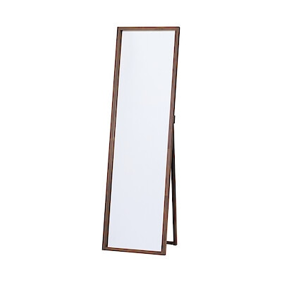
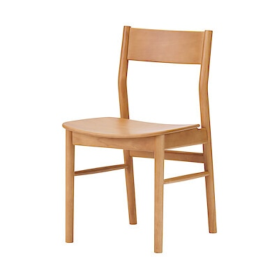
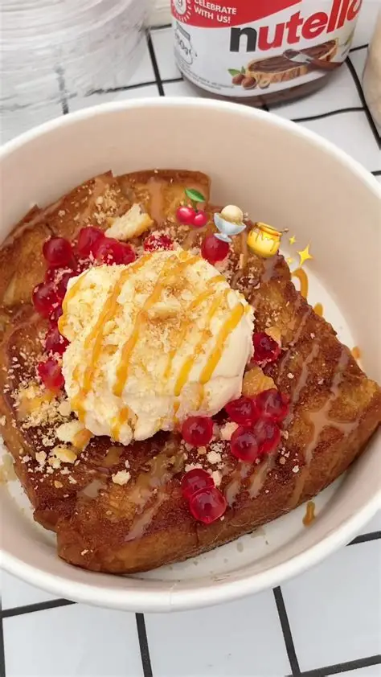

# ใบงานการทดลอง: พื้นฐานการจัดการรูปแบบเว็บไซต์ด้วย CSS
[](#การทดลองที่-1-ทำความรู้จักกับ-css)
## การทดลองที่ 1: ทำความรู้จักกับ CSS

### 1.1 วิธีการใช้งาน CSS
CSS สามารถใช้งานได้ 3 วิธี:

1. **Inline CSS**:
```html
<p style="color: blue; font-size: 16px;">ข้อความสีน้ำเงิน</p>
```

2. **Internal CSS**:
```html
<head>
    <style>
        p {
            color: blue;
            font-size: 16px;
        }
    </style>
</head>
```

3. **External CSS**:
```html
<head>
    <link rel="stylesheet" href="style.css">
</head>
```

### ตัวอย่างการใช้งาน: การสร้างปุ่มสไตล์ต่างๆ

```html
<!-- ไฟล์ index.html -->
<!DOCTYPE html>
<html>
<head>
    <title>ตัวอย่างปุ่ม CSS</title>
    <!-- Internal CSS -->
    <style>
        .btn-primary {
            background-color: #007bff;
            color: white;
            padding: 10px 20px;
            border: none;
            border-radius: 5px;
            cursor: pointer;
        }
    </style>
    <!-- External CSS -->
    <link rel="stylesheet" href="css/buttons.css">
</head>
<body>
    <!-- Inline CSS -->
    <button style="background-color: #dc3545; color: white; padding: 10px 20px;">ปุ่มแบบ Inline</button>
    
    <!-- Internal CSS -->
    <button class="btn-primary">ปุ่มแบบ Internal</button>
    
    <!-- External CSS -->
    <button class="btn-success">ปุ่มแบบ External</button>
</body>
</html>
```

```css
/* สร้างไฟล์ buttons.css ในโฟลเดอร์ css */
.btn-success {
    background-color: #28a745;
    color: white;
    padding: 10px 20px;
    border: none;
    border-radius: 5px;
    cursor: pointer;
}
```
[](#การทดลองที่-2-selectors-ใน-CSS)
## การทดลองที่ 2: Selectors ใน CSS
CSS Selector คือวิธีการระบุหรือเลือกองค์ประกอบ (elements) ที่เราต้องการจัดรูปแบบใน HTML โดยมีประเภทหลัก ๆ ดังนี้:

1. **Element Selector** - เลือกโดยใช้ชื่อ element
```css
p { color: red; }  /* เลือกทุก <p> elements */
h1 { color: blue; }  /* เลือกทุก <h1> elements */
```

2. **Class Selector** - เลือกโดยใช้ชื่อ class (ขึ้นต้นด้วย .)
```css
.menu { color: green; }  /* เลือก elements ที่มี class="menu" */
.highlight { background: yellow; }
```

3. **ID Selector** - เลือกโดยใช้ ID (ขึ้นต้นด้วย #)
```css
#header { background: black; }  /* เลือก element ที่มี id="header" */
#logo { width: 100px; }
```

4. **Descendant Selector** - เลือก elements ที่เป็นลูกหลาน
```css
div p { color: blue; }  /* เลือก <p> ที่อยู่ภายใน <div> */
```

5. **Child Selector** - เลือก elements ที่เป็นลูกโดยตรง (>)
```css
div > p { color: red; }  /* เลือก <p> ที่เป็นลูกโดยตรงของ <div> */
```

6. **Pseudo-class** - เลือกสถานะพิเศษ
```css
a:hover { color: red; }  /* เมื่อเมาส์ชี้ */
input:focus { border: blue; }  /* เมื่อได้รับการโฟกัส */
```

7. **Multiple Selector** - เลือกหลายอย่างพร้อมกัน
```css
h1, h2, h3 { color: purple; }
```

8. **Universal Selector** - เลือกทุก elements (*)
```css
* { margin: 0; padding: 0; }
```

9. **Attribute Selector** - เลือกตาม attribute
```css
input[type="text"] { border: 1px solid gray; }
```

10. **Adjacent Sibling Selector** - เลือกธาตุที่อยู่ถัดไป (+)
```css
h1 + p { margin-top: 20px; }
```

ความสำคัญของ Selector:
- ช่วยให้เราสามารถกำหนดสไตล์ให้กับ elements ที่ต้องการได้อย่างเฉพาะเจาะจง
- ช่วยในการจัดการและบำรุงรักษาโค้ด CSS
- ทำให้สามารถสร้างรูปแบบที่ซับซ้อนได้
- ช่วยลดการเขียนโค้ดซ้ำซ้อน
  
### 2.1 ประเภทของ Selectors
```css
/* Element Selector */
p {
    color: blue;
}

/* Class Selector */
.highlight {
    background-color: yellow;
}

/* ID Selector */
#header {
    font-size: 24px;
}

/* Descendant Selector */
div p {
    margin: 10px;
}

/* Child Selector */
div > p {
    padding: 5px;
}
```

### ตัวอย่างการใช้งาน: การสร้างเมนูนำทาง

```html
<!DOCTYPE html>
<html>
<head>
    <style>
        /* การใช้ Element Selector */
        nav {
            background-color: #333;
            padding: 15px;
        }

        /* การใช้ Descendant Selector */
        nav ul {
            list-style: none;
            margin: 0;
            padding: 0;
            display: flex;
        }

        /* การใช้ Child Selector */
        nav > ul > li {
            margin: 0 10px;
        }

        /* การใช้ Class Selector */
        .menu-item {
            color: white;
            text-decoration: none;
            padding: 5px 10px;
        }

        /* การใช้ Pseudo-class */
        .menu-item:hover {
            background-color: #555;
            border-radius: 3px;
        }

        /* การใช้ ID Selector */
        #active {
            background-color: #007bff;
            border-radius: 3px;
        }
    </style>
</head>
<body>
    <nav>
        <ul>
            <li><a href="#" class="menu-item" id="active">หน้าแรก</a></li>
            <li><a href="#" class="menu-item">สินค้า</a></li>
            <li><a href="#" class="menu-item">เกี่ยวกับเรา</a></li>
            <li><a href="#" class="menu-item">ติดต่อ</a></li>
        </ul>
    </nav>
</body>
</html>
```
### แบบฝึกหัด
1. แก้ไขโค้ดโปรแกรมเดิม ให้ใช้งาน CSS แบบ External CSS
2. แก้ไขให้เมนูถูกเลือกที่ สินค้า
3. เปลี่ยนสีพื้นหลังของเมนู

### ผลการทดลอง
```html
<!DOCTYPE html>
<html lang="th">
<head>
    <meta charset="UTF-8">
    <meta name="viewport" content="width=device-width, initial-scale=1.0">
    <title>การทดลองที่ 2 - Modern Navigation</title>
    <link rel="stylesheet" href="style.css">
</head>
<body>
    <nav class="navbar">
        <ul class="nav-list">
            <li><a href="#" class="menu-item">หน้าแรก</a></li>
            <li><a href="#" class="menu-item active" id="active">สินค้า</a></li>
            <li><a href="#" class="menu-item">เกี่ยวกับเรา</a></li>
            <li><a href="#" class="menu-item">ติดต่อ</a></li>
        </ul>
    </nav>
</body>
</html>
```
[Final/Lab2.png]


[](#การทดลองที่-3-การจัดการสีและพื้นหลัง)
## การทดลองที่ 3: การจัดการสีและพื้นหลัง

### 3.1 การกำหนดสีและพื้นหลัง
```css
/* สีพื้นฐาน */
color: red;
color: #FF0000;
color: rgb(255, 0, 0);
color: rgba(255, 0, 0, 0.5);

/* พื้นหลัง */
background-color: #f0f0f0;
background-image: url('image.jpg');
background-size: cover;
```

### ตัวอย่างการใช้งาน: การสร้างการ์ดสินค้า

```html
<!DOCTYPE html>
<html>
<head>
    <style>
        .product-card {
            width: 300px;
            border-radius: 8px;
            overflow: hidden;
            box-shadow: 0 2px 4px rgba(0,0,0,0.1);
            background-color: white;
        }

        .product-image {
            width: 100%;
            height: 200px;
            background-image: url('product.jpg');
            background-size: cover;
            background-position: center;
        }

        .product-info {
            padding: 15px;
        }

        .product-title {
            color: #333;
            font-size: 18px;
            margin-bottom: 10px;
        }

        .product-price {
            color: #007bff;
            font-size: 24px;
            font-weight: bold;
        }

        .product-description {
            color: #666;
            font-size: 14px;
            line-height: 1.5;
        }

        .product-button {
            display: block;
            background: linear-gradient(to right, #007bff, #0056b3);
            color: white;
            text-align: center;
            padding: 10px;
            text-decoration: none;
            margin-top: 15px;
            border-radius: 4px;
        }

        .product-button:hover {
            background: linear-gradient(to right, #0056b3, #003980);
        }
    </style>
</head>
<body>
    <div class="product-card">
        <div class="product-image"></div>
        <div class="product-info">
            <h2 class="product-title">สินค้าตัวอย่าง</h2>
            <p class="product-price">฿1,999</p>
            <p class="product-description">
                รายละเอียดสินค้าตัวอย่าง ที่มีความน่าสนใจและน่าใช้งาน
            </p>
            <a href="#" class="product-button">เพิ่มลงตะกร้า</a>
        </div>
    </div>
</body>
</html>
```

### แบบฝึกหัด
1. แก้ไขโค้ดโปรแกรมเดิม ให้ใช้งาน CSS แบบ External CSS
2. แก้ไขให้แสดงรูปสินค้า โดยให้รูปสินค้าเก็บอยู่ในโฟลเดอร์ images
3. เพิ่มเติมให้มี card แสดงข้อมูลสินค้า 4 รูป

### ผลการทดลอง
```html
<!DOCTYPE html>
<html lang="th">
<head>
    <meta charset="UTF-8">
    <meta name="viewport" content="width=device-width, initial-scale=1.0">
    <title>Modern Shop - ระบบจัดการสินค้า</title>
    <link rel="stylesheet" href="style.css">
    <link href="https://fonts.googleapis.com/css2?family=Sarabun:wght@300;400;600&display=swap" rel="stylesheet">
</head>
<body>
    <header class="main-header">
        <div class="container header-flex">
            <div class="logo">My<span>Shop</span></div>
            <nav class="user-nav">
                <button class="btn btn-profile">โปรไฟล์</button>
                <button class="btn btn-logout">ออกจากระบบ</button>
            </nav>
        </div>
    </header>

    <main class="container">
        <section class="welcome-section">
            <h1>รายการสินค้าใหม่</h1>
            <p>ค้นหาสินค้าคุณภาพเยี่ยมที่คัดสรรมาเพื่อคุณโดยเฉพาะ</p>
        </section>

        <div class="product-grid">
            <div class="product-card">
                <div class="product-image">
                    
                </div>
                <div class="product-info">
                    <h3>สมาร์ทโฟน รุ่น A1</h3>
                    <p class="price">฿15,900</p>
                    <button class="btn-buy">เพิ่มลงรถเข็น</button>
                </div>
            </div>

            <div class="product-card">
                <div class="product-image">
                    
                </div>
                <div class="product-info">
                    <h3>หูฟังไร้สาย Pro</h3>
                    <p class="price">฿3,500</p>
                    <button class="btn-buy">เพิ่มลงรถเข็น</button>
                </div>
            </div>

            <div class="product-card">
                <div class="product-image">
                    
                </div>
                <div class="product-info">
                    <h3>นาฬิกา Smart Watch</h3>
                    <p class="price">฿5,200</p>
                    <button class="btn-buy">เพิ่มลงรถเข็น</button>
                </div>
            </div>

            <div class="product-card">
                <div class="product-image">
                    
                </div>
                <div class="product-info">
                    <h3>ลำโพง Bluetooth</h3>
                    <p class="price">฿2,800</p>
                    <button class="btn-buy">เพิ่มลงรถเข็น</button>
                </div>
            </div>
        </div>
    </main>
</body>
</html>
```
[Final/Lab3.png]

[](#การทดลองที่-4-การจัดการขนาดและระยะห่าง)
## การทดลองที่ 4: การจัดการขนาดและระยะห่าง

### 4.1 หน่วยวัดและ Box Model
```css
/* หน่วยวัด */
width: 100px;
width: 50%;
font-size: 1.2rem;
height: 100vh;

/* Box Model */
padding: 10px;
margin: 15px;
border: 1px solid black;
```

### ตัวอย่างการใช้งาน: การสร้างส่วนแสดงสถิติ

```html
<!DOCTYPE html>
<html>
<head>
    <style>
        .stats-container {
            display: flex;
            justify-content: space-around;
            max-width: 1200px;
            margin: 2rem auto;
            padding: 0 1rem;
        }

        .stat-box {
            flex: 1;
            margin: 0 15px;
            padding: 2rem;
            text-align: center;
            background-color: white;
            border-radius: 8px;
            box-shadow: 0 2px 4px rgba(0,0,0,0.1);
        }

        .stat-number {
            font-size: 2.5rem;
            font-weight: bold;
            color: #007bff;
            margin-bottom: 0.5rem;
        }

        .stat-label {
            font-size: 1rem;
            color: #666;
            text-transform: uppercase;
            letter-spacing: 1px;
        }

        /* Responsive Design */
        @media (max-width: 768px) {
            .stats-container {
                flex-direction: column;
            }

            .stat-box {
                margin: 1rem 0;
            }
        }
    </style>
</head>
<body>
    <div class="stats-container">
        <div class="stat-box">
            <div class="stat-number">1,234</div>
            <div class="stat-label">ผู้ใช้งาน</div>
        </div>
        <div class="stat-box">
            <div class="stat-number">5.6K</div>
            <div class="stat-label">ยอดขาย</div>
        </div>
        <div class="stat-box">
            <div class="stat-number">98%</div>
            <div class="stat-label">ความพึงพอใจ</div>
        </div>
    </div>
</body>
</html>
```

### แบบฝึกหัด
1. แก้ไขโค้ดโปรแกรมเดิม ให้ใช้งาน CSS แบบ External CSS
2. ปรับแต่ง ขนาดต่าง ๆ ของ Box model, ขนาดและฟอนต์ตัวหนังสือ, สี


### ผลการทดลอง
```html
[<!DOCTYPE html>
<html lang="th">
<head>
    <meta charset="UTF-8">
    <meta name="viewport" content="width=device-width, initial-scale=1.0">
    <title>Dashboard Stats - Box Model Lab</title>
    <link rel="stylesheet" href="style.css">
    <link href="https://fonts.googleapis.com/css2?family=Sarabun:wght@400;700&display=swap" rel="stylesheet">
</head>
<body>
    <div class="stats-container">
        <div class="stat-box">
            <div class="stat-icon icon-blue">👤</div>
            <div class="stat-number">1,234</div>
            <div class="stat-label">ผู้ใช้งานใหม่</div>
            <div class="stat-trend trend-up">↑ 12% เดือนนี้</div>
        </div>

        <div class="stat-box">
            <div class="stat-icon icon-green">💰</div>
            <div class="stat-number">5.6K</div>
            <div class="stat-label">ยอดขายเดือนนี้</div>
            <div class="stat-trend trend-up">↑ 8% เดือนนี้</div>
        </div>

        <div class="stat-box">
            <div class="stat-icon icon-orange">⭐</div>
            <div class="stat-number">98%</div>
            <div class="stat-label">ความพึงพอใจ</div>
            <div class="stat-trend">คงที่</div>
        </div>
    </div>
</body>
</html>]
```
```css
[/* --- 1. Global Reset & Box Model Setup --- */
* {
    margin: 0;
    padding: 0;
    /* หัวใจสำคัญของ Box Model: ทำให้ padding ไม่ไปเพิ่มความกว้างของกล่อง */
    box-sizing: border-box; 
    font-family: 'Sarabun', sans-serif;
}

:root {
    --bg-color: #f1f5f9;
    --card-bg: #ffffff;
    --text-main: #1e293b;
    --text-muted: #64748b;
    --primary: #6366f1;
    --border-color: #e2e8f0;
}

body {
    background-color: var(--bg-color);
    display: flex;
    align-items: center;
    justify-content: center;
    min-height: 100vh;
    padding: 20px;
}

/* --- 2. Container Layout --- */
.stats-container {
    display: flex;
    flex-wrap: wrap; /* รองรับการตัดบรรทัดบนมือถือ */
    justify-content: center;
    gap: 24px; /* ระยะห่างระหว่างกล่อง (Modern Spacing) */
    width: 100%;
    max-width: 1100px;
}

/* --- 3. Stat Box (The Box Model Lab) --- */
.stat-box {
    flex: 1;
    min-width: 280px; /* ป้องกันกล่องบีบจนเล็กเกินไป */
    background-color: var(--card-bg);
    
    /* Box Model Properties */
    padding: 40px 24px;    /* ภายใน: เว้นระยะจากขอบเข้ามา */
    border-radius: 20px;  /* ความโค้งของมุมขอบ */
    border: 1px solid var(--border-color); /* เส้นขอบ */
    
    text-align: center;
    transition: all 0.3s cubic-bezier(0.4, 0, 0.2, 1);
    box-shadow: 0 4px 6px -1px rgba(0, 0, 0, 0.1);
}

.stat-box:hover {
    transform: translateY(-8px);
    box-shadow: 0 20px 25px -5px rgba(0, 0, 0, 0.1);
    border-color: var(--primary);
}

/* --- 4. Typography & Elements inside Box --- */
.stat-icon {
    font-size: 2rem;
    margin-bottom: 16px; /* Spacing ด้านล่างไอคอน */
    display: inline-block;
    width: 60px;
    height: 60px;
    line-height: 60px;
    border-radius: 50%;
    background: #f8fafc;
}

.stat-number {
    font-size: 2.5rem;
    font-weight: 700;
    color: var(--text-main);
    line-height: 1.2;
}

.stat-label {
    font-size: 1rem;
    color: var(--text-muted);
    margin: 8px 0 16px 0; /* Margin: บน 8px, ล่าง 16px */
    font-weight: 400;
}

.stat-trend {
    font-size: 0.875rem;
    font-weight: 600;
    padding: 4px 12px;
    background: #f1f5f9;
    border-radius: 20px;
    display: inline-block;
}

.trend-up {
    color: #10b981;
    background: #ecfdf5;
}

/* --- 5. Responsive Adjustment --- */
@media (max-width: 768px) {
    .stats-container {
        flex-direction: column;
    }
    .stat-box {
        width: 100%;
    }
}]
```
[Final/Lab4.png]

[](#การทดลองที่-5-การจัดการข้อความและฟอนต์)
## การทดลองที่ 5: การจัดการข้อความและฟอนต์

### 5.1 การจัดการข้อความและฟอนต์
```css
/* การจัดการข้อความ */
text-align: center;
text-decoration: none;
text-transform: uppercase;
line-height: 1.5;

/* การจัดการฟอนต์ */
font-family: 'Arial', sans-serif;
font-size: 16px;
font-weight: bold;
```

### ตัวอย่างการใช้งาน: การสร้างบทความบล็อก

```html
<!DOCTYPE html>
<html>
<head>
    <style>
        .blog-post {
            max-width: 800px;
            margin: 2rem auto;
            padding: 0 1rem;
            font-family: 'Sarabun', sans-serif;
        }

        .post-header {
            text-align: center;
            margin-bottom: 2rem;
        }

        .post-title {
            font-size: 2.5rem;
            color: #333;
            margin-bottom: 0.5rem;
            line-height: 1.2;
        }

        .post-meta {
            color: #666;
            font-size: 0.9rem;
            text-transform: uppercase;
            letter-spacing: 1px;
        }

        .post-content {
            font-size: 1.1rem;
            line-height: 1.8;
            color: #444;
        }

        .post-content p {
            margin-bottom: 1.5rem;
        }

        .post-content h2 {
            font-size: 1.8rem;
            color: #333;
            margin: 2rem 0 1rem;
        }

        blockquote {
            font-style: italic;
            border-left: 4px solid #007bff;
            margin: 1.5rem 0;
            padding-left: 1rem;
            color: #555;
        }

        @media (max-width: 768px) {
            .post-title {
                font-size: 2rem;
            }
        }
    </style>
</head>
<body>
    <article class="blog-post">
        <header class="post-header">
            <h1 class="post-title">วิธีการเขียนบทความที่น่าสนใจ</h1>
            <div class="post-meta">โพสต์เมื่อ 1 มกราคม 2025 | โดย ผู้เขียน</div>
        </header>
        
        <div class="post-content">
            <p>เนื้อหาบทความที่ดีควรมีความน่าสนใจและเป็นประโยชน์ต่อผู้อ่าน การเขียนบทความให้น่าอ่านนั้นมีหลักการสำคัญหลายประการ</p>

            <h2>1. การเลือกหัวข้อที่น่าสนใจ</h2>
            <p>หัวข้อที่ดีควรตรงกับความสนใจของกลุ่มเป้าหมาย และมีประโยชน์ต่อผู้อ่าน</p>

            <blockquote>
                "การเขียนที่ดีไม่ได้เกิดจากพรสวรรค์เพียงอย่างเดียว แต่เกิดจากการฝึกฝนอย่างสม่ำเสมอ"
            </blockquote>

            <h2>2. การจัดโครงสร้างเนื้อหา</h2>
            <p>เนื้อหาที่ดีควรมีการจัดลำดับที่เป็นระบบ เข้าใจง่าย และมีความต่อเนื่อง</p>
        </div>
    </article>
</body>
</html>
```
### แบบฝึกหัด
1. แก้ไขโค้ดโปรแกรมเดิม ให้ใช้งาน CSS แบบ External CSS
2. ปรับแต่งรูปแบบ สีและขนาด font

### ผลการทดลอง
```html
[<!DOCTYPE html>
<html lang="th">
<head>
    <meta charset="UTF-8">
    <meta name="viewport" content="width=device-width, initial-scale=1.0">
    <title>Modern Typography Lab - บทความ</title>
    <link rel="stylesheet" href="style.css">
    <link href="https://fonts.googleapis.com/css2?family=Sarabun:wght@300;400;600;700&display=swap" rel="stylesheet">
</head>
<body>
    <article class="blog-post">
        <header class="post-header">
            <span class="post-category">Writing Guide</span>
            <h1 class="post-title">ศิลปะการเขียนบทความ<br>ให้สะกดใจผู้อ่าน</h1>
            <div class="post-meta">
                <span class="author">โดย <strong>Editor-in-Chief</strong></span>
                <span class="separator">•</span>
                <span class="date">25 กุมภาพันธ์ 2026</span>
            </div>
        </header>
        
        <div class="post-content">
            <p class="lead">
                เนื้อหาบทความที่ดีควรเริ่มด้วยความน่าสนใจและสร้างประโยชน์ทันทีที่อ่าน 
                การสื่อสารที่มีประสิทธิภาพไม่ได้อยู่ที่ปริมาณคำ แต่อยู่ที่ความชัดเจนของสารที่ส่งออกไป
            </p>

            <h2>1. การเลือกหัวข้อที่ทรงพลัง</h2>
            <p>หัวข้อคือประตูด่านแรกที่ผู้อ่านจะเลือกเปิดเข้ามา หัวข้อที่ดีควรมีความกระชับ ตรงประเด็น และกระตุ้นความอยากรู้อยากเห็นโดยไม่ใช้วิธีการหลอกลวง (Clickbait)</p>

            <blockquote>
                "การเขียนที่ดีไม่ได้เกิดจากพรสวรรค์เพียงอย่างเดียว แต่มันคือการขัดเกลาความคิดให้กลายเป็นตัวอักษรที่ทรงพลัง"
            </blockquote>

            <h2>2. โครงสร้างและการเว้นจังหวะ</h2>
            <p>ในโลกที่ผู้คนสแกนเนื้อหาผ่านมือถือ การใช้หัวข้อย่อย (Sub-headings) และการเว้นระยะบรรทัดที่พอเหมาะจะช่วยลดความเหนื่อยล้าของสายตา และช่วยให้ผู้อ่านจับประเด็นสำคัญได้เร็วขึ้น</p>
            
            <p>อย่าลืมใช้ตัวหนาสำหรับ <strong>ใจความสำคัญ</strong> เพื่อช่วยนำสายตาผู้อ่านไปยังส่วนที่สำคัญที่สุดของย่อหน้านั้นๆ</p>
        </div>

        <footer class="post-footer">
            <p>แท็ก: #Writing #Typography #ContentCreator</p>
        </footer>
    </article>
</body>
</html>]
```
```css
[/* --- 1. Typography Core Setup --- */
:root {
    --text-dark: #1a1a1a;
    --text-body: #4a4a4a;
    --text-muted: #888888;
    --accent-color: #3498db;
    --bg-paper: #ffffff;
    --line-height-body: 1.8;
}

* {
    margin: 0;
    padding: 0;
    box-sizing: border-box;
}

body {
    background-color: #fcfcfc;
    font-family: 'Sarabun', sans-serif;
    color: var(--text-body);
    -webkit-font-smoothing: antialiased; /* ทำให้ตัวอักษรดูคมชัดขึ้นบน Mac */
}

/* --- 2. Article Container --- */
.blog-post {
    max-width: 800px; /* ความกว้างที่เหมาะสมที่สุดสำหรับการอ่าน (Optimal Reading Width) */
    margin: 6rem auto;
    padding: 0 2rem;
    background: var(--bg-paper);
}

/* --- 3. Header Styling --- */
.post-header {
    text-align: center;
    margin-bottom: 4rem;
}

.post-category {
    text-transform: uppercase;
    letter-spacing: 3px;
    font-size: 0.8rem;
    color: var(--accent-color);
    font-weight: 700;
    display: block;
    margin-bottom: 1rem;
}

.post-title {
    font-size: 3.5rem; /* ขนาดใหญ่พิเศษเพื่อให้ดูน่าสนใจ */
    color: var(--text-dark);
    line-height: 1.2;
    font-weight: 700;
    margin-bottom: 1.5rem;
}

.post-meta {
    font-size: 0.95rem;
    color: var(--text-muted);
}

.separator {
    margin: 0 10px;
}

/* --- 4. Body Typography --- */
.post-content {
    font-size: 1.15rem;
    line-height: var(--line-height-body);
}

/* ย่อหน้านำ (Lead Paragraph) */
.lead {
    font-size: 1.4rem;
    color: var(--text-dark);
    font-weight: 300;
    margin-bottom: 2.5rem;
    border-left: 4px solid var(--accent-color);
    padding-left: 1.5rem;
}

.post-content p {
    margin-bottom: 2rem;
}

.post-content h2 {
    font-size: 2rem;
    color: var(--text-dark);
    margin: 3rem 0 1.5rem 0;
    font-weight: 600;
}

/* Quote Styling */
blockquote {
    font-size: 1.6rem;
    font-style: italic;
    color: var(--text-dark);
    margin: 3.5rem 0;
    padding: 2rem;
    background: #f8f9fa;
    border-radius: 8px;
    text-align: center;
    position: relative;
}

blockquote::before {
    content: '"';
    font-size: 5rem;
    position: absolute;
    top: -10px;
    left: 20px;
    color: #e9ecef;
    font-family: serif;
}

/* Footer Section */
.post-footer {
    margin-top: 5rem;
    padding-top: 2rem;
    border-top: 1px solid #eee;
    color: var(--text-muted);
    font-size: 0.9rem;
}

/* --- Responsive --- */
@media (max-width: 768px) {
    .post-title {
        font-size: 2.5rem;
    }
    .blog-post {
        margin: 3rem auto;
    }
}]
```
[Final/Lab5.png]

[](#การทดลองที่-6-Layout-และการจัดวางอิลิเมนต์)
## การทดลองที่ 6: Layout และการจัดวางอิลิเมนต์

### 6.1 การจัดวางด้วย Flexbox และ Grid

```css
/* Flexbox */
.container {
    display: flex;
    justify-content: space-between;
    align-items: center;
}

/* Grid */
.grid-container {
    display: grid;
    grid-template-columns: repeat(3, 1fr);
    gap: 20px;
}
```

### ตัวอย่างการใช้งาน: การสร้างหน้าแสดงสินค้าแบบ Grid

```html
<!DOCTYPE html>
<html>
<head>
    <style>
        .product-grid {
            display: grid;
            grid-template-columns: repeat(auto-fill, minmax(250px, 1fr));
            gap: 20px;
            padding: 20px;
            max-width: 1200px;
            margin: 0 auto;
        }

        .product-card {
            background: white;
            border-radius: 8px;
            overflow: hidden;
            box-shadow: 0 2px 4px rgba(0,0,0,0.1);
            transition: transform 0.3s ease;
        }

        .product-card:hover {
            transform: translateY(-5px);
        }

        .product-image {
            width: 100%;
            height: 200px;
            background-color: #f5f5f5;
            background-size: cover;
            background-position: center;
        }

        .product-details {
            padding: 15px;
        }

        .product-title {
            font-size: 1.1rem;
            margin: 0 0 10px 0;
            color: #333;
        }

        .product-price {
            font-size: 1.2rem;
            color: #007bff;
            font-weight: bold;
        }

        .product-action {
            display: flex;
            justify-content: space-between;
            align-items: center;
            margin-top: 15px;
        }

        .add-to-cart {
            background-color: #007bff;
            color: white;
            border: none;
            padding: 8px 15px;
            border-radius: 4px;
            cursor: pointer;
        }

        .add-to-cart:hover {
            background-color: #0056b3;
        }

        @media (max-width: 768px) {
            .product-grid {
                grid-template-columns: repeat(auto-fill, minmax(200px, 1fr));
            }
        }
    </style>
</head>
<body>
    <div class="product-grid">
        <!-- สินค้าชิ้นที่ 1 -->
        <div class="product-card">
            <div class="product-image" style="background-image: url('product1.jpg')"></div>
            <div class="product-details">
                <h3 class="product-title">สินค้าตัวอย่างที่ 1</h3>
                <div class="product-price">฿1,299</div>
                <div class="product-action">
                    <button class="add-to-cart">เพิ่มลงตะกร้า</button>
                </div>
            </div>
        </div>

        <!-- สินค้าชิ้นที่ 2 -->
        <div class="product-card">
            <div class="product-image" style="background-image: url('product2.jpg')"></div>
            <div class="product-details">
                <h3 class="product-title">สินค้าตัวอย่างที่ 2</h3>
                <div class="product-price">฿1,499</div>
                <div class="product-action">
                    <button class="add-to-cart">เพิ่มลงตะกร้า</button>
                </div>
            </div>
        </div>

        <!-- เพิ่มสินค้าอื่นๆ ตามต้องการ -->
    </div>
</body>
</html>
```

### แบบฝึกหัด
1. แก้ไขโค้ดโปรแกรมเดิม ให้ใช้งาน CSS แบบ External CSS
2. ปรับแต่งขนาดแสดงผลสินค้าให้เล็กลง
3. เพ่ิมรูปภาพของสินค้า


### ผลการทดลอง
```html
[<!DOCTYPE html>
<html lang="th">
<head>
    <meta charset="UTF-8">
    <meta name="viewport" content="width=device-width, initial-scale=1.0">
    <title>Modern Layout Lab - Grid & Flexbox</title>
    <link rel="stylesheet" href="style.css">
    <link href="https://fonts.googleapis.com/css2?family=Sarabun:wght@400;700&display=swap" rel="stylesheet">
</head>
<body>
    <div class="page-wrapper">
        <header class="section-title">
            <h2>สินค้าแนะนำสำหรับคุณ</h2>
            <p>เลือกซื้อสินค้าที่ตรงใจคุณด้วยดีไซน์ใหม่ล่าสุด</p>
        </header>

        <div class="product-grid">
            <div class="product-card">
                <div class="image-wrapper">
                    
                    <span class="badge-new">New</span>
                </div>
                <div class="card-body">
                    <h3 class="product-title">หูฟังตัดเสียงรบกวนไร้สาย</h3>
                    <div class="price-container">
                        <span class="price-amount">฿1,299</span>
                    </div>
                    <div class="card-footer">
                        <button class="btn-wishlist">♡</button>
                        <button class="add-to-cart">หยิบใส่รถเข็น</button>
                    </div>
                </div>
            </div>

            <div class="product-card">
                <div class="image-wrapper">
                    
                </div>
                <div class="card-body">
                    <h3 class="product-title">กล้อง Action Cam 4K</h3>
                    <div class="price-container">
                        <span class="price-amount">฿1,499</span>
                    </div>
                    <div class="card-footer">
                        <button class="btn-wishlist">♡</button>
                        <button class="add-to-cart">หยิบใส่รถเข็น</button>
                    </div>
                </div>
            </div>

            <div class="product-card">
                <div class="image-wrapper">
                    
                </div>
                <div class="card-body">
                    <h3 class="product-title">คีย์บอร์ดกลไก RGB]
```
```css
[:root {
    --primary: #2563eb;
    --danger: #ef4444;
    --bg-gray: #f8fafc;
    --card-shadow: 0 10px 15px -3px rgba(0, 0, 0, 0.05);
}

* {
    margin: 0;
    padding: 0;
    box-sizing: border-box;
}

body {
    background-color: var(--bg-gray);
    font-family: 'Sarabun', sans-serif;
    padding: 60px 20px;
}

.page-wrapper {
    max-width: 1100px;
    margin: 0 auto;
}

.section-title {
    text-align: center;
    margin-bottom: 50px;
}

.section-title h2 {
    font-size: 2rem;
    color: #1e293b;
    margin-bottom: 10px;
}

/* --- 1. Grid Layout --- */
.product-grid {
    display: grid;
    /* ใช้ auto-fill เพื่อให้จำนวน Card ปรับตามความกว้างหน้าจออัตโนมัติ */
    grid-template-columns: repeat(auto-fill, minmax(240px, 1fr));
    gap: 25px;
}

/* --- 2. Flexbox within Card --- */
.product-card {
    background: #ffffff;
    border-radius: 16px;
    overflow: hidden;
    box-shadow: var(--card-shadow);
    transition: all 0.3s ease;
    border: 1px solid #e2e8f0;
    
    /* ใช้ Flexbox แนวตั้งเพื่อให้เนื้อหาจัดเรียงสวยงาม */
    display: flex;
    flex-direction: column;
}

.product-card:hover {
    transform: translateY(-8px);
    box-shadow: 0 20px 25px -5px rgba(0, 0, 0, 0.1);
}

.image-wrapper {
    position: relative;
    height: 200px;
    background: #f1f5f9;
    overflow: hidden;
}

.product-img {
    width: 100%;
    height: 100%;
    object-fit: cover;
    transition: transform 0.5s ease;
}

.product-card:hover .product-img {
    transform: scale(1.1);
}

/* Badge overlay */
.badge-new {
    position: absolute;
    top: 12px;
    left: 12px;
    background: var(--primary);
    color: white;
    padding: 4px 12px;
    border-radius: 20px;
    font-size: 0.75rem;
    font-weight: bold;
}

.card-body {
    padding: 20px;
    display: flex;
    flex-direction: column;
    flex-grow: 1; /* ขยายเนื้อหาให้เต็มความสูงของ Card */
}

.product-title {
    font-size: 1.1rem;
    color: #1e293b;
    margin-bottom: 10px;
    /* แสดงผลแค่ 1 บรรทัด ถ้าเกินให้เป็น ... */
    white-space: nowrap;
    overflow: hidden;
    text-overflow: ellipsis;
}

.price-container {
    margin-bottom: 20px;
}

.price-amount {
    font-size: 1.25rem;
    font-weight: 700;
    color: var(--danger);
}

/* Footer Card ใช้ Flexbox แนวนอน */
.card-footer {
    display: flex;
    gap: 10px;
    margin-top: auto; /* ดัน Footer ไปล่างสุดเสมอ */
}

.btn-wishlist {
    padding: 10px;
    border: 1px solid #e2e8f0;
    background: white;
    border-radius: 8px;
    cursor: pointer;
    transition: 0.2s;
}

.btn-wishlist:hover {
    background: #fee2e2;
    border-color: #fca5a5;
}

.add-to-cart {
    flex-grow: 1; /* ให้ปุ่มซื้อกินพื้นที่ที่เหลือ */
    padding: 10px;
    background: var(--primary);
    color: white;
    border: none;
    border-radius: 8px;
    font-weight: 600;
    cursor: pointer;
    transition: 0.2s;
}

.add-to-cart:hover {
    background: #1d4ed8;
}]
```
[/Final/Lab6.1.png]


### ตัวอย่างการใช้งาน: การสร้างเลย์เอาต์ Modern Dashboard

```html
<!DOCTYPE html>
<html>
<head>
    <style>
        .dashboard {
            display: grid;
            grid-template-areas: 
                "sidebar header"
                "sidebar main";
            grid-template-columns: 250px 1fr;
            grid-template-rows: auto 1fr;
            min-height: 100vh;
        }

        .header {
            grid-area: header;
            background: white;
            padding: 1rem;
            box-shadow: 0 2px 4px rgba(0,0,0,0.1);
            display: flex;
            justify-content: space-between;
            align-items: center;
        }

        .sidebar {
            grid-area: sidebar;
            background: #2c3e50;
            color: white;
            padding: 1rem;
        }

        .main-content {
            grid-area: main;
            padding: 1rem;
            background: #f5f7fa;
        }

        .stats-grid {
            display: grid;
            grid-template-columns: repeat(auto-fit, minmax(250px, 1fr));
            gap: 1rem;
            margin-bottom: 2rem;
        }

        .stat-card {
            background: white;
            padding: 1.5rem;
            border-radius: 8px;
            box-shadow: 0 2px 4px rgba(0,0,0,0.1);
        }

        .chart-container {
            display: grid;
            grid-template-columns: 2fr 1fr;
            gap: 1rem;
        }

        .chart {
            background: white;
            padding: 1.5rem;
            border-radius: 8px;
            box-shadow: 0 2px 4px rgba(0,0,0,0.1);
        }

        @media (max-width: 768px) {
            .dashboard {
                grid-template-areas: 
                    "header"
                    "main";
                grid-template-columns: 1fr;
            }

            .sidebar {
                display: none;
            }

            .chart-container {
                grid-template-columns: 1fr;
            }
        }
    </style>
</head>
<body>
    <div class="dashboard">
        <header class="header">
            <h1>แดชบอร์ด</h1>
            <nav>
                <button>โปรไฟล์</button>
                <button>ออกจากระบบ</button>
            </nav>
        </header>

        <aside class="sidebar">
            <nav>
                <ul>
                    <li>หน้าแรก</li>
                    <li>รายงาน</li>
                    <li>การตั้งค่า</li>
                </ul>
            </nav>
        </aside>

        <main class="main-content">
            <div class="stats-grid">
                <div class="stat-card">
                    <h3>ยอดขายรวม</h3>
                    <p>฿150,000</p>
                </div>
                <div class="stat-card">
                    <h3>จำนวนออเดอร์</h3>
                    <p>1,234</p>
                </div>
                <div class="stat-card">
                    <h3>ลูกค้าใหม่</h3>
                    <p>45</p>
                </div>
            </div>

            <div class="chart-container">
                <div class="chart">
                    <h3>กราฟแสดงยอดขาย</h3>
                    <!-- เพิ่มกราฟตามต้องการ -->
                </div>
                <div class="chart">
                    <h3>สัดส่วนสินค้าขายดี</h3>
                    <!-- เพิ่มกราฟตามต้องการ -->
                </div>
            </div>
        </main>
    </div>
</body>
</html>
```

### แบบฝึกหัด
1. แก้ไขโค้ดโปรแกรมเดิม ให้ใช้งาน CSS แบบ External CSS
2. ปรับแต่งการแสดงผลต่าง ๆ ให้สวยงาม


### ผลการทดลอง
```html
[<!DOCTYPE html>
<html lang="th">
<head>
    <meta charset="UTF-8">
    <meta name="viewport" content="width=device-width, initial-scale=1.0">
    <title>Advanced Dashboard - Admin Panel</title>
    <link rel="stylesheet" href="style.css">
    <link href="https://fonts.googleapis.com/css2?family=Sarabun:wght@300;400;600&display=swap" rel="stylesheet">
</head>
<body>
    <div class="dashboard-container">
        <aside class="sidebar">
            <div class="sidebar-brand">
                <div class="logo-icon">A</div>
                <span>Admin<span>Core</span></span>
            </div>
            <nav class="sidebar-menu">
                <p class="menu-label">Main Menu</p>
                <ul>
                    <li class="active"><span class="icon">🏠</span> หน้าแรก</li>
                    <li><span class="icon">📊</span> รายงานยอดขาย</li>
                    <li><span class="icon">🛒</span> ออเดอร์</li>
                    <li><span class="icon">👥</span> ลูกค้า</li>
                </ul>
                <p class="menu-label">System</p>
                <ul>
                    <li><span class="icon">⚙️</span> การตั้งค่า</li>
                    <li><span class="icon">🛡️</span> ความปลอดภัย</li>
                </ul>
            </nav>
        </aside>

        <header class="main-header">
            <div class="header-left">
                <h1 class="page-title">แดชบอร์ดสรุปผล</h1>
            </div>
            <div class="header-right">
                <div class="search-bar">
                    <input type="text" placeholder="ค้นหาข้อมูล...">
                </div>
                <div class="user-profile">
                    <div class="avatar">JD</div>
                    <button class="btn-logout">ออกจากระบบ</button>
                </div>
            </div>
        </header>

        <main class="content-area">
            <div class="stats-grid">
                <div class="stat-card">
                    <div class="stat-icon bg-blue">💰</div>
                    <div class="stat-details">
                        <span class="label">ยอดขายรวม</span>
                        <h3 class="value">฿150,000</h3>
                        <span class="trend up">↑ 12.5%</span>
                    </div>
                </div>
                <div class="stat-card">
                    <div class="stat-icon bg-green">📦</div>
                    <div class="stat-details">
                        <span class="label">จำนวนออเดอร์</span>
                        <h3 class="value">1,234</h3>
                        <span class="trend up">↑ 5.2%</span>
                    </div>
                </div>
                <div class="stat-card">
                    <div class="stat-icon bg-orange">👥</div>
                    <div class="stat-details">
                        <span class="label">ลูกค้าใหม่</span>
                        <h3 class="value">45</h3>
                        <span class="trend down">↓ 2.1%</span>
                    </div>
                </div>
            </div>

            <div class="visual-section">
                <div class="card chart-main">
                    <div class="card-header">
                        <h3>กราฟแสดงยอดขายรายเดือน</h3>
                        <button class="btn-more">...</button>
                    </div>
                    <div class="chart-box">
                        <div class="bar-chart-sim">
                            <div class="bar" style="height: 60%"></div>
                            <div class="bar" style="height: 80%"></div>
                            <div class="bar" style="height: 40%"></div>
                            <div class="bar" style="height: 90%"></div>
                        </div>
                    </div>
                </div>
                <div class="card chart-side">
                    <div class="card-header">
                        <h3>สัดส่วนสินค้า</h3>
                    </div>
                    <div class="chart-box circle-sim">
                        <div class="circle-inner">75%</div>
                    </div>
                </div>
            </div>
        </main>
    </div>
</body>
</html>]
```
```css
[:root {
    --sidebar-width: 260px;
    --header-height: 70px;
    --primary-blue: #3b82f6;
    --success-green: #10b981;
    --warning-orange: #f59e0b;
    --bg-main: #f3f4f6;
    --sidebar-dark: #1e293b;
    --white: #ffffff;
}

* {
    margin: 0;
    padding: 0;
    box-sizing: border-box;
    font-family: 'Sarabun', sans-serif;
}

/* --- 1. Grid Layout Structure --- */
.dashboard-container {
    display: grid;
    grid-template-areas: 
        "side head"
        "side main";
    grid-template-columns: var(--sidebar-width) 1fr;
    grid-template-rows: var(--header-height) 1fr;
    min-height: 100vh;
}

/* --- 2. Sidebar (Grid Area: side) --- */
.sidebar {
    grid-area: side;
    background-color: var(--sidebar-dark);
    color: #94a3b8;
    padding: 20px;
    display: flex;
    flex-direction: column;
}

.sidebar-brand {
    display: flex;
    align-items: center;
    gap: 12px;
    padding-bottom: 30px;
    color: var(--white);
    font-size: 1.25rem;
    font-weight: bold;
}

.logo-icon {
    background: var(--primary-blue);
    width: 35px;
    height: 35px;
    border-radius: 8px;
    display: flex;
    align-items: center;
    justify-content: center;
}

.menu-label {
    font-size: 0.75rem;
    text-transform: uppercase;
    letter-spacing: 1px;
    margin: 20px 0 10px 10px;
}

.sidebar-menu ul { list-style: none; }

.sidebar-menu li {
    padding: 12px 15px;
    border-radius: 8px;
    cursor: pointer;
    transition: 0.3s;
    display: flex;
    align-items: center;
    gap: 10px;
    margin-bottom: 5px;
}

.sidebar-menu li:hover, .sidebar-menu li.active {
    background: rgba(255, 255, 255, 0.1);
    color: var(--white);
}

.sidebar-menu li.active {
    border-left: 4px solid var(--primary-blue);
}

/* --- 3. Header (Grid Area: head) --- */
.main-header {
    grid-area: head;
    background: var(--white);
    display: flex;
    justify-content: space-between;
    align-items: center;
    padding: 0 30px;
    border-bottom: 1px solid #e5e7eb;
}

.header-right {
    display: flex;
    align-items: center;
    gap: 20px;
}

.search-bar input {
    padding: 8px 15px;
    border: 1px solid #e5e7eb;
    border-radius: 20px;
    background: #f9fafb;
}

.user-profile {
    display: flex;
    align-items: center;
    gap: 10px;
}

.avatar {
    width: 35px;
    height: 35px;
    background: #e2e8f0;
    border-radius: 50%;
    display: flex;
    align-items: center;
    justify-content: center;
    font-size: 0.8rem;
    font-weight: bold;
}

/* --- 4. Main Area (Grid Area: main) --- */
.content-area {
    grid-area: main;
    background-color: var(--bg-main);
    padding: 30px;
}

.stats-grid {
    display: grid;
    grid-template-columns: repeat(3, 1fr);
    gap: 25px;
    margin-bottom: 30px;
}

.stat-card {
    background: var(--white);
    padding: 25px;
    border-radius: 16px;
    display: flex;
    align-items: center;
    gap: 20px;
    box-shadow: 0 4px 6px -1px rgba(0,0,0,0.05);
}

.stat-icon {
    width: 60px;
    height: 60px;
    border-radius: 12px;
    display: flex;
    align-items: center;
    justify-content: center;
    font-size: 1.5rem;
}

.bg-blue { background: #eff6ff; color: var(--primary-blue); }
.bg-green { background: #ecfdf5; color: var(--success-green); }
.bg-orange { background: #fffbeb; color: var(--warning-orange); }

.value { font-size: 1.5rem; color: #1e293b; margin: 5px 0; }
.trend { font-size: 0.85rem; font-weight: bold; }
.trend.up { color: var(--success-green); }
.trend.down { color: #ef4444; }

/* Visual Section (Mixed Grid) */
.visual-section {
    display: grid;
    grid-template-columns: 2fr 1fr;
    gap: 25px;
}

.card {
    background: var(--white);
    padding: 20px;
    border-radius: 16px;
}

.card-header {
    display: flex;
    justify-content: space-between;
    margin-bottom: 20px;
}

.chart-box {
    height: 250px;
    background: #f9fafb;
    border-radius: 12px;
    display: flex;
    align-items: flex-end;
    justify-content: space-around;
    padding: 20px;
}

/* Simple Bar Chart Sim */
.bar {
    width: 40px;
    background: var(--primary-blue);
    border-radius: 4px 4px 0 0;
    transition: 0.3s;
}

.bar:hover { opacity: 0.8; }
```
[Final/Lab6.2.png]

