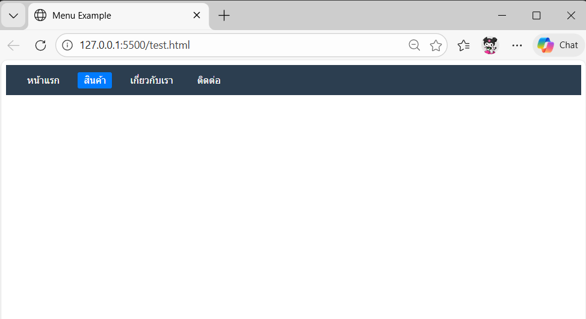
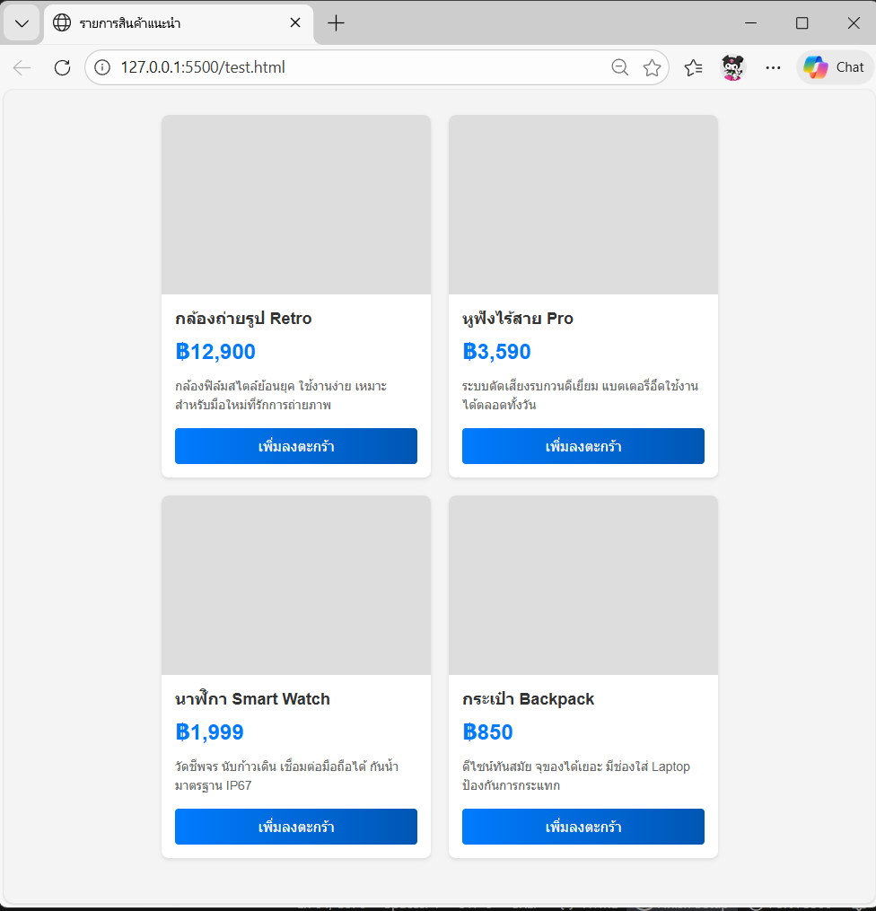
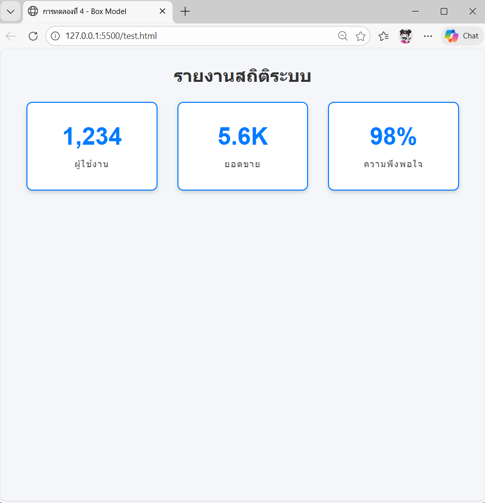
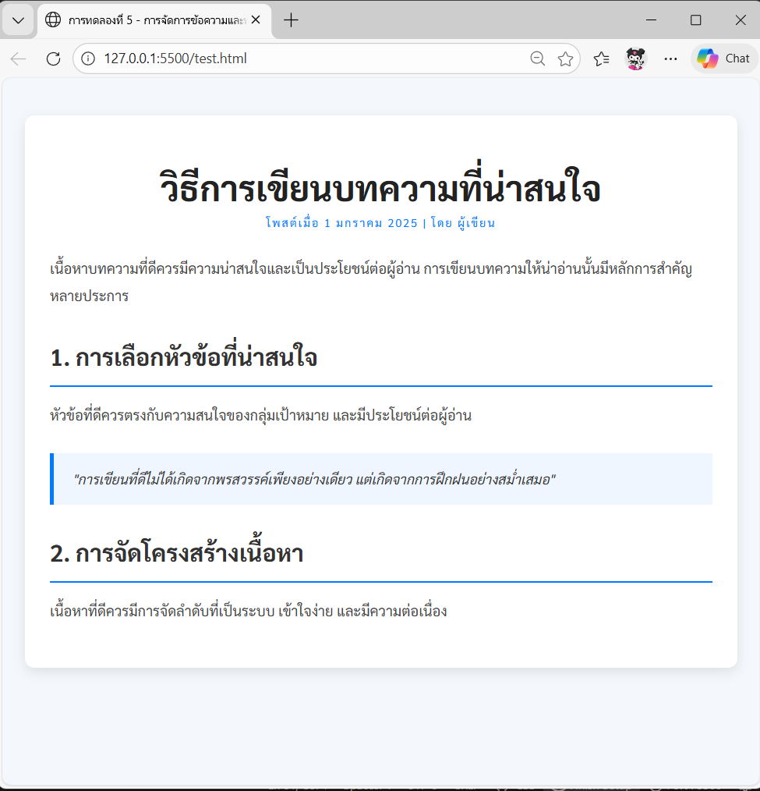
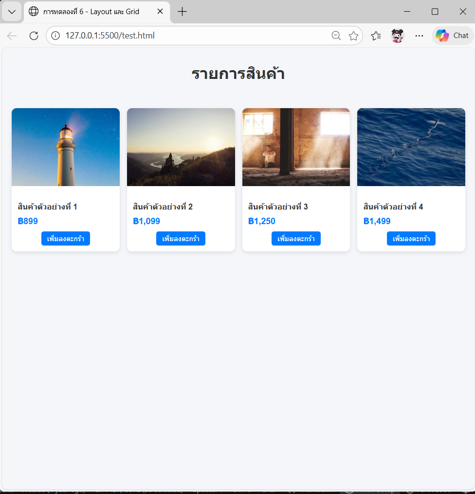
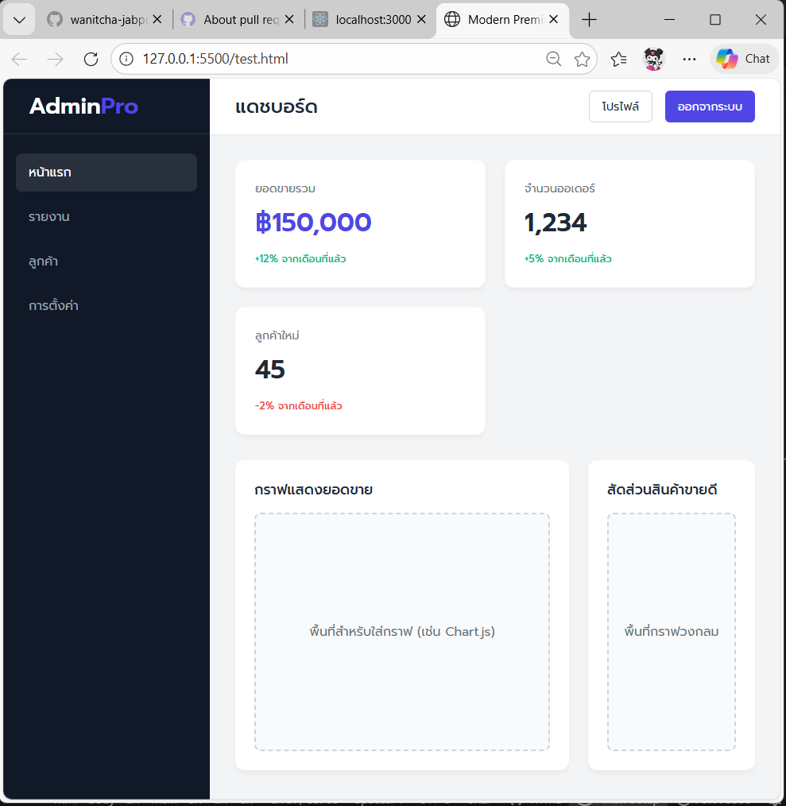

# ใบงานการทดลอง: พื้นฐานการจัดการรูปแบบเว็บไซต์ด้วย CSS
[](#การทดลองที่-1-ทำความรู้จักกับ-css)
## การทดลองที่ 1: ทำความรู้จักกับ CSS

### 1.1 วิธีการใช้งาน CSS
CSS สามารถใช้งานได้ 3 วิธี:

1. **Inline CSS**:
```html
<p style="color: blue; font-size: 16px;">ข้อความสีน้ำเงิน</p>
```

2. **Internal CSS**:
```html
<head>
    <style>
        p {
            color: blue;
            font-size: 16px;
        }
    </style>
</head>
```

3. **External CSS**:
```html
<head>
    <link rel="stylesheet" href="style.css">
</head>
```

### ตัวอย่างการใช้งาน: การสร้างปุ่มสไตล์ต่างๆ

```html
<!-- ไฟล์ index.html -->
<!DOCTYPE html>
<html>
<head>
    <title>ตัวอย่างปุ่ม CSS</title>
    <!-- Internal CSS -->
    <style>
        .btn-primary {
            background-color: #007bff;
            color: white;
            padding: 10px 20px;
            border: none;
            border-radius: 5px;
            cursor: pointer;
        }
    </style>
    <!-- External CSS -->
    <link rel="stylesheet" href="css/buttons.css">
</head>
<body>
    <!-- Inline CSS -->
    <button style="background-color: #dc3545; color: white; padding: 10px 20px;">ปุ่มแบบ Inline</button>
    
    <!-- Internal CSS -->
    <button class="btn-primary">ปุ่มแบบ Internal</button>
    
    <!-- External CSS -->
    <button class="btn-success">ปุ่มแบบ External</button>
</body>
</html>
```

```css
/* สร้างไฟล์ buttons.css ในโฟลเดอร์ css */
.btn-success {
    background-color: #28a745;
    color: white;
    padding: 10px 20px;
    border: none;
    border-radius: 5px;
    cursor: pointer;
}
```
[](#การทดลองที่-2-selectors-ใน-CSS)
## การทดลองที่ 2: Selectors ใน CSS
CSS Selector คือวิธีการระบุหรือเลือกองค์ประกอบ (elements) ที่เราต้องการจัดรูปแบบใน HTML โดยมีประเภทหลัก ๆ ดังนี้:

1. **Element Selector** - เลือกโดยใช้ชื่อ element
```css
p { color: red; }  /* เลือกทุก <p> elements */
h1 { color: blue; }  /* เลือกทุก <h1> elements */
```

2. **Class Selector** - เลือกโดยใช้ชื่อ class (ขึ้นต้นด้วย .)
```css
.menu { color: green; }  /* เลือก elements ที่มี class="menu" */
.highlight { background: yellow; }
```

3. **ID Selector** - เลือกโดยใช้ ID (ขึ้นต้นด้วย #)
```css
#header { background: black; }  /* เลือก element ที่มี id="header" */
#logo { width: 100px; }
```

4. **Descendant Selector** - เลือก elements ที่เป็นลูกหลาน
```css
div p { color: blue; }  /* เลือก <p> ที่อยู่ภายใน <div> */
```

5. **Child Selector** - เลือก elements ที่เป็นลูกโดยตรง (>)
```css
div > p { color: red; }  /* เลือก <p> ที่เป็นลูกโดยตรงของ <div> */
```

6. **Pseudo-class** - เลือกสถานะพิเศษ
```css
a:hover { color: red; }  /* เมื่อเมาส์ชี้ */
input:focus { border: blue; }  /* เมื่อได้รับการโฟกัส */
```

7. **Multiple Selector** - เลือกหลายอย่างพร้อมกัน
```css
h1, h2, h3 { color: purple; }
```

8. **Universal Selector** - เลือกทุก elements (*)
```css
* { margin: 0; padding: 0; }
```

9. **Attribute Selector** - เลือกตาม attribute
```css
input[type="text"] { border: 1px solid gray; }
```

10. **Adjacent Sibling Selector** - เลือกธาตุที่อยู่ถัดไป (+)
```css
h1 + p { margin-top: 20px; }
```

ความสำคัญของ Selector:
- ช่วยให้เราสามารถกำหนดสไตล์ให้กับ elements ที่ต้องการได้อย่างเฉพาะเจาะจง
- ช่วยในการจัดการและบำรุงรักษาโค้ด CSS
- ทำให้สามารถสร้างรูปแบบที่ซับซ้อนได้
- ช่วยลดการเขียนโค้ดซ้ำซ้อน
  
### 2.1 ประเภทของ Selectors
```css
/* Element Selector */
p {
    color: blue;
}

/* Class Selector */
.highlight {
    background-color: yellow;
}

/* ID Selector */
#header {
    font-size: 24px;
}

/* Descendant Selector */
div p {
    margin: 10px;
}

/* Child Selector */
div > p {
    padding: 5px;
}
```

### ตัวอย่างการใช้งาน: การสร้างเมนูนำทาง

```html
<!DOCTYPE html>
<html>
<head>
    <style>
        /* การใช้ Element Selector */
        nav {
            background-color: #333;
            padding: 15px;
        }

        /* การใช้ Descendant Selector */
        nav ul {
            list-style: none;
            margin: 0;
            padding: 0;
            display: flex;
        }

        /* การใช้ Child Selector */
        nav > ul > li {
            margin: 0 10px;
        }

        /* การใช้ Class Selector */
        .menu-item {
            color: white;
            text-decoration: none;
            padding: 5px 10px;
        }

        /* การใช้ Pseudo-class */
        .menu-item:hover {
            background-color: #555;
            border-radius: 3px;
        }

        /* การใช้ ID Selector */
        #active {
            background-color: #007bff;
            border-radius: 3px;
        }
    </style>
</head>
<body>
    <nav>
        <ul>
            <li><a href="#" class="menu-item" id="active">หน้าแรก</a></li>
            <li><a href="#" class="menu-item">สินค้า</a></li>
            <li><a href="#" class="menu-item">เกี่ยวกับเรา</a></li>
            <li><a href="#" class="menu-item">ติดต่อ</a></li>
        </ul>
    </nav>
</body>
</html>
```
### แบบฝึกหัด
1. แก้ไขโค้ดโปรแกรมเดิม ให้ใช้งาน CSS แบบ External CSS
2. แก้ไขให้เมนูถูกเลือกที่ สินค้า
3. เปลี่ยนสีพื้นหลังของเมนู

### ผลการทดลอง
```html
[<!DOCTYPE html>
<html>
<head>
    <meta charset="UTF-8">
    <title>Menu Example</title>
    <link rel="stylesheet" href="style.css">
</head>
<body>
    <nav>
        <ul>
            <li><a href="#" class="menu-item">หน้าแรก</a></li>
            <li><a href="#" class="menu-item" id="active">สินค้า</a></li>
            <li><a href="#" class="menu-item">เกี่ยวกับเรา</a></li>
            <li><a href="#" class="menu-item">ติดต่อ</a></li>
        </ul>
    </nav>
</body>
</html>

## css
/* 1. ย้าย CSS มาไว้ในไฟล์แยก และ 3. เปลี่ยนสีพื้นหลัง */
nav {
    background-color: #2c3e50; /* แก้ไข: เปลี่ยนสีพื้นหลังเป็นน้ำเงินเข้ม */
    padding: 15px;
}

nav ul {
    list-style: none;
    margin: 0;
    padding: 0;
    display: flex;
}

nav > ul > li {
    margin: 0 10px;
}

.menu-item {
    color: white;
    text-decoration: none;
    padding: 5px 10px;
    font-family: Arial, sans-serif;
}

.menu-item:hover {
    background-color: #555;
    border-radius: 3px;
}

#active {
    background-color: #007bff;
    border-radius: 3px;
}      ]
```
[]


[](#การทดลองที่-3-การจัดการสีและพื้นหลัง)
## การทดลองที่ 3: การจัดการสีและพื้นหลัง

### 3.1 การกำหนดสีและพื้นหลัง
```css
/* สีพื้นฐาน */
color: red;
color: #FF0000;
color: rgb(255, 0, 0);
color: rgba(255, 0, 0, 0.5);

/* พื้นหลัง */
background-color: #f0f0f0;
background-image: url('image.jpg');
background-size: cover;
```

### ตัวอย่างการใช้งาน: การสร้างการ์ดสินค้า

```html
<!DOCTYPE html>
<html>
<head>
    <style>
        .product-card {
            width: 300px;
            border-radius: 8px;
            overflow: hidden;
            box-shadow: 0 2px 4px rgba(0,0,0,0.1);
            background-color: white;
        }

        .product-image {
            width: 100%;
            height: 200px;
            background-image: url('product.jpg');
            background-size: cover;
            background-position: center;
        }

        .product-info {
            padding: 15px;
        }

        .product-title {
            color: #333;
            font-size: 18px;
            margin-bottom: 10px;
        }

        .product-price {
            color: #007bff;
            font-size: 24px;
            font-weight: bold;
        }

        .product-description {
            color: #666;
            font-size: 14px;
            line-height: 1.5;
        }

        .product-button {
            display: block;
            background: linear-gradient(to right, #007bff, #0056b3);
            color: white;
            text-align: center;
            padding: 10px;
            text-decoration: none;
            margin-top: 15px;
            border-radius: 4px;
        }

        .product-button:hover {
            background: linear-gradient(to right, #0056b3, #003980);
        }
    </style>
</head>
<body>
    <div class="product-card">
        <div class="product-image"></div>
        <div class="product-info">
            <h2 class="product-title">สินค้าตัวอย่าง</h2>
            <p class="product-price">฿1,999</p>
            <p class="product-description">
                รายละเอียดสินค้าตัวอย่าง ที่มีความน่าสนใจและน่าใช้งาน
            </p>
            <a href="#" class="product-button">เพิ่มลงตะกร้า</a>
        </div>
    </div>
</body>
</html>
```

### แบบฝึกหัด
1. แก้ไขโค้ดโปรแกรมเดิม ให้ใช้งาน CSS แบบ External CSS
2. แก้ไขให้แสดงรูปสินค้า โดยให้รูปสินค้าเก็บอยู่ในโฟลเดอร์ images
3. เพิ่มเติมให้มี card แสดงข้อมูลสินค้า 4 รูป

### ผลการทดลอง
```html
[<!DOCTYPE html>
<html lang="th">
<head>
    <meta charset="UTF-8">
    <meta name="viewport" content="width=device-width, initial-scale=1.0">
    <title>รายการสินค้าแนะนำ</title>
    <link rel="stylesheet" href="style.css">
</head>
<body>

    <div class="container">
        
        <div class="product-card">
            <div class="product-image" style="background-image: url('images/product1.jpg');"></div>
            <div class="product-info">
                <h2 class="product-title">กล้องถ่ายรูป Retro</h2>
                <p class="product-price">฿12,900</p>
                <p class="product-description">
                    กล้องฟิล์มสไตล์ย้อนยุค ใช้งานง่าย เหมาะสำหรับมือใหม่ที่รักการถ่ายภาพ
                </p>
                <a href="#" class="product-button">เพิ่มลงตะกร้า</a>
            </div>
        </div>

        <div class="product-card">
            <div class="product-image" style="background-image: url('images/product2.jpg');"></div>
            <div class="product-info">
                <h2 class="product-title">หูฟังไร้สาย Pro</h2>
                <p class="product-price">฿3,590</p>
                <p class="product-description">
                    ระบบตัดเสียงรบกวนดีเยี่ยม แบตเตอรี่อึดใช้งานได้ตลอดทั้งวัน
                </p>
                <a href="#" class="product-button">เพิ่มลงตะกร้า</a>
            </div>
        </div>

        <div class="product-card">
            <div class="product-image" style="background-image: url('images/product3.jpg');"></div>
            <div class="product-info">
                <h2 class="product-title">นาฬิกา Smart Watch</h2>
                <p class="product-price">฿1,999</p>
                <p class="product-description">
                    วัดชีพจร นับก้าวเดิน เชื่อมต่อมือถือได้ กันน้ำมาตรฐาน IP67
                </p>
                <a href="#" class="product-button">เพิ่มลงตะกร้า</a>
            </div>
        </div>

        <div class="product-card">
            <div class="product-image" style="background-image: url('images/product4.jpg');"></div>
            <div class="product-info">
                <h2 class="product-title">กระเป๋า Backpack</h2>
                <p class="product-price">฿850</p>
                <p class="product-description">
                    ดีไซน์ทันสมัย จุของได้เยอะ มีช่องใส่ Laptop ป้องกันการกระแทก
                </p>
                <a href="#" class="product-button">เพิ่มลงตะกร้า</a>
            </div>
        </div>

    </div>

</body>
</html>]
```css
[/* กำหนดภาพรวมของ body เพื่อความสวยงาม */
body {
    font-family: 'Sarabun', sans-serif; /* แนะนำให้ใส่ฟอนต์ภาษาไทยถ้ามี */
    background-color: #f4f4f4;
    padding: 20px;
}

/* Container สำหรับจัดเรียงการ์ด 4 ใบ */
.container {
    display: flex;
    flex-wrap: wrap; /* ให้ปัดลงบรรทัดใหม่เมื่อที่เต็ม */
    gap: 20px; /* ระยะห่างระหว่างการ์ด */
    justify-content: center; /* จัดกึ่งกลาง */
}

/* --- Styles เดิมจากโจทย์ --- */
.product-card {
    width: 300px;
    border-radius: 8px;
    overflow: hidden;
    box-shadow: 0 2px 4px rgba(0,0,0,0.1);
    background-color: white;
    /* เพิ่ม transition เล็กน้อยให้นุ่มนวล */
    transition: transform 0.2s;
}

.product-card:hover {
    transform: translateY(-5px); /* ขยับขึ้นเล็กน้อยเมื่อชี้ */
}

.product-image {
    width: 100%;
    height: 200px;
    /* ลบ background-image ออกจากตรงนี้ เพื่อไปกำหนดแยกใน HTML */
    background-color: #ddd; /* สีสำรองกรณีโหลดรูปไม่ได้ */
    background-size: cover;
    background-position: center;
}

.product-info {
    padding: 15px;
}

.product-title {
    color: #333;
    font-size: 18px;
    margin-bottom: 10px;
    margin-top: 0;
}

.product-price {
    color: #007bff;
    font-size: 24px;
    font-weight: bold;
    margin: 10px 0;
}

.product-description {
    color: #666;
    font-size: 14px;
    line-height: 1.5;
}

.product-button {
    display: block;
    background: linear-gradient(to right, #007bff, #0056b3);
    color: white;
    text-align: center;
    padding: 10px;
    text-decoration: none;
    margin-top: 15px;
    border-radius: 4px;
}

.product-button:hover {
    background: linear-gradient(to right, #0056b3, #003980);
}]
[]

[](#การทดลองที่-4-การจัดการขนาดและระยะห่าง)
## การทดลองที่ 4: การจัดการขนาดและระยะห่าง

### 4.1 หน่วยวัดและ Box Model
```css
/* หน่วยวัด */
width: 100px;
width: 50%;
font-size: 1.2rem;
height: 100vh;

/* Box Model */
padding: 10px;
margin: 15px;
border: 1px solid black;
```

### ตัวอย่างการใช้งาน: การสร้างส่วนแสดงสถิติ

```html
<!DOCTYPE html>
<html>
<head>
    <style>
        .stats-container {
            display: flex;
            justify-content: space-around;
            max-width: 1200px;
            margin: 2rem auto;
            padding: 0 1rem;
        }

        .stat-box {
            flex: 1;
            margin: 0 15px;
            padding: 2rem;
            text-align: center;
            background-color: white;
            border-radius: 8px;
            box-shadow: 0 2px 4px rgba(0,0,0,0.1);
        }

        .stat-number {
            font-size: 2.5rem;
            font-weight: bold;
            color: #007bff;
            margin-bottom: 0.5rem;
        }

        .stat-label {
            font-size: 1rem;
            color: #666;
            text-transform: uppercase;
            letter-spacing: 1px;
        }

        /* Responsive Design */
        @media (max-width: 768px) {
            .stats-container {
                flex-direction: column;
            }

            .stat-box {
                margin: 1rem 0;
            }
        }
    </style>
</head>
<body>
    <div class="stats-container">
        <div class="stat-box">
            <div class="stat-number">1,234</div>
            <div class="stat-label">ผู้ใช้งาน</div>
        </div>
        <div class="stat-box">
            <div class="stat-number">5.6K</div>
            <div class="stat-label">ยอดขาย</div>
        </div>
        <div class="stat-box">
            <div class="stat-number">98%</div>
            <div class="stat-label">ความพึงพอใจ</div>
        </div>
    </div>
</body>
</html>
```

### แบบฝึกหัด
1. แก้ไขโค้ดโปรแกรมเดิม ให้ใช้งาน CSS แบบ External CSS
2. ปรับแต่ง ขนาดต่าง ๆ ของ Box model, ขนาดและฟอนต์ตัวหนังสือ, สี


### ผลการทดลอง
```html
[<!DOCTYPE html>
<html lang="th">
<head>
    <meta charset="UTF-8">
    <title>การทดลองที่ 4 - Box Model</title>
    <link rel="stylesheet" href="style.css">
</head>
<body>

    <h1 class="main-title">รายงานสถิติระบบ</h1>

    <div class="stats-container">
        <div class="stat-box">
            <div class="stat-number">1,234</div>
            <div class="stat-label">ผู้ใช้งาน</div>
        </div>

        <div class="stat-box">
            <div class="stat-number">5.6K</div>
            <div class="stat-label">ยอดขาย</div>
        </div>

        <div class="stat-box">
            <div class="stat-number">98%</div>
            <div class="stat-label">ความพึงพอใจ</div>
        </div>
    </div>

</body>
</html>
]
```
```css
[/* กำหนดค่าพื้นฐาน */
body {
    font-family: Arial, sans-serif;
    margin: 0;
    padding: 0;
    background-color: #f4f6f9;
}

/* หัวข้อหลัก */
.main-title {
    text-align: center;
    margin: 2rem 0;
    font-size: 2.2rem;
    color: #333;
}

/* กล่องรวมสถิติ */
.stats-container {
    display: flex;
    justify-content: space-between;
    max-width: 1100px;
    margin: 2rem auto;
    padding: 0 2rem;
}

/* กล่องสถิติแต่ละอัน */
.stat-box {
    flex: 1;
    margin: 0 20px;
    padding: 2.5rem;
    text-align: center;
    background-color: #ffffff;
    border-radius: 12px;
    border: 2px solid #007bff;
    box-shadow: 0 4px 8px rgba(0, 0, 0, 0.15);
    transition: transform 0.3s;
}

/* เอฟเฟกต์เวลาเอาเมาส์ไปชี้ */
.stat-box:hover {
    transform: translateY(-5px);
}

/* ตัวเลข */
.stat-number {
    font-size: 3rem;
    font-weight: bold;
    color: #007bff;
    margin-bottom: 1rem;
}

/* ป้ายชื่อ */
.stat-label {
    font-size: 1.1rem;
    color: #555;
    text-transform: uppercase;
    letter-spacing: 2px;
}

/* Responsive */
@media (max-width: 768px) {
    .stats-container {
        flex-direction: column;
        align-items: center;
    }

    .stat-box {
        width: 80%;
        margin: 1rem 0;
    }
}
]
```
[]

[](#การทดลองที่-5-การจัดการข้อความและฟอนต์)
## การทดลองที่ 5: การจัดการข้อความและฟอนต์

### 5.1 การจัดการข้อความและฟอนต์
```css
/* การจัดการข้อความ */
text-align: center;
text-decoration: none;
text-transform: uppercase;
line-height: 1.5;

/* การจัดการฟอนต์ */
font-family: 'Arial', sans-serif;
font-size: 16px;
font-weight: bold;
```

### ตัวอย่างการใช้งาน: การสร้างบทความบล็อก

```html
<!DOCTYPE html>
<html>
<head>
    <style>
        .blog-post {
            max-width: 800px;
            margin: 2rem auto;
            padding: 0 1rem;
            font-family: 'Sarabun', sans-serif;
        }

        .post-header {
            text-align: center;
            margin-bottom: 2rem;
        }

        .post-title {
            font-size: 2.5rem;
            color: #333;
            margin-bottom: 0.5rem;
            line-height: 1.2;
        }

        .post-meta {
            color: #666;
            font-size: 0.9rem;
            text-transform: uppercase;
            letter-spacing: 1px;
        }

        .post-content {
            font-size: 1.1rem;
            line-height: 1.8;
            color: #444;
        }

        .post-content p {
            margin-bottom: 1.5rem;
        }

        .post-content h2 {
            font-size: 1.8rem;
            color: #333;
            margin: 2rem 0 1rem;
        }

        blockquote {
            font-style: italic;
            border-left: 4px solid #007bff;
            margin: 1.5rem 0;
            padding-left: 1rem;
            color: #555;
        }

        @media (max-width: 768px) {
            .post-title {
                font-size: 2rem;
            }
        }
    </style>
</head>
<body>
    <article class="blog-post">
        <header class="post-header">
            <h1 class="post-title">วิธีการเขียนบทความที่น่าสนใจ</h1>
            <div class="post-meta">โพสต์เมื่อ 1 มกราคม 2025 | โดย ผู้เขียน</div>
        </header>
        
        <div class="post-content">
            <p>เนื้อหาบทความที่ดีควรมีความน่าสนใจและเป็นประโยชน์ต่อผู้อ่าน การเขียนบทความให้น่าอ่านนั้นมีหลักการสำคัญหลายประการ</p>

            <h2>1. การเลือกหัวข้อที่น่าสนใจ</h2>
            <p>หัวข้อที่ดีควรตรงกับความสนใจของกลุ่มเป้าหมาย และมีประโยชน์ต่อผู้อ่าน</p>

            <blockquote>
                "การเขียนที่ดีไม่ได้เกิดจากพรสวรรค์เพียงอย่างเดียว แต่เกิดจากการฝึกฝนอย่างสม่ำเสมอ"
            </blockquote>

            <h2>2. การจัดโครงสร้างเนื้อหา</h2>
            <p>เนื้อหาที่ดีควรมีการจัดลำดับที่เป็นระบบ เข้าใจง่าย และมีความต่อเนื่อง</p>
        </div>
    </article>
</body>
</html>
```
### แบบฝึกหัด
1. แก้ไขโค้ดโปรแกรมเดิม ให้ใช้งาน CSS แบบ External CSS
2. ปรับแต่งรูปแบบ สีและขนาด font

### ผลการทดลอง
```html
[<!DOCTYPE html>
<html lang="th">
<head>
    <meta charset="UTF-8">
    <title>การทดลองที่ 5 - การจัดการข้อความและฟอนต์</title>
    <link rel="stylesheet" href="style.css">

    <!-- โหลดฟอนต์จาก Google Fonts -->
    <link href="https://fonts.googleapis.com/css2?family=Sarabun:wght@300;400;600;700&display=swap" rel="stylesheet">
</head>
<body>

    <article class="blog-post">
        <header class="post-header">
            <h1 class="post-title">วิธีการเขียนบทความที่น่าสนใจ</h1>
            <div class="post-meta">โพสต์เมื่อ 1 มกราคม 2025 | โดย ผู้เขียน</div>
        </header>
        
        <div class="post-content">
            <p>
                เนื้อหาบทความที่ดีควรมีความน่าสนใจและเป็นประโยชน์ต่อผู้อ่าน 
                การเขียนบทความให้น่าอ่านนั้นมีหลักการสำคัญหลายประการ
            </p>

            <h2>1. การเลือกหัวข้อที่น่าสนใจ</h2>
            <p>
                หัวข้อที่ดีควรตรงกับความสนใจของกลุ่มเป้าหมาย 
                และมีประโยชน์ต่อผู้อ่าน
            </p>

            <blockquote>
                "การเขียนที่ดีไม่ได้เกิดจากพรสวรรค์เพียงอย่างเดียว 
                แต่เกิดจากการฝึกฝนอย่างสม่ำเสมอ"
            </blockquote>

            <h2>2. การจัดโครงสร้างเนื้อหา</h2>
            <p>
                เนื้อหาที่ดีควรมีการจัดลำดับที่เป็นระบบ เข้าใจง่าย 
                และมีความต่อเนื่อง
            </p>
        </div>
    </article>

</body>
</html>
]
```
```css
[/* พื้นฐานหน้าเว็บ */
body {
    margin: 0;
    padding: 0;
    background-color: #f4f7fb;
    font-family: 'Sarabun', sans-serif;
}

/* กล่องบทความ */
.blog-post {
    max-width: 850px;
    margin: 3rem auto;
    padding: 2rem;
    background-color: #ffffff;
    border-radius: 12px;
    box-shadow: 0 5px 15px rgba(0,0,0,0.1);
}

/* ส่วนหัวบทความ */
.post-header {
    text-align: center;
    margin-bottom: 2rem;
}

.post-title {
    font-size: 2.8rem;
    font-weight: 700;
    color: #222;
    margin-bottom: 0.5rem;
    line-height: 1.3;
}

.post-meta {
    color: #007bff;
    font-size: 0.9rem;
    text-transform: uppercase;
    letter-spacing: 2px;
}

/* เนื้อหา */
.post-content {
    font-size: 1.15rem;
    line-height: 1.9;
    color: #444;
}

.post-content p {
    margin-bottom: 1.5rem;
}

/* หัวข้อย่อย */
.post-content h2 {
    font-size: 1.9rem;
    color: #333;
    margin: 2rem 0 1rem;
    border-bottom: 2px solid #007bff;
    padding-bottom: 0.5rem;
}

/* คำคม */
blockquote {
    font-style: italic;
    font-size: 1.1rem;
    border-left: 5px solid #007bff;
    margin: 2rem 0;
    padding: 1rem 1.5rem;
    background-color: #f0f6ff;
    color: #333;
}

/* Responsive */
@media (max-width: 768px) {
    .post-title {
        font-size: 2.2rem;
    }

    .blog-post {
        padding: 1.5rem;
    }
}
]
```
]

[](#การทดลองที่-6-Layout-และการจัดวางอิลิเมนต์)
## การทดลองที่ 6: Layout และการจัดวางอิลิเมนต์

### 6.1 การจัดวางด้วย Flexbox และ Grid

```css
/* Flexbox */
.container {
    display: flex;
    justify-content: space-between;
    align-items: center;
}

/* Grid */
.grid-container {
    display: grid;
    grid-template-columns: repeat(3, 1fr);
    gap: 20px;
}
```

### ตัวอย่างการใช้งาน: การสร้างหน้าแสดงสินค้าแบบ Grid

```html
<!DOCTYPE html>
<html>
<head>
    <style>
        .product-grid {
            display: grid;
            grid-template-columns: repeat(auto-fill, minmax(250px, 1fr));
            gap: 20px;
            padding: 20px;
            max-width: 1200px;
            margin: 0 auto;
        }

        .product-card {
            background: white;
            border-radius: 8px;
            overflow: hidden;
            box-shadow: 0 2px 4px rgba(0,0,0,0.1);
            transition: transform 0.3s ease;
        }

        .product-card:hover {
            transform: translateY(-5px);
        }

        .product-image {
            width: 100%;
            height: 200px;
            background-color: #f5f5f5;
            background-size: cover;
            background-position: center;
        }

        .product-details {
            padding: 15px;
        }

        .product-title {
            font-size: 1.1rem;
            margin: 0 0 10px 0;
            color: #333;
        }

        .product-price {
            font-size: 1.2rem;
            color: #007bff;
            font-weight: bold;
        }

        .product-action {
            display: flex;
            justify-content: space-between;
            align-items: center;
            margin-top: 15px;
        }

        .add-to-cart {
            background-color: #007bff;
            color: white;
            border: none;
            padding: 8px 15px;
            border-radius: 4px;
            cursor: pointer;
        }

        .add-to-cart:hover {
            background-color: #0056b3;
        }

        @media (max-width: 768px) {
            .product-grid {
                grid-template-columns: repeat(auto-fill, minmax(200px, 1fr));
            }
        }
    </style>
</head>
<body>
    <div class="product-grid">
        <!-- สินค้าชิ้นที่ 1 -->
        <div class="product-card">
            <div class="product-image" style="background-image: url('product1.jpg')"></div>
            <div class="product-details">
                <h3 class="product-title">สินค้าตัวอย่างที่ 1</h3>
                <div class="product-price">฿1,299</div>
                <div class="product-action">
                    <button class="add-to-cart">เพิ่มลงตะกร้า</button>
                </div>
            </div>
        </div>

        <!-- สินค้าชิ้นที่ 2 -->
        <div class="product-card">
            <div class="product-image" style="background-image: url('product2.jpg')"></div>
            <div class="product-details">
                <h3 class="product-title">สินค้าตัวอย่างที่ 2</h3>
                <div class="product-price">฿1,499</div>
                <div class="product-action">
                    <button class="add-to-cart">เพิ่มลงตะกร้า</button>
                </div>
            </div>
        </div>

        <!-- เพิ่มสินค้าอื่นๆ ตามต้องการ -->
    </div>
</body>
</html>
```

### แบบฝึกหัด
1. แก้ไขโค้ดโปรแกรมเดิม ให้ใช้งาน CSS แบบ External CSS
2. ปรับแต่งขนาดแสดงผลสินค้าให้เล็กลง
3. เพ่ิมรูปภาพของสินค้า


### ผลการทดลอง
```html
[<!DOCTYPE html>
<html lang="th">
<head>
    <meta charset="UTF-8">
    <title>การทดลองที่ 6 - Layout และ Grid</title>
    <link rel="stylesheet" href="style.css">
</head>
<body>

    <h1 class="page-title">รายการสินค้า</h1>

    <div class="product-grid">

        <!-- สินค้า 1 -->
        <div class="product-card">
            
            <div class="product-details">
                <h3 class="product-title">สินค้าตัวอย่างที่ 1</h3>
                <div class="product-price">฿899</div>
                <div class="product-action">
                    <button class="add-to-cart">เพิ่มลงตะกร้า</button>
                </div>
            </div>
        </div>

        <!-- สินค้า 2 -->
        <div class="product-card">
            
            <div class="product-details">
                <h3 class="product-title">สินค้าตัวอย่างที่ 2</h3>
                <div class="product-price">฿1,099</div>
                <div class="product-action">
                    <button class="add-to-cart">เพิ่มลงตะกร้า</button>
                </div>
            </div>
        </div>

        <!-- สินค้า 3 -->
        <div class="product-card">
            
            <div class="product-details">
                <h3 class="product-title">สินค้าตัวอย่างที่ 3</h3>
                <div class="product-price">฿1,250</div>
                <div class="product-action">
                    <button class="add-to-cart">เพิ่มลงตะกร้า</button>
                </div>
            </div>
        </div>

        <!-- สินค้า 4 -->
        <div class="product-card">
            
            <div class="product-details">
                <h3 class="product-title">สินค้าตัวอย่างที่ 4</h3>
                <div class="product-price">฿1,499</div>
                <div class="product-action">
                    <button class="add-to-cart">เพิ่มลงตะกร้า</button>
                </div>
            </div>
        </div>

    </div>

</body>
</html>]
```
```css
[/* พื้นฐาน */
body {
    margin: 0;
    padding: 0;
    font-family: Arial, sans-serif;
    background-color: #f4f6f9;
}

/* หัวข้อหน้า */
.page-title {
    text-align: center;
    margin: 2rem 0;
    font-size: 2rem;
    color: #333;
}

/* Grid Layout */
.product-grid {
    display: grid;
    grid-template-columns: repeat(auto-fill, minmax(220px, 1fr));
    gap: 15px;
    padding: 20px;
    max-width: 1000px;
    margin: 0 auto;
}

/* กล่องสินค้า (ปรับให้เล็กลง) */
.product-card {
    background: white;
    border-radius: 10px;
    overflow: hidden;
    box-shadow: 0 3px 8px rgba(0,0,0,0.1);
    transition: transform 0.3s ease;
}

/* Hover Effect */
.product-card:hover {
    transform: translateY(-5px);
}

/* รูปสินค้า */
.product-image {
    width: 100%;
    height: 160px;   /* ลดขนาดลง */
    object-fit: cover;
}

/* รายละเอียดสินค้า */
.product-details {
    padding: 12px;
}

.product-title {
    font-size: 1rem;
    margin-bottom: 8px;
    color: #333;
}

.product-price {
    font-size: 1.1rem;
    color: #007bff;
    font-weight: bold;
}

/* ปุ่ม */
.product-action {
    margin-top: 10px;
    display: flex;
    justify-content: center;
}

.add-to-cart {
    background-color: #007bff;
    color: white;
    border: none;
    padding: 6px 12px;  /* ลดขนาดปุ่ม */
    border-radius: 5px;
    cursor: pointer;
    font-size: 0.9rem;
}

.add-to-cart:hover {
    background-color: #0056b3;
}

/* Responsive */
@media (max-width: 768px) {
    .product-grid {
        grid-template-columns: repeat(auto-fill, minmax(180px, 1fr));
    }
}]
```
[]


### ตัวอย่างการใช้งาน: การสร้างเลย์เอาต์ Modern Dashboard

```html
<!DOCTYPE html>
<html>
<head>
    <style>
        .dashboard {
            display: grid;
            grid-template-areas: 
                "sidebar header"
                "sidebar main";
            grid-template-columns: 250px 1fr;
            grid-template-rows: auto 1fr;
            min-height: 100vh;
        }

        .header {
            grid-area: header;
            background: white;
            padding: 1rem;
            box-shadow: 0 2px 4px rgba(0,0,0,0.1);
            display: flex;
            justify-content: space-between;
            align-items: center;
        }

        .sidebar {
            grid-area: sidebar;
            background: #2c3e50;
            color: white;
            padding: 1rem;
        }

        .main-content {
            grid-area: main;
            padding: 1rem;
            background: #f5f7fa;
        }

        .stats-grid {
            display: grid;
            grid-template-columns: repeat(auto-fit, minmax(250px, 1fr));
            gap: 1rem;
            margin-bottom: 2rem;
        }

        .stat-card {
            background: white;
            padding: 1.5rem;
            border-radius: 8px;
            box-shadow: 0 2px 4px rgba(0,0,0,0.1);
        }

        .chart-container {
            display: grid;
            grid-template-columns: 2fr 1fr;
            gap: 1rem;
        }

        .chart {
            background: white;
            padding: 1.5rem;
            border-radius: 8px;
            box-shadow: 0 2px 4px rgba(0,0,0,0.1);
        }

        @media (max-width: 768px) {
            .dashboard {
                grid-template-areas: 
                    "header"
                    "main";
                grid-template-columns: 1fr;
            }

            .sidebar {
                display: none;
            }

            .chart-container {
                grid-template-columns: 1fr;
            }
        }
    </style>
</head>
<body>
    <div class="dashboard">
        <header class="header">
            <h1>แดชบอร์ด</h1>
            <nav>
                <button>โปรไฟล์</button>
                <button>ออกจากระบบ</button>
            </nav>
        </header>

        <aside class="sidebar">
            <nav>
                <ul>
                    <li>หน้าแรก</li>
                    <li>รายงาน</li>
                    <li>การตั้งค่า</li>
                </ul>
            </nav>
        </aside>

        <main class="main-content">
            <div class="stats-grid">
                <div class="stat-card">
                    <h3>ยอดขายรวม</h3>
                    <p>฿150,000</p>
                </div>
                <div class="stat-card">
                    <h3>จำนวนออเดอร์</h3>
                    <p>1,234</p>
                </div>
                <div class="stat-card">
                    <h3>ลูกค้าใหม่</h3>
                    <p>45</p>
                </div>
            </div>

            <div class="chart-container">
                <div class="chart">
                    <h3>กราฟแสดงยอดขาย</h3>
                    <!-- เพิ่มกราฟตามต้องการ -->
                </div>
                <div class="chart">
                    <h3>สัดส่วนสินค้าขายดี</h3>
                    <!-- เพิ่มกราฟตามต้องการ -->
                </div>
            </div>
        </main>
    </div>
</body>
</html>
```

### แบบฝึกหัด
1. แก้ไขโค้ดโปรแกรมเดิม ให้ใช้งาน CSS แบบ External CSS
2. ปรับแต่งการแสดงผลต่าง ๆ ให้สวยงาม


### ผลการทดลอง
```html
[<!DOCTYPE html>
<html lang="th">
<head>
    <meta charset="UTF-8">
    <meta name="viewport" content="width=device-width, initial-scale=1.0">
    <title>Modern Premium Dashboard</title>
    <link href="https://fonts.googleapis.com/css2?family=Prompt:wght@300;400;500;600&display=swap" rel="stylesheet">
    <link rel="stylesheet" href="style.css">
</head>
<body>
    <div class="dashboard">
        <header class="header">
            <h1>แดชบอร์ด</h1>
            <nav class="header-nav">
                <button class="btn btn-outline">โปรไฟล์</button>
                <button class="btn btn-primary">ออกจากระบบ</button>
            </nav>
        </header>

        <aside class="sidebar">
            <div class="logo">
                <h2>Admin<span>Pro</span></h2>
            </div>
            <nav>
                <ul class="nav-list">
                    <li class="active"><a href="#">หน้าแรก</a></li>
                    <li><a href="#">รายงาน</a></li>
                    <li><a href="#">ลูกค้า</a></li>
                    <li><a href="#">การตั้งค่า</a></li>
                </ul>
            </nav>
        </aside>

        <main class="main-content">
            <div class="stats-grid">
                <div class="stat-card">
                    <p class="stat-title">ยอดขายรวม</p>
                    <h3 class="stat-value text-primary">฿150,000</h3>
                    <span class="stat-trend positive">+12% จากเดือนที่แล้ว</span>
                </div>
                <div class="stat-card">
                    <p class="stat-title">จำนวนออเดอร์</p>
                    <h3 class="stat-value">1,234</h3>
                    <span class="stat-trend positive">+5% จากเดือนที่แล้ว</span>
                </div>
                <div class="stat-card">
                    <p class="stat-title">ลูกค้าใหม่</p>
                    <h3 class="stat-value">45</h3>
                    <span class="stat-trend negative">-2% จากเดือนที่แล้ว</span>
                </div>
            </div>

            <div class="chart-container">
                <div class="chart card-glass">
                    <h3>กราฟแสดงยอดขาย</h3>
                    <div class="chart-placeholder">
                        <p>พื้นที่สำหรับใส่กราฟ (เช่น Chart.js)</p>
                    </div>
                </div>
                <div class="chart card-glass">
                    <h3>สัดส่วนสินค้าขายดี</h3>
                    <div class="chart-placeholder pie-placeholder">
                        <p>พื้นที่กราฟวงกลม</p>
                    </div>
                </div>
            </div>
        </main>
    </div>
</body>
</html>]
```
```css
[
:root {
    --primary-color: #4f46e5;
    --primary-hover: #4338ca;
    --bg-main: #f3f4f6;
    --bg-card: #ffffff;
    --sidebar-bg: #111827;
    --sidebar-text: #9ca3af;
    --text-dark: #1f2937;
    --text-muted: #6b7280;
    --success: #10b981;
    --danger: #ef4444;
}

/* 2. Reset & Base Styles */
* {
    margin: 0;
    padding: 0;
    box-sizing: border-box;
}

body {
    font-family: 'Prompt', sans-serif;
    background-color: var(--bg-main);
    color: var(--text-dark);
}

/* 3. โครงสร้าง Grid หลัก */
.dashboard {
    display: grid;
    grid-template-areas: 
        "sidebar header"
        "sidebar main";
    grid-template-columns: 260px 1fr;
    grid-template-rows: 70px 1fr;
    min-height: 100vh;
}

/* 4. ส่วนหัวเว็บ (Header) */
.header {
    grid-area: header;
    background: var(--bg-card);
    padding: 0 2rem;
    box-shadow: 0 1px 3px rgba(0,0,0,0.05);
    display: flex;
    justify-content: space-between;
    align-items: center;
    z-index: 10;
}

.header h1 {
    font-size: 1.5rem;
    font-weight: 500;
}

/* สไตล์ปุ่มกด */
.header-nav {
    display: flex;
    gap: 1rem;
}

.btn {
    padding: 8px 16px;
    border-radius: 6px;
    font-family: 'Prompt', sans-serif;
    font-size: 0.9rem;
    cursor: pointer;
    transition: all 0.3s ease;
    border: none;
}

.btn-primary {
    background-color: var(--primary-color);
    color: white;
}

.btn-primary:hover {
    background-color: var(--primary-hover);
    transform: translateY(-2px);
}

.btn-outline {
    background-color: transparent;
    border: 1px solid #d1d5db;
    color: var(--text-dark);
}

.btn-outline:hover {
    background-color: #f9fafb;
}

/* 5. เมนูด้านข้าง (Sidebar) */
.sidebar {
    grid-area: sidebar;
    background: var(--sidebar-bg);
    color: white;
    display: flex;
    flex-direction: column;
}

.sidebar .logo {
    height: 70px;
    display: flex;
    align-items: center;
    padding: 0 2rem;
    font-size: 1.2rem;
    border-bottom: 1px solid rgba(255,255,255,0.1);
}

.sidebar .logo span {
    color: var(--primary-color);
}

.nav-list {
    list-style: none;
    padding: 1.5rem 1rem;
    display: flex;
    flex-direction: column;
    gap: 0.5rem;
}

.nav-list li a {
    color: var(--sidebar-text);
    text-decoration: none;
    display: block;
    padding: 12px 16px;
    border-radius: 8px;
    transition: all 0.3s ease;
}

.nav-list li a:hover, .nav-list li.active a {
    background-color: rgba(255,255,255,0.1);
    color: white;
}

/* 6. พื้นที่เนื้อหาหลัก */
.main-content {
    grid-area: main;
    padding: 2rem;
}

/* สถิติ (Stats Grid) */
.stats-grid {
    display: grid;
    grid-template-columns: repeat(auto-fit, minmax(280px, 1fr));
    gap: 1.5rem;
    margin-bottom: 2rem;
}

.stat-card {
    background: var(--bg-card);
    padding: 1.5rem;
    border-radius: 12px;
    box-shadow: 0 4px 6px -1px rgba(0, 0, 0, 0.05);
    border: 1px solid rgba(0,0,0,0.02);
    transition: transform 0.3s ease, box-shadow 0.3s ease;
}

.stat-card:hover {
    transform: translateY(-5px);
    box-shadow: 0 10px 15px -3px rgba(0, 0, 0, 0.1);
}

.stat-title {
    color: var(--text-muted);
    font-size: 0.9rem;
    margin-bottom: 0.5rem;
}

.stat-value {
    font-size: 2rem;
    font-weight: 600;
    margin-bottom: 0.5rem;
}

.text-primary {
    color: var(--primary-color);
}

.stat-trend {
    font-size: 0.8rem;
    font-weight: 500;
}

.stat-trend.positive { color: var(--success); }
.stat-trend.negative { color: var(--danger); }

/* พื้นที่กราฟ (Charts) */
.chart-container {
    display: grid;
    grid-template-columns: 2fr 1fr;
    gap: 1.5rem;
}

.chart {
    background: var(--bg-card);
    padding: 1.5rem;
    border-radius: 12px;
    box-shadow: 0 4px 6px -1px rgba(0, 0, 0, 0.05);
}

.chart h3 {
    font-size: 1.1rem;
    font-weight: 500;
    margin-bottom: 1rem;
    color: var(--text-dark);
}

/* กล่องตัวแทนกราฟ */
.chart-placeholder {
    width: 100%;
    height: 300px;
    background-color: #f8fafc;
    border: 2px dashed #cbd5e1;
    border-radius: 8px;
    display: flex;
    justify-content: center;
    align-items: center;
    color: var(--text-muted);
}

/* 7. Responsive Design สำหรับมือถือ */
@media (max-width: 768px) {
    .dashboard {
        grid-template-areas: 
            "header"
            "main";
        grid-template-columns: 1fr;
    }

    .sidebar {
        display: none; /* ซ่อน Sidebar ในจอมือถือ */
    }

    .chart-container {
        grid-template-columns: 1fr;
    }
    
    .header {
        padding: 0 1rem;
    }
}]
```
[]

