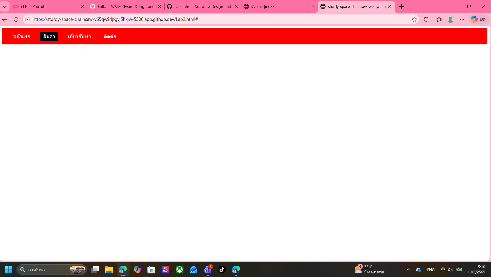
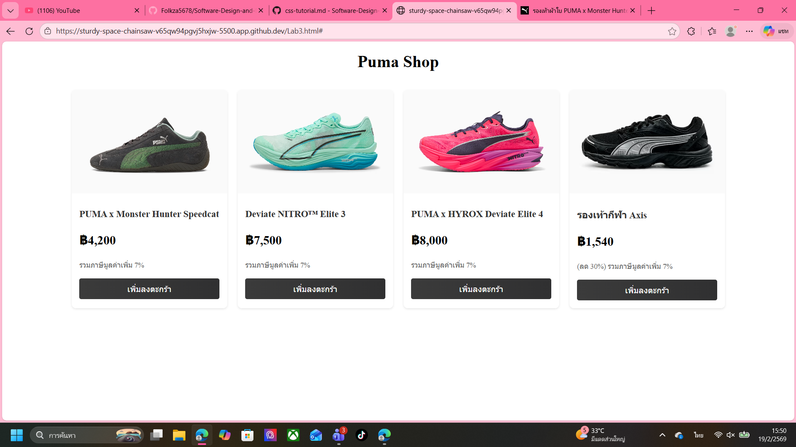
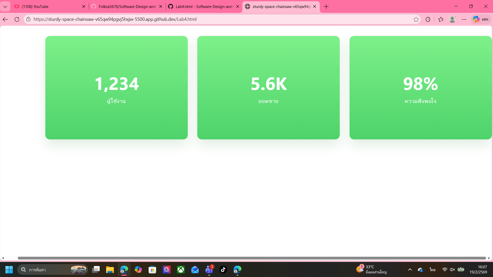
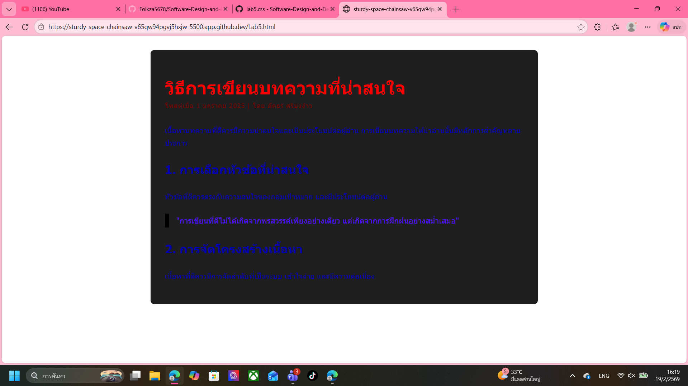
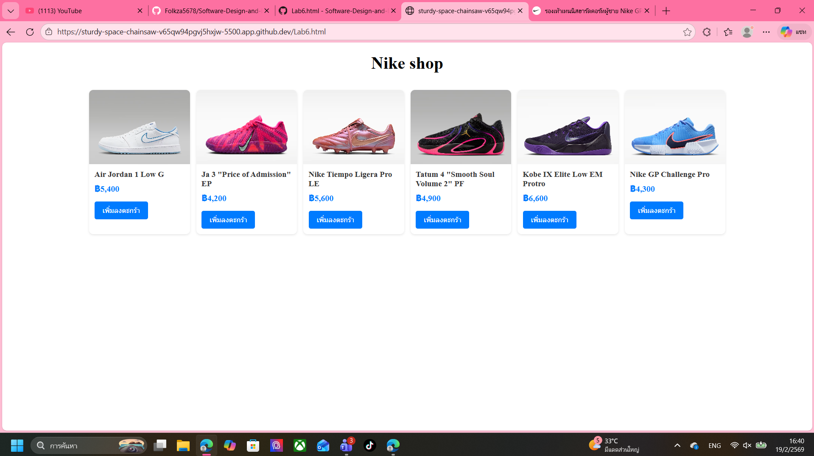

# ใบงานการทดลอง: พื้นฐานการจัดการรูปแบบเว็บไซต์ด้วย CSS
[](#การทดลองที่-1-ทำความรู้จักกับ-css)
## การทดลองที่ 1: ทำความรู้จักกับ CSS

### 1.1 วิธีการใช้งาน CSS
CSS สามารถใช้งานได้ 3 วิธี:

1. **Inline CSS**:
```html
<p style="color: blue; font-size: 16px;">ข้อความสีน้ำเงิน</p>
```

2. **Internal CSS**:
```html
<head>
    <style>
        p {
            color: blue;
            font-size: 16px;
        }
    </style>
</head>
```

3. **External CSS**:
```html
<head>
    <link rel="stylesheet" href="style.css">
</head>
```

### ตัวอย่างการใช้งาน: การสร้างปุ่มสไตล์ต่างๆ

```html
<!-- ไฟล์ index.html -->
<!DOCTYPE html>
<html>
<head>
    <title>ตัวอย่างปุ่ม CSS</title>
    <!-- Internal CSS -->
    <style>
        .btn-primary {
            background-color: #007bff;
            color: white;
            padding: 10px 20px;
            border: none;
            border-radius: 5px;
            cursor: pointer;
        }
    </style>
    <!-- External CSS -->
    <link rel="stylesheet" href="css/buttons.css">
</head>
<body>
    <!-- Inline CSS -->
    <button style="background-color: #dc3545; color: white; padding: 10px 20px;">ปุ่มแบบ Inline</button>
    
    <!-- Internal CSS -->
    <button class="btn-primary">ปุ่มแบบ Internal</button>
    
    <!-- External CSS -->
    <button class="btn-success">ปุ่มแบบ External</button>
</body>
</html>
```

```css
/* สร้างไฟล์ buttons.css ในโฟลเดอร์ css */
.btn-success {
    background-color: #28a745;
    color: white;
    padding: 10px 20px;
    border: none;
    border-radius: 5px;
    cursor: pointer;
}
```
[](#การทดลองที่-2-selectors-ใน-CSS)
## การทดลองที่ 2: Selectors ใน CSS
CSS Selector คือวิธีการระบุหรือเลือกองค์ประกอบ (elements) ที่เราต้องการจัดรูปแบบใน HTML โดยมีประเภทหลัก ๆ ดังนี้:

1. **Element Selector** - เลือกโดยใช้ชื่อ element
```css
p { color: red; }  /* เลือกทุก <p> elements */
h1 { color: blue; }  /* เลือกทุก <h1> elements */
```

2. **Class Selector** - เลือกโดยใช้ชื่อ class (ขึ้นต้นด้วย .)
```css
.menu { color: green; }  /* เลือก elements ที่มี class="menu" */
.highlight { background: yellow; }
```

3. **ID Selector** - เลือกโดยใช้ ID (ขึ้นต้นด้วย #)
```css
#header { background: black; }  /* เลือก element ที่มี id="header" */
#logo { width: 100px; }
```

4. **Descendant Selector** - เลือก elements ที่เป็นลูกหลาน
```css
div p { color: blue; }  /* เลือก <p> ที่อยู่ภายใน <div> */
```

5. **Child Selector** - เลือก elements ที่เป็นลูกโดยตรง (>)
```css
div > p { color: red; }  /* เลือก <p> ที่เป็นลูกโดยตรงของ <div> */
```

6. **Pseudo-class** - เลือกสถานะพิเศษ
```css
a:hover { color: red; }  /* เมื่อเมาส์ชี้ */
input:focus { border: blue; }  /* เมื่อได้รับการโฟกัส */
```

7. **Multiple Selector** - เลือกหลายอย่างพร้อมกัน
```css
h1, h2, h3 { color: purple; }
```

8. **Universal Selector** - เลือกทุก elements (*)
```css
* { margin: 0; padding: 0; }
```

9. **Attribute Selector** - เลือกตาม attribute
```css
input[type="text"] { border: 1px solid gray; }
```

10. **Adjacent Sibling Selector** - เลือกธาตุที่อยู่ถัดไป (+)
```css
h1 + p { margin-top: 20px; }
```

ความสำคัญของ Selector:
- ช่วยให้เราสามารถกำหนดสไตล์ให้กับ elements ที่ต้องการได้อย่างเฉพาะเจาะจง
- ช่วยในการจัดการและบำรุงรักษาโค้ด CSS
- ทำให้สามารถสร้างรูปแบบที่ซับซ้อนได้
- ช่วยลดการเขียนโค้ดซ้ำซ้อน
  
### 2.1 ประเภทของ Selectors
```css
/* Element Selector */
p {
    color: blue;
}

/* Class Selector */
.highlight {
    background-color: yellow;
}

/* ID Selector */
#header {
    font-size: 24px;
}

/* Descendant Selector */
div p {
    margin: 10px;
}

/* Child Selector */
div > p {
    padding: 5px;
}
```

### ตัวอย่างการใช้งาน: การสร้างเมนูนำทาง

```html
<!DOCTYPE html>
<html>
<head>
    <style>
       
    </style>
</head>
<body>
    <nav>
        <ul>
            <li><a href="#" class="menu-item" id="active">หน้าแรก</a></li>
            <li><a href="#" class="menu-item">สินค้า</a></li>
            <li><a href="#" class="menu-item">เกี่ยวกับเรา</a></li>
            <li><a href="#" class="menu-item">ติดต่อ</a></li>
        </ul>
    </nav>
</body>
</html>
```
### แบบฝึกหัด
1. แก้ไขโค้ดโปรแกรมเดิม ให้ใช้งาน CSS แบบ External CSS
2. แก้ไขให้เมนูถูกเลือกที่ สินค้า
3. เปลี่ยนสีพื้นหลังของเมนู

### ผลการทดลอง
```html
<!DOCTYPE html>
<html>
<head>
    <style>
        /* การใช้ Element Selector */
        nav {
            background-color: #ff0000;
            padding: 15px;
        }

        /* การใช้ Descendant Selector */
        nav ul {
            list-style: none;
            margin: 0;
            padding: 0;
            display: flex;
        }

        /* การใช้ Child Selector */
        nav > ul > li {
            margin: 0 10px;
        }

        /* การใช้ Class Selector */
        .menu-item {
            color: white;
            text-decoration: none;
            padding: 5px 10px;
        }

        /* การใช้ Pseudo-class */
        .menu-item:hover {
            background-color: #1c1c1d;
            border-radius: 3px;
        }

        /* การใช้ ID Selector */
        #active {
            background-color: #000000;
            border-radius: 3px;
        }
    </style>
    <link rel="stylesheet" href="css/lab2.css">
</head>
<body>
    <nav>
        <ul>
            <li><a href="#" class="menu-item">หน้าแรก</a></li>
            <li><a href="#" class="menu-item" id="active">สินค้า</a></li>
            <li><a href="#" class="menu-item">เกี่ยวกับเรา</a></li>
            <li><a href="#" class="menu-item">ติดต่อ</a></li>
        </ul>
    </nav>
</body>
</html>
```



[](#การทดลองที่-3-การจัดการสีและพื้นหลัง)
## การทดลองที่ 3: การจัดการสีและพื้นหลัง

### 3.1 การกำหนดสีและพื้นหลัง
```css
/* สีพื้นฐาน */
color: red;
color: #FF0000;
color: rgb(255, 0, 0);
color: rgba(255, 0, 0, 0.5);

/* พื้นหลัง */
background-color: #f0f0f0;
background-image: url('image.jpg');
background-size: cover;
```

### ตัวอย่างการใช้งาน: การสร้างการ์ดสินค้า

```html
<!DOCTYPE html>
<html>
<head>
    <style>
        .product-card {
            width: 300px;
            border-radius: 8px;
            overflow: hidden;
            box-shadow: 0 2px 4px rgba(0,0,0,0.1);
            background-color: white;
        }

        .product-image {
            width: 100%;
            height: 200px;
            background-image: url('product.jpg');
            background-size: cover;
            background-position: center;
        }

        .product-info {
            padding: 15px;
        }

        .product-title {
            color: #333;
            font-size: 18px;
            margin-bottom: 10px;
        }

        .product-price {
            color: #007bff;
            font-size: 24px;
            font-weight: bold;
        }

        .product-description {
            color: #666;
            font-size: 14px;
            line-height: 1.5;
        }

        .product-button {
            display: block;
            background: linear-gradient(to right, #007bff, #0056b3);
            color: white;
            text-align: center;
            padding: 10px;
            text-decoration: none;
            margin-top: 15px;
            border-radius: 4px;
        }

        .product-button:hover {
            background: linear-gradient(to right, #0056b3, #003980);
        }
    </style>
</head>
<body>
    <div class="product-card">
        <div class="product-image"></div>
        <div class="product-info">
            <h2 class="product-title">สินค้าตัวอย่าง</h2>
            <p class="product-price">฿1,999</p>
            <p class="product-description">
                รายละเอียดสินค้าตัวอย่าง ที่มีความน่าสนใจและน่าใช้งาน
            </p>
            <a href="#" class="product-button">เพิ่มลงตะกร้า</a>
        </div>
    </div>
</body>
</html>
```

### แบบฝึกหัด
1. แก้ไขโค้ดโปรแกรมเดิม ให้ใช้งาน CSS แบบ External CSS
2. แก้ไขให้แสดงรูปสินค้า โดยให้รูปสินค้าเก็บอยู่ในโฟลเดอร์ images
3. เพิ่มเติมให้มี card แสดงข้อมูลสินค้า 4 รูป

### ผลการทดลอง
```html
<!DOCTYPE html>
<html>
<head>
    <style>
    </style>
    <link rel="stylesheet" href="css/lab3.css">
</head>
<body>
    <h1>Puma Shop</h1>
    <div class="product-list">
        <div class="product-card">
            <div class="product-image" style="background-image: url('images/puma4.png');"></div>
            <div class="product-info">
                <h2 class="product-title"> PUMA x Monster Hunter Speedcat</h2>
                <p class="product-price">฿4,200</p>
                <p class="product-description">
                    รวมภาษีมูลค่าเพิ่ม 7%
                </p>
                <a href="#" class="product-button">เพิ่มลงตะกร้า</a>
            </div>
        </div>
        <div class="product-card">
            <div class="product-image" style="background-image: url('images/puma3.png');"></div>
            <div class="product-info">
                <h2 class="product-title">Deviate NITRO™ Elite 3</h2>
                <p class="product-price">฿7,500</p>
                <p class="product-description">
                    รวมภาษีมูลค่าเพิ่ม 7%
                </p>
                <a href="#" class="product-button">เพิ่มลงตะกร้า</a>
            </div>
        </div>
        <div class="product-card">
            <div class="product-image" style="background-image: url('images/puma2.png');"></div>
            <div class="product-info">
                <h2 class="product-title">PUMA x HYROX Deviate Elite 4</h2>
                <p class="product-price">฿8,000</p>
                <p class="product-description"> รวมภาษีมูลค่าเพิ่ม 7%
                </p>
                <a href="#" class="product-button">เพิ่มลงตะกร้า</a>
            </div>
        </div>
        <div class="product-card">
            <div class="product-image" style="background-image: url('images/puma1.png');"></div>
            <div class="product-info">
                <h2 class="product-title">รองเท้ากีฬา Axis</h2>
                <p class="product-price">฿1,540</p>
                <p class="product-description">
                    (ลด 30%) รวมภาษีมูลค่าเพิ่ม 7%
                </p>
                <a href="#" class="product-button">เพิ่มลงตะกร้า</a>
            </div>
        </div>
    </div>
</body>
</html>
```
[บันทึกภาพหน้าจอของผลลัพธ์การทดลอง]


[](#การทดลองที่-4-การจัดการขนาดและระยะห่าง)
## การทดลองที่ 4: การจัดการขนาดและระยะห่าง

### 4.1 หน่วยวัดและ Box Model
```css
/* หน่วยวัด */
width: 100px;
width: 50%;
font-size: 1.2rem;
height: 100vh;

/* Box Model */
padding: 10px;
margin: 15px;
border: 1px solid black;
```

### ตัวอย่างการใช้งาน: การสร้างส่วนแสดงสถิติ

```html
<!DOCTYPE html>
<html>
<head>
    <style>
        .stats-container {
            display: flex;
            justify-content: space-around;
            max-width: 1200px;
            margin: 2rem auto;
            padding: 0 1rem;
        }

        .stat-box {
            flex: 1;
            margin: 0 15px;
            padding: 2rem;
            text-align: center;
            background-color: white;
            border-radius: 8px;
            box-shadow: 0 2px 4px rgba(0,0,0,0.1);
        }

        .stat-number {
            font-size: 2.5rem;
            font-weight: bold;
            color: #007bff;
            margin-bottom: 0.5rem;
        }

        .stat-label {
            font-size: 1rem;
            color: #666;
            text-transform: uppercase;
            letter-spacing: 1px;
        }

        /* Responsive Design */
        @media (max-width: 768px) {
            .stats-container {
                flex-direction: column;
            }

            .stat-box {
                margin: 1rem 0;
            }
        }
    </style>
</head>
<body>
    <div class="stats-container">
        <div class="stat-box">
            <div class="stat-number">1,234</div>
            <div class="stat-label">ผู้ใช้งาน</div>
        </div>
        <div class="stat-box">
            <div class="stat-number">5.6K</div>
            <div class="stat-label">ยอดขาย</div>
        </div>
        <div class="stat-box">
            <div class="stat-number">98%</div>
            <div class="stat-label">ความพึงพอใจ</div>
        </div>
    </div>
</body>
</html>
```

### แบบฝึกหัด
1. แก้ไขโค้ดโปรแกรมเดิม ให้ใช้งาน CSS แบบ External CSS
2. ปรับแต่ง ขนาดต่าง ๆ ของ Box model, ขนาดและฟอนต์ตัวหนังสือ, สี


### ผลการทดลอง
```html
<!DOCTYPE html>
<html>
<head>
    <style>
        
    </style>
    <link rel="stylesheet" href="css/lab4.css">
</head>
<body>
    <div class="stats-container">
        <div class="stat-box">
            <div class="stat-number">1,234</div>
            <div class="stat-label">ผู้ใช้งาน</div>
        </div>
        <div class="stat-box">
            <div class="stat-number">5.6K</div>
            <div class="stat-label">ยอดขาย</div>
        </div>
        <div class="stat-box">
            <div class="stat-number">98%</div>
            <div class="stat-label">ความพึงพอใจ</div>
        </div>
    </div>
</body>
</html>
```
```css
body {
  font-family: 'Inter', system-ui, -apple-system, 'Segoe UI', Roboto, Arial, sans-serif;
}
.stats-container {
            display: flex;
            justify-content: space-around;
            max-width: 1200px;
            margin: 2rem auto;
            padding: 0 1rem;
        }

     .stat-box {
    flex: 1 1 420px;
    min-width: 340px;
    margin: 0 15px;
    padding: 3.2rem;
    text-align: center;
    background: linear-gradient(180deg, #7ef08a 0%, #4ed36a 100%);
    color: #072b12;
    border-radius: 14px;
    box-shadow: 0 18px 36px rgba(46, 125, 50, 0.14);
    display:flex;
    flex-direction:column;
    justify-content:center;
    align-items:center;
    min-height: 220px;
    transition: transform .16s ease, box-shadow .16s ease;
}
.stat-box:hover {
    transform: translateY(-10px);
    box-shadow: 0 28px 60px rgba(46,125,50,0.18);
}


        .stat-number {
            font-size: 3.4rem;
            font-weight: 800;
            color: #ffffff;
            margin-bottom: 0.5rem;
        }

        .stat-label {
            font-size: 1.1rem;
            color: rgba(255,255,255,0.95);
            text-transform: uppercase;
            letter-spacing: 1px;
        }
        @media (max-width: 768px) {
            .stats-container {
                flex-direction: column;
                gap: 12px;
                padding: 0 1rem;
            }

            .stat-box {
                margin: 0;
                min-width: auto;
                width: 100%;
                flex: none;
                padding: 1.25rem 1rem;
                min-height: 140px;
            }
            .stat-number { font-size: 2rem; }
            .stat-label { font-size: 0.95rem; }
        }
```
[บันทึกภาพหน้าจอของผลลัพธ์การทดลอง]


[](#การทดลองที่-5-การจัดการข้อความและฟอนต์)
## การทดลองที่ 5: การจัดการข้อความและฟอนต์

### 5.1 การจัดการข้อความและฟอนต์
```css
/* การจัดการข้อความ */
text-align: center;
text-decoration: none;
text-transform: uppercase;
line-height: 1.5;

/* การจัดการฟอนต์ */
font-family: 'Arial', sans-serif;
font-size: 16px;
font-weight: bold;
```

### ตัวอย่างการใช้งาน: การสร้างบทความบล็อก

```html
<!DOCTYPE html>
<html>
<head>
    <style>
        .blog-post {
            max-width: 800px;
            margin: 2rem auto;
            padding: 0 1rem;
            font-family: 'Sarabun', sans-serif;
        }

        .post-header {
            text-align: center;
            margin-bottom: 2rem;
        }

        .post-title {
            font-size: 2.5rem;
            color: #333;
            margin-bottom: 0.5rem;
            line-height: 1.2;
        }

        .post-meta {
            color: #666;
            font-size: 0.9rem;
            text-transform: uppercase;
            letter-spacing: 1px;
        }

        .post-content {
            font-size: 1.1rem;
            line-height: 1.8;
            color: #444;
        }

        .post-content p {
            margin-bottom: 1.5rem;
        }

        .post-content h2 {
            font-size: 1.8rem;
            color: #333;
            margin: 2rem 0 1rem;
        }

        blockquote {
            font-style: italic;
            border-left: 4px solid #007bff;
            margin: 1.5rem 0;
            padding-left: 1rem;
            color: #555;
        }

        @media (max-width: 768px) {
            .post-title {
                font-size: 2rem;
            }
        }
    </style>
</head>
<body>
    <article class="blog-post">
        <header class="post-header">
            <h1 class="post-title">วิธีการเขียนบทความที่น่าสนใจ</h1>
            <div class="post-meta">โพสต์เมื่อ 1 มกราคม 2025 | โดย ผู้เขียน</div>
        </header>
        
        <div class="post-content">
            <p>เนื้อหาบทความที่ดีควรมีความน่าสนใจและเป็นประโยชน์ต่อผู้อ่าน การเขียนบทความให้น่าอ่านนั้นมีหลักการสำคัญหลายประการ</p>

            <h2>1. การเลือกหัวข้อที่น่าสนใจ</h2>
            <p>หัวข้อที่ดีควรตรงกับความสนใจของกลุ่มเป้าหมาย และมีประโยชน์ต่อผู้อ่าน</p>

            <blockquote>
                "การเขียนที่ดีไม่ได้เกิดจากพรสวรรค์เพียงอย่างเดียว แต่เกิดจากการฝึกฝนอย่างสม่ำเสมอ"
            </blockquote>

            <h2>2. การจัดโครงสร้างเนื้อหา</h2>
            <p>เนื้อหาที่ดีควรมีการจัดลำดับที่เป็นระบบ เข้าใจง่าย และมีความต่อเนื่อง</p>
        </div>
    </article>
</body>
</html>
```
### แบบฝึกหัด
1. แก้ไขโค้ดโปรแกรมเดิม ให้ใช้งาน CSS แบบ External CSS
2. ปรับแต่งรูปแบบ สีและขนาด font

### ผลการทดลอง
```html
<!DOCTYPE html>
<html>
<head>
    <style>
    </style>
    <link rel="stylesheet" href="css/lab5.css">
</head>
<body>
    <article class="blog-post">
        <header class="post-header">
            <h1 class="post-title">วิธีการเขียนบทความที่น่าสนใจ</h1>
            <div class="post-meta">โพสต์เมื่อ 1 มกราคม 2025 | โดย ภัคธร ศรีบุ่งง้าว</div>
        </header>
        
        <div class="post-content">
            <p>เนื้อหาบทความที่ดีควรมีความน่าสนใจและเป็นประโยชน์ต่อผู้อ่าน การเขียนบทความให้น่าอ่านนั้นมีหลักการสำคัญหลายประการ</p>

            <h2>1. การเลือกหัวข้อที่น่าสนใจ</h2>
            <p>หัวข้อที่ดีควรตรงกับความสนใจของกลุ่มเป้าหมาย และมีประโยชน์ต่อผู้อ่าน</p>

            <blockquote>
                "การเขียนที่ดีไม่ได้เกิดจากพรสวรรค์เพียงอย่างเดียว แต่เกิดจากการฝึกฝนอย่างสม่ำเสมอ"
            </blockquote>

            <h2>2. การจัดโครงสร้างเนื้อหา</h2>
            <p>เนื้อหาที่ดีควรมีการจัดลำดับที่เป็นระบบ เข้าใจง่าย และมีความต่อเนื่อง</p>
        </div>
    </article>
</body>
</html>
```
```css
.blog-post {
            max-width: 800px;
            margin: 2rem auto;
            padding: 2rem;
            font-family: 'Sarabun', sans-serif;
            background-color: #1f1f1f;
            border-radius: 8px;
        }

        .post-header {
            text-align: left;
            margin-bottom: 2rem;
        }

        .post-title {
            font-size: 2.5rem;
            color: #fd0000;
            margin-bottom: 0.5rem;
            line-height: 1.2;
        }

        .post-meta {
            color: #790000;
            font-size: 0.9rem;
            text-transform: uppercase;
            letter-spacing: 1px;
        }

        .post-content {
            font-size: 1.1rem;
            line-height: 1.8;
            color: #0300b0;
        }

       h1, h2, .heading {
  font-family: 'Kanit', 'Mitr', sans-serif;
  font-weight: 700;
}

p, .content {
  font-family: 'Sarabun', 'Noto Sans Thai', sans-serif;
  font-weight: 400;
  font-size: 1.05rem;
  line-height: 1.7;
}

        blockquote {
            font-family: 'Sarabun', 'Noto Sans Thai', sans-serif;
            border-left: 10px solid #000000;
            margin: 1.5rem 0;
            padding-left: 1rem;
            color: #570ffd;
        }

        @media (max-width: 768px) {
            .post-title {
                font-size: 2rem;
            }
        }
```
[บันทึกภาพหน้าจอของผลลัพธ์การทดลอง]

[](#การทดลองที่-6-Layout-และการจัดวางอิลิเมนต์)
## การทดลองที่ 6: Layout และการจัดวางอิลิเมนต์

### 6.1 การจัดวางด้วย Flexbox และ Grid

```css
/* Flexbox */
.container {
    display: flex;
    justify-content: space-between;
    align-items: center;
}

/* Grid */
.grid-container {
    display: grid;
    grid-template-columns: repeat(3, 1fr);
    gap: 20px;
}
```

### ตัวอย่างการใช้งาน: การสร้างหน้าแสดงสินค้าแบบ Grid

```html
<!DOCTYPE html>
<html>
<head>
    <style>
        .product-grid {
            display: grid;
            grid-template-columns: repeat(auto-fill, minmax(250px, 1fr));
            gap: 20px;
            padding: 20px;
            max-width: 1200px;
            margin: 0 auto;
        }

        .product-card {
            background: white;
            border-radius: 8px;
            overflow: hidden;
            box-shadow: 0 2px 4px rgba(0,0,0,0.1);
            transition: transform 0.3s ease;
        }

        .product-card:hover {
            transform: translateY(-5px);
        }

        .product-image {
            width: 100%;
            height: 200px;
            background-color: #f5f5f5;
            background-size: cover;
            background-position: center;
        }

        .product-details {
            padding: 15px;
        }

        .product-title {
            font-size: 1.1rem;
            margin: 0 0 10px 0;
            color: #333;
        }

        .product-price {
            font-size: 1.2rem;
            color: #007bff;
            font-weight: bold;
        }

        .product-action {
            display: flex;
            justify-content: space-between;
            align-items: center;
            margin-top: 15px;
        }

        .add-to-cart {
            background-color: #007bff;
            color: white;
            border: none;
            padding: 8px 15px;
            border-radius: 4px;
            cursor: pointer;
        }

        .add-to-cart:hover {
            background-color: #0056b3;
        }

        @media (max-width: 768px) {
            .product-grid {
                grid-template-columns: repeat(auto-fill, minmax(200px, 1fr));
            }
        }
    </style>
</head>
<body>
    <div class="product-grid">
        <!-- สินค้าชิ้นที่ 1 -->
        <div class="product-card">
            <div class="product-image" style="background-image: url('product1.jpg')"></div>
            <div class="product-details">
                <h3 class="product-title">สินค้าตัวอย่างที่ 1</h3>
                <div class="product-price">฿1,299</div>
                <div class="product-action">
                    <button class="add-to-cart">เพิ่มลงตะกร้า</button>
                </div>
            </div>
        </div>

        <!-- สินค้าชิ้นที่ 2 -->
        <div class="product-card">
            <div class="product-image" style="background-image: url('product2.jpg')"></div>
            <div class="product-details">
                <h3 class="product-title">สินค้าตัวอย่างที่ 2</h3>
                <div class="product-price">฿1,499</div>
                <div class="product-action">
                    <button class="add-to-cart">เพิ่มลงตะกร้า</button>
                </div>
            </div>
        </div>

        <!-- เพิ่มสินค้าอื่นๆ ตามต้องการ -->
    </div>
</body>
</html>
```

### แบบฝึกหัด
1. แก้ไขโค้ดโปรแกรมเดิม ให้ใช้งาน CSS แบบ External CSS
2. ปรับแต่งขนาดแสดงผลสินค้าให้เล็กลง
3. เพ่ิมรูปภาพของสินค้า


### ผลการทดลอง
```html
<!DOCTYPE html>
<html>
<head>
    <style>
        
    </style>
    <link rel="stylesheet" href="css/lab6.css">
</head>
<body>
    <h1>Nike shop</h1>
    <div class="product-grid">
        <!-- สินค้าชิ้นที่ 1 -->
        <div class="product-card">
            <div class="product-image" style="background-image: url('images/nike1.png');"></div>
            <div class="product-details">
                <h3 class="product-title">Air Jordan 1 Low G</h3>
                <div class="product-price">฿5,400</div>
                <div class="product-action">
                    <button class="add-to-cart">เพิ่มลงตะกร้า</button>
                </div>
            </div>
        </div>

        <!-- สินค้าชิ้นที่ 2 -->
        <div class="product-card">
            <div class="product-image" style="background-image: url('images/nike2.png');"></div>
            <div class="product-details">
                <h3 class="product-title">Ja 3 "Price of Admission" EP</h3>
                <div class="product-price">฿4,200</div>
                <div class="product-action">
                    <button class="add-to-cart">เพิ่มลงตะกร้า</button>
                </div>
            </div>
        </div>

         <div class="product-card">
            <div class="product-image" style="background-image: url('images/nike3.png');"></div>
            <div class="product-details">
                <h3 class="product-title">Nike Tiempo Ligera Pro LE</h3>
                <div class="product-price">฿5,600</div>
                <div class="product-action">
                    <button class="add-to-cart">เพิ่มลงตะกร้า</button>
                </div>
            </div>
        </div>

         <div class="product-card">
            <div class="product-image" style="background-image: url('images/nike4.png');"></div>
            <div class="product-details">
                <h3 class="product-title">Tatum 4 "Smooth Soul Volume 2" PF</h3>
                <div class="product-price">฿4,900</div>
                <div class="product-action">
                    <button class="add-to-cart">เพิ่มลงตะกร้า</button>
                </div>
            </div>
        </div>

         <div class="product-card">
            <div class="product-image" style="background-image: url('images/nike5.png');"></div>
            <div class="product-details">
                <h3 class="product-title">Kobe IX Elite Low EM Protro</h3>
                <div class="product-price">฿6,600</div>
                <div class="product-action">
                    <button class="add-to-cart">เพิ่มลงตะกร้า</button>
                </div>
            </div>
        </div>

         <div class="product-card">
            <div class="product-image" style="background-image: url('images/nike6.png');"></div>
            <div class="product-details">
                <h3 class="product-title">Nike GP Challenge Pro</h3>
                <div class="product-price">฿4,300</div>
                <div class="product-action">
                    <button class="add-to-cart">เพิ่มลงตะกร้า</button>
                </div>
            </div>
        </div>
    </div>
</body>
</html>
```
```css
.product-grid {
            display: grid;
            grid-template-columns: repeat(auto-fill, minmax(180px, 1fr));
            gap: 12px;
            padding: 12px;
            max-width: 1200px;
            margin: 0 auto;
        }

             h1 {
            text-align: center;
            margin: 20px 0;
        }
        .product-card {
            background: white;
            border-radius: 8px;
            overflow: hidden;
            box-shadow: 0 2px 4px rgba(0,0,0,0.1);
            transition: transform 0.3s ease;
        }

        .product-card:hover {
            transform: translateY(-5px);
        }

        .product-image {
            width: 100%;
            height: 140px;
            background-color: #f5f5f5;
            background-size: cover;
            background-position: center;
        }

        .product-details {
            padding: 10px;
        }

        .product-title {
            font-size: 0.95rem;
            margin: 0 0 8px 0;
            color: #333;
        }

        .product-price {
            font-size: 1rem;
            color: #007bff;
            font-weight: bold;
        }

        .product-action {
            display: flex;
            justify-content: space-between;
            align-items: center;
            margin-top: 15px;
        }

        .add-to-cart {
            background-color: #007bff;
            color: white;
            border: none;
            padding: 8px 15px;
            border-radius: 4px;
            cursor: pointer;
        }

        .add-to-cart:hover {
            background-color: #0056b3;
        }

        @media (max-width: 768px) {
            .product-grid {
                grid-template-columns: repeat(auto-fill, minmax(150px, 1fr));
                gap: 10px;
                padding: 10px;
            }
        }
```
[บันทึกภาพหน้าจอของผลลัพธ์การทดลอง]


### ตัวอย่างการใช้งาน: การสร้างเลย์เอาต์ Modern Dashboard

```html
<!DOCTYPE html>
<html>
<head>
    <style>
        .dashboard {
            display: grid;
            grid-template-areas: 
                "sidebar header"
                "sidebar main";
            grid-template-columns: 250px 1fr;
            grid-template-rows: auto 1fr;
            min-height: 100vh;
        }

        .header {
            grid-area: header;
            background: white;
            padding: 1rem;
            box-shadow: 0 2px 4px rgba(0,0,0,0.1);
            display: flex;
            justify-content: space-between;
            align-items: center;
        }

        .sidebar {
            grid-area: sidebar;
            background: #2c3e50;
            color: white;
            padding: 1rem;
        }

        .main-content {
            grid-area: main;
            padding: 1rem;
            background: #f5f7fa;
        }

        .stats-grid {
            display: grid;
            grid-template-columns: repeat(auto-fit, minmax(250px, 1fr));
            gap: 1rem;
            margin-bottom: 2rem;
        }

        .stat-card {
            background: white;
            padding: 1.5rem;
            border-radius: 8px;
            box-shadow: 0 2px 4px rgba(0,0,0,0.1);
        }

        .chart-container {
            display: grid;
            grid-template-columns: 2fr 1fr;
            gap: 1rem;
        }

        .chart {
            background: white;
            padding: 1.5rem;
            border-radius: 8px;
            box-shadow: 0 2px 4px rgba(0,0,0,0.1);
        }

        @media (max-width: 768px) {
            .dashboard {
                grid-template-areas: 
                    "header"
                    "main";
                grid-template-columns: 1fr;
            }

            .sidebar {
                display: none;
            }

            .chart-container {
                grid-template-columns: 1fr;
            }
        }
    </style>
</head>
<body>
    <div class="dashboard">
        <header class="header">
            <h1>แดชบอร์ด</h1>
            <nav>
                <button>โปรไฟล์</button>
                <button>ออกจากระบบ</button>
            </nav>
        </header>

        <aside class="sidebar">
            <nav>
                <ul>
                    <li>หน้าแรก</li>
                    <li>รายงาน</li>
                    <li>การตั้งค่า</li>
                </ul>
            </nav>
        </aside>

        <main class="main-content">
            <div class="stats-grid">
                <div class="stat-card">
                    <h3>ยอดขายรวม</h3>
                    <p>฿150,000</p>
                </div>
                <div class="stat-card">
                    <h3>จำนวนออเดอร์</h3>
                    <p>1,234</p>
                </div>
                <div class="stat-card">
                    <h3>ลูกค้าใหม่</h3>
                    <p>45</p>
                </div>
            </div>

            <div class="chart-container">
                <div class="chart">
                    <h3>กราฟแสดงยอดขาย</h3>
                    <!-- เพิ่มกราฟตามต้องการ -->
                </div>
                <div class="chart">
                    <h3>สัดส่วนสินค้าขายดี</h3>
                    <!-- เพิ่มกราฟตามต้องการ -->
                </div>
            </div>
        </main>
    </div>
</body>
</html>
```

### แบบฝึกหัด
1. แก้ไขโค้ดโปรแกรมเดิม ให้ใช้งาน CSS แบบ External CSS
2. ปรับแต่งการแสดงผลต่าง ๆ ให้สวยงาม


### ผลการทดลอง
```html
<!DOCTYPE html>
<html>
<head>
    <meta charset="UTF-8">
    <title>แดชบอร์ด</title>
    <link rel="stylesheet" href="css/lab7.css">
</head>
<body>
    <div class="dashboard">
        <header class="header">
            <h1>แดชบอร์ด</h1>
            <nav>
                <button>โปรไฟล์</button>
                <button>ออกจากระบบ</button>
            </nav>
        </header>

        <aside class="sidebar">
            <nav>
                <ul>
                    <li>หน้าแรก</li>
                    <li>รายงาน</li>
                    <li>การตั้งค่า</li>
                </ul>
            </nav>
        </aside>

        <main class="main-content">
            <div class="stats-grid">
                <div class="stat-card">
                    <h3>ยอดขายรวม</h3>
                    <p>฿150,000</p>
                </div>
                <div class="stat-card">
                    <h3>จำนวนออเดอร์</h3>
                    <p>1,234</p>
                </div>
                <div class="stat-card">
                    <h3>ลูกค้าใหม่</h3>
                    <p>45</p>
                </div>
            </div>

            <div class="chart-container">
                <div class="chart">
                    <h3>กราฟแสดงยอดขาย</h3>
                    <canvas id="salesChart"></canvas>
                </div>
                <div class="chart">
                    <h3>สัดส่วนสินค้าขายดี</h3>
                    <canvas id="productsChart"></canvas>
                </div>
            </div>
        </main>
    </div>

    <script src="https://cdn.jsdelivr.net/npm/chart.js"></script>
    <script>
        // sample sales line chart
        const ctx1 = document.getElementById('salesChart').getContext('2d');
        new Chart(ctx1, {
            type: 'line',
            data: {
                labels: ['ม.ค.','ก.พ.','มี.ค.','เม.ย.','พ.ค.','มิ.ย.'],
                datasets: [{
                    label: 'ยอดขาย',
                    data: [12000,15000,14000,16000,17000,18000],
                    backgroundColor: 'rgba(52,152,219,0.2)',
                    borderColor: '#3498db',
                    borderWidth: 2
                }]
            },
            options: { responsive: true }
        });


        const ctx2 = document.getElementById('productsChart').getContext('2d');
        new Chart(ctx2, {
            type: 'doughnut',
            data: {
                labels: ['สินค้า A','สินค้า B','สินค้า C'],
                datasets: [{
                    data: [55,25,20],
                    backgroundColor: ['#3498db','#2ecc71','#e74c3c']
                }]
            },
            options: { responsive: true }
        });
    </script>
</body>
</html>
```
```css
        .dashboard {
            display: grid;
            grid-template-areas: 
                "sidebar header"
                "sidebar main";
            grid-template-columns: 250px 1fr;
            grid-template-rows: auto 1fr;
            min-height: 100vh;
        }

        .header {
            grid-area: header;
            background: linear-gradient(90deg, #2c3e50 0%, #34495e 100%);
            padding: 1rem 1.5rem;
            box-shadow: 0 4px 12px rgba(0,0,0,0.15);
            display: flex;
            justify-content: space-between;
            align-items: center;
            color: white;
        }
        .header h1 { margin: 0; font-size: 1.5rem; font-weight: 700; }

        .header button {
            background: #3498db;
            border: none;
            color: white;
            padding: 0.5rem 1rem;
            border-radius: 4px;
            cursor: pointer;
            font-size: 0.9rem;
            transition: background .2s ease;
        }
        .header button:hover { background: #2980b9; }

        .sidebar {
            grid-area: sidebar;
            background: linear-gradient(180deg, #2c3e50 0%, #1a252f 100%);
            color: white;
            padding: 1.5rem 1rem;
        }
        .sidebar h3 { margin-top: 0; font-size: 0.9rem; color: #bdc3c7; text-transform: uppercase; letter-spacing: 1px; }
        .sidebar ul { list-style: none; padding: 0; margin: 1rem 0; }
        .sidebar li { margin: 0.5rem 0; }
        .sidebar a { color: #ecf0f1; text-decoration: none; display: block; padding: 0.75rem 0.5rem; border-radius: 4px; transition: all .2s ease; }
        .sidebar a:hover { background: rgba(255,255,255,0.1); color: #3498db; font-weight: 600; }

        .main-content {
            grid-area: main;
            padding: 2rem;
            background: linear-gradient(135deg, #f5f7fa 0%, #ecf0f1 100%);
        }

        .stats-grid {
            display: grid;
            grid-template-columns: repeat(auto-fit, minmax(250px, 1fr));
            gap: 1.5rem;
            margin-bottom: 2rem;
        }

        .stat-card {
            background: white;
            padding: 1.75rem;
            border-radius: 12px;
            box-shadow: 0 6px 20px rgba(0,0,0,0.08);
            border-left: 4px solid #3498db;
            transition: all .3s ease;
        }
        .stat-card:hover { transform: translateY(-6px); box-shadow: 0 12px 30px rgba(0,0,0,0.12); }
        .stat-card h3 { margin: 0 0 0.5rem 0; font-size: 0.9rem; color: #7f8c8d; text-transform: uppercase; letter-spacing: 0.5px; }
        .stat-card .value { font-size: 2rem; font-weight: 700; color: #2c3e50; }

        .chart-container {
            display: grid;
            grid-template-columns: 2fr 1fr;
            gap: 1.5rem;
        }

        .chart {
            background: white;
            padding: 2rem;
            border-radius: 12px;
            box-shadow: 0 6px 20px rgba(0,0,0,0.08);
            transition: all .3s ease;
        }
        .chart:hover { box-shadow: 0 10px 30px rgba(0,0,0,0.12); }
        .chart h2 { margin-top: 0; font-size: 1.2rem; color: #2c3e50; font-weight: 700; }
        .chart canvas {
            width: 100% !important;
            height: 300px !important;
        }

        @media (max-width: 768px) {
            .dashboard {
                grid-template-areas: 
                    "header"
                    "main";
                grid-template-columns: 1fr;
            }

            .sidebar {
                display: none;
            }

            .chart-container {
                grid-template-columns: 1fr;
            }
        }
```
[บันทึกภาพหน้าจอของผลลัพธ์การทดลอง]


