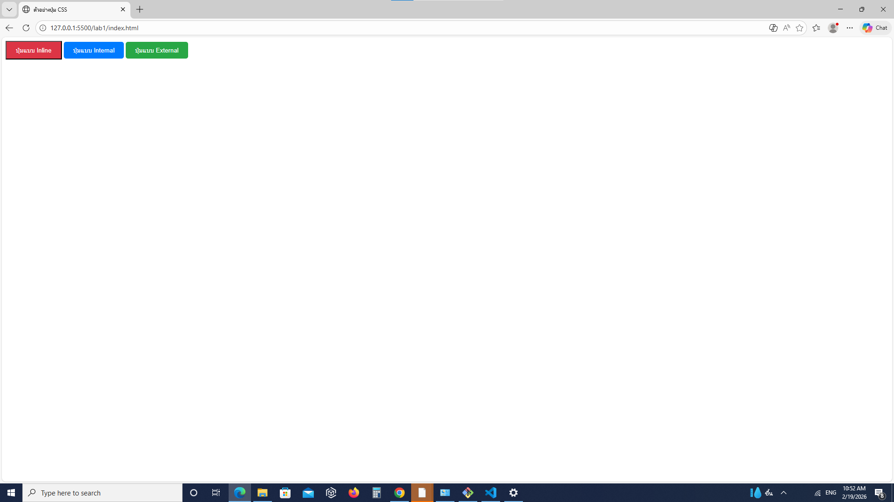
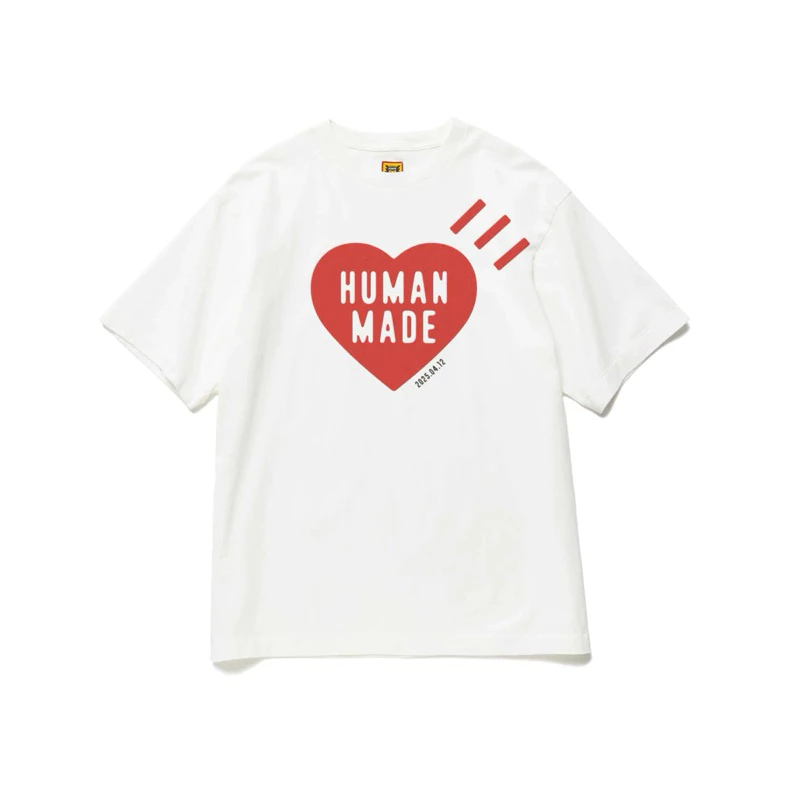
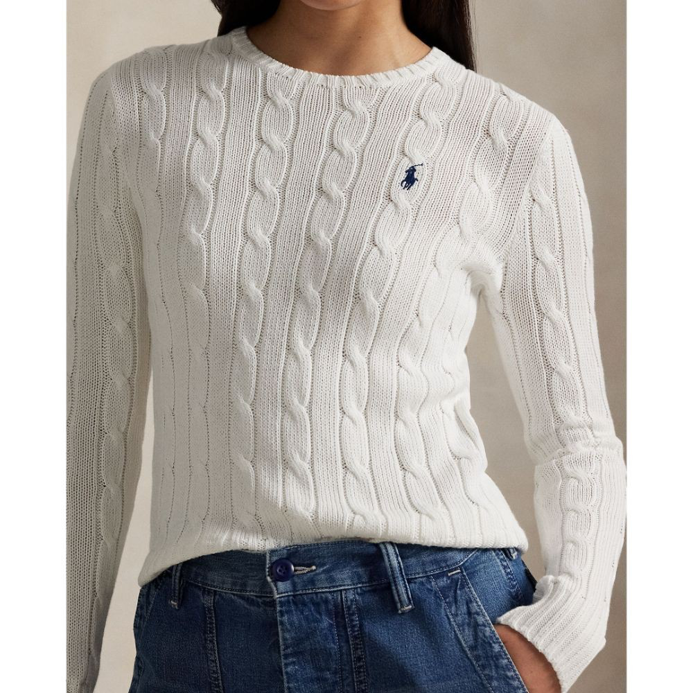
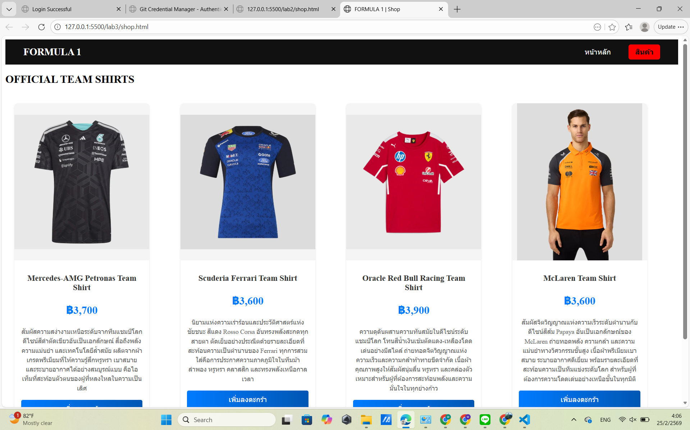
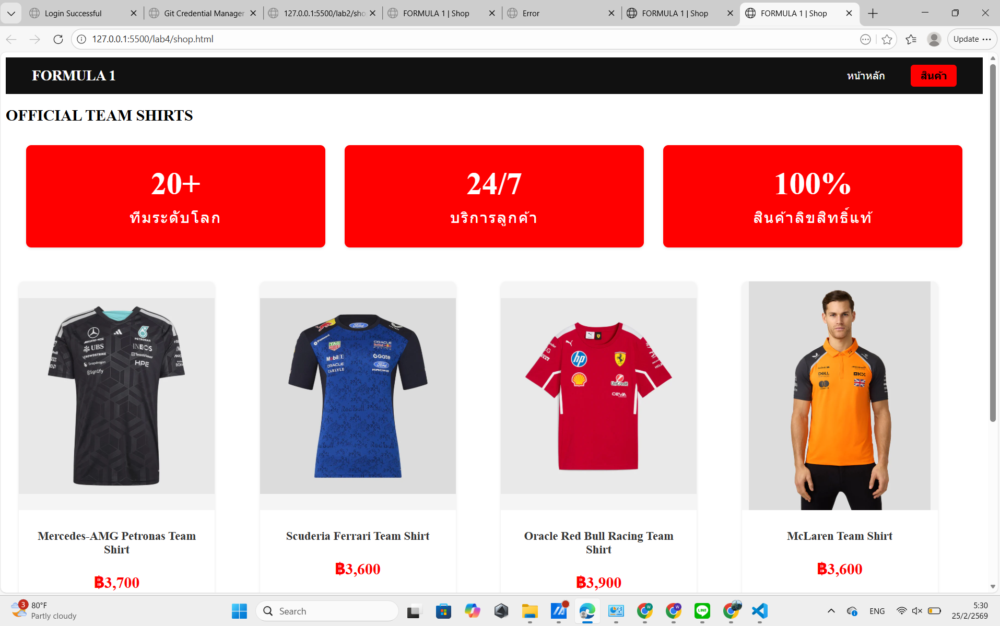
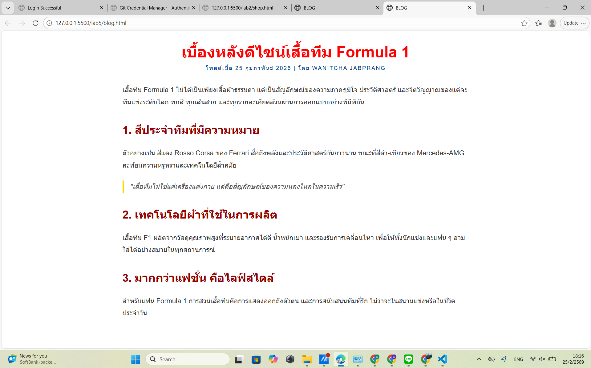

# ใบงานการทดลอง: พื้นฐานการจัดการรูปแบบเว็บไซต์ด้วย CSS
[](#การทดลองที่-1-ทำความรู้จักกับ-css)
## การทดลองที่ 1: ทำความรู้จักกับ CSS

### 1.1 วิธีการใช้งาน CSS
CSS สามารถใช้งานได้ 3 วิธี:

1. **Inline CSS**:
```html
<p style="color: blue; font-size: 16px;">ข้อความสีน้ำเงิน</p>
```

2. **Internal CSS**:
```html
<head>
    <style>
        p {
            color: blue;
            font-size: 16px;
        }
    </style>
</head>
```

3. **External CSS**:
```html
<head>
    <link rel="stylesheet" href="style.css">
</head>
```

### ตัวอย่างการใช้งาน: การสร้างปุ่มสไตล์ต่างๆ

```html
<!-- ไฟล์ index.html -->
<!DOCTYPE html>
<html>
<head>
    <title>ตัวอย่างปุ่ม CSS</title>
    <!-- Internal CSS -->
    <style>
        .btn-primary {
            background-color: #007bff;
            color: white;
            padding: 10px 20px;
            border: none;
            border-radius: 5px;
            cursor: pointer;
        }
    </style>
    <!-- External CSS -->
    <link rel="stylesheet" href="css/buttons.css">
</head>
<body>
    <!-- Inline CSS -->
    <button style="background-color: #dc3545; color: white; padding: 10px 20px;">ปุ่มแบบ Inline</button>
    
    <!-- Internal CSS -->
    <button class="btn-primary">ปุ่มแบบ Internal</button>
    
    <!-- External CSS -->
    <button class="btn-success">ปุ่มแบบ External</button>
</body>
</html>
```

```css
/* สร้างไฟล์ buttons.css ในโฟลเดอร์ css */
.btn-success {
    background-color: #28a745;
    color: white;
    padding: 10px 20px;
    border: none;
    border-radius: 5px;
    cursor: pointer;
}
```


[](#การทดลองที่-2-selectors-ใน-CSS)
## การทดลองที่ 2: Selectors ใน CSS
CSS Selector คือวิธีการระบุหรือเลือกองค์ประกอบ (elements) ที่เราต้องการจัดรูปแบบใน HTML โดยมีประเภทหลัก ๆ ดังนี้:

1. **Element Selector** - เลือกโดยใช้ชื่อ element
```css
p { color: red; }  /* เลือกทุก <p> elements */
h1 { color: blue; }  /* เลือกทุก <h1> elements */
```

2. **Class Selector** - เลือกโดยใช้ชื่อ class (ขึ้นต้นด้วย .)
```css
.menu { color: green; }  /* เลือก elements ที่มี class="menu" */
.highlight { background: yellow; }
```

3. **ID Selector** - เลือกโดยใช้ ID (ขึ้นต้นด้วย #)
```css
#header { background: black; }  /* เลือก element ที่มี id="header" */
#logo { width: 100px; }
```

4. **Descendant Selector** - เลือก elements ที่เป็นลูกหลาน
```css
div p { color: blue; }  /* เลือก <p> ที่อยู่ภายใน <div> */
```

5. **Child Selector** - เลือก elements ที่เป็นลูกโดยตรง (>)
```css
div > p { color: red; }  /* เลือก <p> ที่เป็นลูกโดยตรงของ <div> */
```

6. **Pseudo-class** - เลือกสถานะพิเศษ
```css
a:hover { color: red; }  /* เมื่อเมาส์ชี้ */
input:focus { border: blue; }  /* เมื่อได้รับการโฟกัส */
```

7. **Multiple Selector** - เลือกหลายอย่างพร้อมกัน
```css
h1, h2, h3 { color: purple; }
```

8. **Universal Selector** - เลือกทุก elements (*)
```css
* { margin: 0; padding: 0; }
```

9. **Attribute Selector** - เลือกตาม attribute
```css
input[type="text"] { border: 1px solid gray; }
```

10. **Adjacent Sibling Selector** - เลือกธาตุที่อยู่ถัดไป (+)
```css
h1 + p { margin-top: 20px; }
```

ความสำคัญของ Selector:
- ช่วยให้เราสามารถกำหนดสไตล์ให้กับ elements ที่ต้องการได้อย่างเฉพาะเจาะจง
- ช่วยในการจัดการและบำรุงรักษาโค้ด CSS
- ทำให้สามารถสร้างรูปแบบที่ซับซ้อนได้
- ช่วยลดการเขียนโค้ดซ้ำซ้อน
  
### 2.1 ประเภทของ Selectors
```css
/* Element Selector */
p {
    color: blue;
}

/* Class Selector */
.highlight {
    background-color: yellow;
}

/* ID Selector */
#header {
    font-size: 24px;
}

/* Descendant Selector */
div p {
    margin: 10px;
}

/* Child Selector */
div > p {
    padding: 5px;
}
```

### ตัวอย่างการใช้งาน: การสร้างเมนูนำทาง

```html
<!DOCTYPE html>
<html>
<head>
    <style>
        /* การใช้ Element Selector */
        nav {
            background-color: #333;
            padding: 15px;
        }

        /* การใช้ Descendant Selector */
        nav ul {
            list-style: none;
            margin: 0;
            padding: 0;
            display: flex;
        }

        /* การใช้ Child Selector */
        nav > ul > li {
            margin: 0 10px;
        }

        /* การใช้ Class Selector */
        .menu-item {
            color: white;
            text-decoration: none;
            padding: 5px 10px;
        }

        /* การใช้ Pseudo-class */
        .menu-item:hover {
            background-color: #555;
            border-radius: 3px;
        }

        /* การใช้ ID Selector */
        #active {
            background-color: #007bff;
            border-radius: 3px;
        }
    </style>
</head>
<body>
    <nav>
        <ul>
            <li><a href="#" class="menu-item" id="active">หน้าแรก</a></li>
            <li><a href="#" class="menu-item">สินค้า</a></li>
            <li><a href="#" class="menu-item">เกี่ยวกับเรา</a></li>
            <li><a href="#" class="menu-item">ติดต่อ</a></li>
        </ul>
    </nav>
</body>
</html>
```
### แบบฝึกหัด
1. แก้ไขโค้ดโปรแกรมเดิม ให้ใช้งาน CSS แบบ External CSS
2. แก้ไขให้เมนูถูกเลือกที่ สินค้า
3. เปลี่ยนสีพื้นหลังของเมนู

### ผลการทดลอง
```html
<!DOCTYPE html>
<html lang="th">
<head>
    <meta charset="UTF-8">
    <title>FORMULA 1 | Shop</title>
    <link rel="stylesheet" href="style.css">
</head>
<body>

<header>
    <div class="logo">FORMULA 1</div>
    <nav>
        <a href="home.html">หน้าหลัก</a>
        <a href="shop.html" class="active">สินค้า</a>
    </nav>
</header>

<section class="content">
    <h2>OFFICIAL TEAM SHIRTS</h2>

    <div class="product-grid">
        <div class="card">
            <div class="images"></div>
            <h3>Mercedes-AMG Petronas Team Shirt</h3>
            <p>
            สัมผัสความสง่างามเหนือระดับจากทีมแชมป์โลก 
            ดีไซน์สีดำตัดเขียวอันเป็นเอกลักษณ์ สื่อถึงพลัง ความแม่นยำ 
            และเทคโนโลยีล้ำสมัย ผลิตจากผ้าเกรดพรีเมียมที่ให้ความรู้สึกหรูหรา 
            เบาสบาย และระบายอากาศได้อย่างสมบูรณ์แบบ 
            คือไอเท็มที่สะท้อนตัวตนของผู้ที่หลงใหลในความเป็นเลิศ
            </p>
        </div>

        <div class="card">
            <div class="images"></div>
            <h3>Scuderia Ferrari Team Shirt</h3>
            <p>
            นิยามแห่งความเร่าร้อนและประวัติศาสตร์แห่งชัยชนะ 
            สีแดง Rosso Corsa อันทรงพลังสะกดทุกสายตา 
            ตัดเย็บอย่างประณีตด้วยรายละเอียดที่สะท้อนความเป็นตำนานของ Ferrari 
            ทุกการสวมใส่คือการประกาศความภาคภูมิใจในทีมม้าลำพอง 
            หรูหรา คลาสสิก และทรงพลังเหนือกาลเวลา
            </p>
        </div>

        <div class="card">
            <div class="images"></div>
            <h3>Oracle Red Bull Racing Team Shirt</h3>
            <p>
            ความดุดันผสานความทันสมัยในดีไซน์ระดับแชมป์โลก 
            โทนสีน้ำเงินเข้มตัดแดง-เหลืองโดดเด่นอย่างมีสไตล์ 
            ถ่ายทอดจิตวิญญาณแห่งความเร็วและความกล้าท้าทายขีดจำกัด 
            เนื้อผ้าคุณภาพสูงให้สัมผัสนุ่มลื่น หรูหรา และคล่องตัว 
            เหมาะสำหรับผู้ที่ต้องการสะท้อนพลังและความมั่นใจในทุกย่างก้าว
            </p>
        </div>
        <div class="card">
            <div class="images"></div>
            <h3>McLaren Team Shirt</h3>
            <p>
        สัมผัสจิตวิญญาณแห่งความเร็วระดับตำนานกับดีไซน์สีส้ม Papaya 
        อันเป็นเอกลักษณ์ของ McLaren ถ่ายทอดพลัง ความกล้า 
        และความแม่นยำทางวิศวกรรมขั้นสูง เนื้อผ้าพรีเมียมเบาสบาย 
        ระบายอากาศดีเยี่ยม พร้อมรายละเอียดที่สะท้อนความเป็นทีมแข่งระดับโลก 
        สำหรับผู้ที่ต้องการความโดดเด่นอย่างเหนือชั้นในทุกมิติ
            </p>
        </div>
    </div>
</section>

<footer>
    <p>© 2026 Formula 1 Official Website</p>
</footer>

</body>
</html>
```
``` css
body {
    margin: 0;
    font-family: Arial, sans-serif;
    background-color: #f5f5f5;
}

header {
    background-color: #111;
    color: white;
    padding: 15px 40px;
    display: flex;
    justify-content: space-between;
    align-items: center;
}

.logo {
    font-size: 22px;
    font-weight: bold;
}

nav a {
    color: white;
    text-decoration: none;
    margin-left: 20px;
    padding: 8px 15px;
    border-radius: 5px;
    transition: 0.3s;
}
.container {
    display: flex;
    gap: 30px;
    padding: 40px;
}

article {
    flex: 3;
    background: white;
    padding: 25px;
    border-radius: 10px;
}
.images {
    display: flex;
    justify-content: center;
}

aside {
    flex: 1;
    background: #ffffff;
    padding: 20px;
    border-radius: 10px;
}

footer {
    text-align: center;
    padding: 15px;
    background-color: #111;
    color: white;
    margin-top: 20px;
}
nav a.active {
    background-color: red;
    color: black;
    font-weight: bold;
}
```
.png)
.png)
.png)

[](#การทดลองที่-3-การจัดการสีและพื้นหลัง)
## การทดลองที่ 3: การจัดการสีและพื้นหลัง

### 3.1 การกำหนดสีและพื้นหลัง
```css
/* สีพื้นฐาน */
color: red;
color: #FF0000;
color: rgb(255, 0, 0);
color: rgba(255, 0, 0, 0.5);

/* พื้นหลัง */
background-color: #f0f0f0;
background-image: url('image.jpg');
background-size: cover;
```

### ตัวอย่างการใช้งาน: การสร้างการ์ดสินค้า

```html
<!DOCTYPE html>
<html>
<head>
    <style>
        .product-card {
            width: 300px;
            border-radius: 8px;
            overflow: hidden;
            box-shadow: 0 2px 4px rgba(0,0,0,0.1);
            background-color: white;
        }

        .product-image {
            width: 100%;
            height: 200px;
            background-image: url('product.jpg');
            background-size: cover;
            background-position: center;
        }

        .product-info {
            padding: 15px;
        }

        .product-title {
            color: #333;
            font-size: 18px;
            margin-bottom: 10px;
        }

        .product-price {
            color: #007bff;
            font-size: 24px;
            font-weight: bold;
        }

        .product-description {
            color: #666;
            font-size: 14px;
            line-height: 1.5;
        }

        .product-button {
            display: block;
            background: linear-gradient(to right, #007bff, #0056b3);
            color: white;
            text-align: center;
            padding: 10px;
            text-decoration: none;
            margin-top: 15px;
            border-radius: 4px;
        }

        .product-button:hover {
            background: linear-gradient(to right, #0056b3, #003980);
        }
    </style>
</head>
<body>
    <div class="product-card">
        <div class="product-image"></div>
        <div class="product-info">
            <h2 class="product-title">สินค้าตัวอย่าง</h2>
            <p class="product-price">฿1,999</p>
            <p class="product-description">
                รายละเอียดสินค้าตัวอย่าง ที่มีความน่าสนใจและน่าใช้งาน
            </p>
            <a href="#" class="product-button">เพิ่มลงตะกร้า</a>
        </div>
    </div>
</body>
</html>
```

### แบบฝึกหัด
1. แก้ไขโค้ดโปรแกรมเดิม ให้ใช้งาน CSS แบบ External CSS
2. แก้ไขให้แสดงรูปสินค้า โดยให้รูปสินค้าเก็บอยู่ในโฟลเดอร์ images
3. เพิ่มเติมให้มี card แสดงข้อมูลสินค้า 4 รูป

### ผลการทดลอง
```html
<!DOCTYPE html>
<html lang="th">
<head>
    <meta charset="UTF-8">
    <title>FORMULA 1 | Shop</title>
    <link rel="stylesheet" href="style.css">
</head>
<body>

<header>
    <div class="logo">FORMULA 1</div>
    <nav>
        <a href="home.html">หน้าหลัก</a>
        <a href="shop.html" class="active">สินค้า</a>
    </nav>
</header>

<section class="content">
    <h2>OFFICIAL TEAM SHIRTS</h2>

    <div class="product-grid">
        <div class="card">
            <div class="images"></div>
            <div class="info">
            <h2 class="product-title">Mercedes-AMG Petronas Team Shirt</h2>
            <p class="product-price">฿3,700</p>
            <p class="product-description">
            สัมผัสความสง่างามเหนือระดับจากทีมแชมป์โลก 
            ดีไซน์สีดำตัดเขียวอันเป็นเอกลักษณ์ สื่อถึงพลัง ความแม่นยำ 
            และเทคโนโลยีล้ำสมัย ผลิตจากผ้าเกรดพรีเมียมที่ให้ความรู้สึกหรูหรา 
            เบาสบาย และระบายอากาศได้อย่างสมบูรณ์แบบ 
            คือไอเท็มที่สะท้อนตัวตนของผู้ที่หลงใหลในความเป็นเลิศ
            </p>
            <a href="#" class="product-button">เพิ่มลงตะกร้า</a>
            </div>
        </div>

        <div class="card">
            <div class="images"></div>
            <div class="info">
            <h2 class="product-title">Scuderia Ferrari Team Shirt</h2>
            <p class="product-price">฿3,600</p>
            <p class="product-description">
            นิยามแห่งความเร่าร้อนและประวัติศาสตร์แห่งชัยชนะ 
            สีแดง Rosso Corsa อันทรงพลังสะกดทุกสายตา 
            ตัดเย็บอย่างประณีตด้วยรายละเอียดที่สะท้อนความเป็นตำนานของ Ferrari 
            ทุกการสวมใส่คือการประกาศความภาคภูมิใจในทีมม้าลำพอง 
            หรูหรา คลาสสิก และทรงพลังเหนือกาลเวลา
            </p>
            <a href="#" class="product-button">เพิ่มลงตะกร้า</a>
            </div>
        </div>

        <div class="card">
            <div class="images"></div>
            <div class="info">
            <h2 class="product-title">Oracle Red Bull Racing Team Shirt</h2>
            <p class="product-price">฿3,900</p>
            <p class="product-description">
            ความดุดันผสานความทันสมัยในดีไซน์ระดับแชมป์โลก 
            โทนสีน้ำเงินเข้มตัดแดง-เหลืองโดดเด่นอย่างมีสไตล์ 
            ถ่ายทอดจิตวิญญาณแห่งความเร็วและความกล้าท้าทายขีดจำกัด 
            เนื้อผ้าคุณภาพสูงให้สัมผัสนุ่มลื่น หรูหรา และคล่องตัว 
            เหมาะสำหรับผู้ที่ต้องการสะท้อนพลังและความมั่นใจในทุกย่างก้าว
            </p>
            <a href="#" class="product-button">เพิ่มลงตะกร้า</a>
            </div>
        </div>
        <div class="card">
            <div class="images"></div>
            <div class="info">
            <h2 class="product-title">McLaren Team Shirt</h2>
            <p class="product-price">฿3,600</p>
            <p class="product-description">
        สัมผัสจิตวิญญาณแห่งความเร็วระดับตำนานกับดีไซน์สีส้ม Papaya 
        อันเป็นเอกลักษณ์ของ McLaren ถ่ายทอดพลัง ความกล้า 
        และความแม่นยำทางวิศวกรรมขั้นสูง เนื้อผ้าพรีเมียมเบาสบาย 
        ระบายอากาศดีเยี่ยม พร้อมรายละเอียดที่สะท้อนความเป็นทีมแข่งระดับโลก 
        สำหรับผู้ที่ต้องการความโดดเด่นอย่างเหนือชั้นในทุกมิติ
            </p>
            <a href="#" class="product-button">เพิ่มลงตะกร้า</a>
            </div>
        </div>
    </div>
</section>

<footer>
    <p>© 2026 Formula 1 Official Website</p>
</footer>

</body>
</html>

```
``` css
header {
    background-color: #111;
    color: white;
    padding: 15px 40px;
    display: flex;
    justify-content: space-between;
    align-items: center;
}

.logo {
    font-size: 22px;
    font-weight: bold;
}

nav a {
    color: white;
    text-decoration: none;
    margin-left: 20px;
    padding: 8px 15px;
    border-radius: 5px;
    transition: 0.3s;
}
nav a.active {
    background-color: red;
    color: black;
    font-weight: bold;
}
.product-grid {
    display: grid;
    grid-template-columns: repeat(auto-fit, minmax(300px, 1fr));
    gap: 20px;
    padding: 20px;
}
.card {
    width: 300px;
    border-radius: 8px;
    overflow: hidden;
    box-shadow: 0 2px 4px rgba(0,0,0,0.1);
    background-color: white;
    text-align: center;
}

.images {
    height: 350px;
    display: flex;
    align-items: center;
    justify-content: center;
    background: #f5f5f5;
}

.images img {
    max-height: 350px;
    max-width: 100%;
    object-fit: contain;
}


.info {
    padding: 15px;
}

.product-title {
    color: #333;
    font-size: 18px;
    margin-bottom: 10px;
}

.product-price {
    color: #007bff;
    font-size: 24px;
    font-weight: bold;
}

.product-description {
    color: #666;
    font-size: 14px;
    line-height: 1.5;
}

.product-button {
    display: block;
    background: linear-gradient(to right, #007bff, #0056b3);
    color: white;
    text-align: center;
    padding: 10px;
    text-decoration: none;
    margin-top: 15px;
    border-radius: 4px;
}

.product-button:hover {
    background: linear-gradient(to right, #0056b3, #003980);
}
footer {
    text-align: center;
    padding: 15px;
    background-color: #111;
    color: white;
    margin-top: 20px;
}
```



[](#การทดลองที่-4-การจัดการขนาดและระยะห่าง)
## การทดลองที่ 4: การจัดการขนาดและระยะห่าง

### 4.1 หน่วยวัดและ Box Model
```css
/* หน่วยวัด */
width: 100px;
width: 50%;
font-size: 1.2rem;
height: 100vh;

/* Box Model */
padding: 10px;
margin: 15px;
border: 1px solid black;
```

### ตัวอย่างการใช้งาน: การสร้างส่วนแสดงสถิติ

```html
<!DOCTYPE html>
<html>
<head>
    <style>
        .stats-container {
            display: flex;
            justify-content: space-around;
            max-width: 1200px;
            margin: 2rem auto;
            padding: 0 1rem;
        }

        .stat-box {
            flex: 1;
            margin: 0 15px;
            padding: 2rem;
            text-align: center;
            background-color: white;
            border-radius: 8px;
            box-shadow: 0 2px 4px rgba(0,0,0,0.1);
        }

        .stat-number {
            font-size: 2.5rem;
            font-weight: bold;
            color: #007bff;
            margin-bottom: 0.5rem;
        }

        .stat-label {
            font-size: 1rem;
            color: #666;
            text-transform: uppercase;
            letter-spacing: 1px;
        }

        /* Responsive Design */
        @media (max-width: 768px) {
            .stats-container {
                flex-direction: column;
            }

            .stat-box {
                margin: 1rem 0;
            }
        }
    </style>
</head>
<body>
    <div class="stats-container">
        <div class="stat-box">
            <div class="stat-number">1,234</div>
            <div class="stat-label">ผู้ใช้งาน</div>
        </div>
        <div class="stat-box">
            <div class="stat-number">5.6K</div>
            <div class="stat-label">ยอดขาย</div>
        </div>
        <div class="stat-box">
            <div class="stat-number">98%</div>
            <div class="stat-label">ความพึงพอใจ</div>
        </div>
    </div>
</body>
</html>
```

### แบบฝึกหัด
1. แก้ไขโค้ดโปรแกรมเดิม ให้ใช้งาน CSS แบบ External CSS
2. ปรับแต่ง ขนาดต่าง ๆ ของ Box model, ขนาดและฟอนต์ตัวหนังสือ, สี


### ผลการทดลอง
```html
<!DOCTYPE html>
<html lang="th">
<head>
    <meta charset="UTF-8">
    <title>FORMULA 1 | Shop</title>
    <link rel="stylesheet" href="style.css">
</head>
<body>

<header>
    <div class="logo">FORMULA 1</div>
    <nav>
        <a href="home.html">หน้าหลัก</a>
        <a href="shop.html" class="active">สินค้า</a>
    </nav>
</header>
<h2>OFFICIAL TEAM SHIRTS</h2>
<section class="stats">
    <div class="stats-container">
        <div class="stat-box">
            <div class="stat-number">20+</div>
            <div class="stat-label">ทีมระดับโลก</div>
        </div>
        <div class="stat-box">
            <div class="stat-number">24/7</div>
            <div class="stat-label">บริการลูกค้า</div>
        </div>
        <div class="stat-box">
            <div class="stat-number">100%</div>
            <div class="stat-label">สินค้าลิขสิทธิ์แท้</div>
        </div>
    </div>
</section>

<section class="product">

    <div class="product-grid">
        <div class="card">
            <div class="images"></div>
            <div class="info">
            <h2 class="product-title">Mercedes-AMG Petronas Team Shirt</h2>
            <p class="product-price">฿3,700</p>
            <p class="product-description">
            สัมผัสความสง่างามเหนือระดับจากทีมแชมป์โลก 
            ดีไซน์สีดำตัดเขียวอันเป็นเอกลักษณ์ สื่อถึงพลัง ความแม่นยำ 
            และเทคโนโลยีล้ำสมัย ผลิตจากผ้าเกรดพรีเมียมที่ให้ความรู้สึกหรูหรา 
            เบาสบาย และระบายอากาศได้อย่างสมบูรณ์แบบ 
            คือไอเท็มที่สะท้อนตัวตนของผู้ที่หลงใหลในความเป็นเลิศ
            </p>
            <a href="#" class="product-button">เพิ่มลงตะกร้า</a>
            </div>
        </div>

        <div class="card">
            <div class="images"></div>
            <div class="info">
            <h2 class="product-title">Scuderia Ferrari Team Shirt</h2>
            <p class="product-price">฿3,600</p>
            <p class="product-description">
            นิยามแห่งความเร่าร้อนและประวัติศาสตร์แห่งชัยชนะ 
            สีแดง Rosso Corsa อันทรงพลังสะกดทุกสายตา 
            ตัดเย็บอย่างประณีตด้วยรายละเอียดที่สะท้อนความเป็นตำนานของ Ferrari 
            ทุกการสวมใส่คือการประกาศความภาคภูมิใจในทีมม้าลำพอง 
            หรูหรา คลาสสิก และทรงพลังเหนือกาลเวลา
            </p>
            <a href="#" class="product-button">เพิ่มลงตะกร้า</a>
            </div>
        </div>

        <div class="card">
            <div class="images"></div>
            <div class="info">
            <h2 class="product-title">Oracle Red Bull Racing Team Shirt</h2>
            <p class="product-price">฿3,900</p>
            <p class="product-description">
            ความดุดันผสานความทันสมัยในดีไซน์ระดับแชมป์โลก 
            โทนสีน้ำเงินเข้มตัดแดง-เหลืองโดดเด่นอย่างมีสไตล์ 
            ถ่ายทอดจิตวิญญาณแห่งความเร็วและความกล้าท้าทายขีดจำกัด 
            เนื้อผ้าคุณภาพสูงให้สัมผัสนุ่มลื่น หรูหรา และคล่องตัว 
            เหมาะสำหรับผู้ที่ต้องการสะท้อนพลังและความมั่นใจในทุกย่างก้าว
            </p>
            <a href="#" class="product-button">เพิ่มลงตะกร้า</a>
            </div>
        </div>
        <div class="card">
            <div class="images"></div>
            <div class="info">
            <h2 class="product-title">McLaren Team Shirt</h2>
            <p class="product-price">฿3,600</p>
            <p class="product-description">
        สัมผัสจิตวิญญาณแห่งความเร็วระดับตำนานกับดีไซน์สีส้ม Papaya 
        อันเป็นเอกลักษณ์ของ McLaren ถ่ายทอดพลัง ความกล้า 
        และความแม่นยำทางวิศวกรรมขั้นสูง เนื้อผ้าพรีเมียมเบาสบาย 
        ระบายอากาศดีเยี่ยม พร้อมรายละเอียดที่สะท้อนความเป็นทีมแข่งระดับโลก 
        สำหรับผู้ที่ต้องการความโดดเด่นอย่างเหนือชั้นในทุกมิติ
            </p>
            <a href="#" class="product-button">เพิ่มลงตะกร้า</a>
            </div>
        </div>
    </div>
</section>

<footer>
    <p>© 2026 Formula 1 Official Website</p>
</footer>

</body>
</html>
```
```css
header {
    background-color: #111;
    color: white;
    padding: 15px 40px;
    display: flex;
    justify-content: space-between;
    align-items: center;
}

.logo {
    font-size: 22px;
    font-weight: bold;
}

nav a {
    color: white;
    text-decoration: none;
    margin-left: 20px;
    padding: 8px 15px;
    border-radius: 5px;
    transition: 0.3s;
}
nav a.active {
    background-color: red;
    color: black;
    font-weight: bold;
}
.stats-container {
    display: flex;
    justify-content: space-around;
    max-width: 1600px;
    margin: 2rem auto;
    padding: 0 1rem;
}

.stat-box {
    flex: 1;
    margin: 0 15px;
    padding: 2rem;
    text-align: center;
    background-color: red;
    border-radius: 8px;
    box-shadow: 0 2px 4px rgba(0,0,0,0.1);
}

.stat-number {
    font-size: 3rem;
    font-weight: bold;
    color: white;
    margin-bottom: 0.5rem;
}

.stat-label {
    font-size: 1.5rem;
    color: #fffefe;
    text-transform: uppercase;
    letter-spacing: 2px;
}

.product-grid {
    display: grid;
    grid-template-columns: repeat(auto-fit, minmax(300px, 1fr));
    gap: 20px;
    padding: 20px;
}
.card {
    width: 300px;
    border-radius: 8px;
    overflow: hidden;
    box-shadow: 0 2px 4px rgba(0,0,0,0.1);
    background-color: white;
    text-align: center;
}

.images {
    height: 350px;
    display: flex;
    align-items: center;
    justify-content: center;
    background: #f5f5f5;
}

.images img {
    max-height: 350px;
    max-width: 100%;
    object-fit: contain;
}


.info {
    padding: 15px;
}

.product-title {
    color: #333;
    font-size: 18px;
    margin-bottom: 10px;
}

.product-price {
    color: red;
    font-size: 24px;
    font-weight: bold;
}

.product-description {
    color: #666;
    font-size: 14px;
    line-height: 1.5;
}

.product-button {
    display: block;
    background: linear-gradient(to right, red, #ffffff);
    color: white;
    text-align: center;
    padding: 10px;
    text-decoration: none;
    margin-top: 15px;
    border-radius: 4px;
}

.product-button:hover {
    background: linear-gradient(to right, #990000, #670101);
}
footer {
    text-align: center;
    padding: 15px;
    background-color: #111;
    color: white;
    margin-top: 20px;
}
```


[](#การทดลองที่-5-การจัดการข้อความและฟอนต์)
## การทดลองที่ 5: การจัดการข้อความและฟอนต์

### 5.1 การจัดการข้อความและฟอนต์
```css
/* การจัดการข้อความ */
text-align: center;
text-decoration: none;
text-transform: uppercase;
line-height: 1.5;

/* การจัดการฟอนต์ */
font-family: 'Arial', sans-serif;
font-size: 16px;
font-weight: bold;
```

### ตัวอย่างการใช้งาน: การสร้างบทความบล็อก

```html
<!DOCTYPE html>
<html>
<head>
    <style>
        .blog-post {
            max-width: 800px;
            margin: 2rem auto;
            padding: 0 1rem;
            font-family: 'Sarabun', sans-serif;
        }

        .post-header {
            text-align: center;
            margin-bottom: 2rem;
        }

        .post-title {
            font-size: 2.5rem;
            color: #333;
            margin-bottom: 0.5rem;
            line-height: 1.2;
        }

        .post-meta {
            color: #666;
            font-size: 0.9rem;
            text-transform: uppercase;
            letter-spacing: 1px;
        }

        .post-content {
            font-size: 1.1rem;
            line-height: 1.8;
            color: #444;
        }

        .post-content p {
            margin-bottom: 1.5rem;
        }

        .post-content h2 {
            font-size: 1.8rem;
            color: #333;
            margin: 2rem 0 1rem;
        }

        blockquote {
            font-style: italic;
            border-left: 4px solid #007bff;
            margin: 1.5rem 0;
            padding-left: 1rem;
            color: #555;
        }

        @media (max-width: 768px) {
            .post-title {
                font-size: 2rem;
            }
        }
    </style>
</head>
<body>
    <article class="blog-post">
        <header class="post-header">
            <h1 class="post-title">วิธีการเขียนบทความที่น่าสนใจ</h1>
            <div class="post-meta">โพสต์เมื่อ 1 มกราคม 2025 | โดย ผู้เขียน</div>
        </header>
        
        <div class="post-content">
            <p>เนื้อหาบทความที่ดีควรมีความน่าสนใจและเป็นประโยชน์ต่อผู้อ่าน การเขียนบทความให้น่าอ่านนั้นมีหลักการสำคัญหลายประการ</p>

            <h2>1. การเลือกหัวข้อที่น่าสนใจ</h2>
            <p>หัวข้อที่ดีควรตรงกับความสนใจของกลุ่มเป้าหมาย และมีประโยชน์ต่อผู้อ่าน</p>

            <blockquote>
                "การเขียนที่ดีไม่ได้เกิดจากพรสวรรค์เพียงอย่างเดียว แต่เกิดจากการฝึกฝนอย่างสม่ำเสมอ"
            </blockquote>

            <h2>2. การจัดโครงสร้างเนื้อหา</h2>
            <p>เนื้อหาที่ดีควรมีการจัดลำดับที่เป็นระบบ เข้าใจง่าย และมีความต่อเนื่อง</p>
        </div>
    </article>
</body>
</html>
```
### แบบฝึกหัด
1. แก้ไขโค้ดโปรแกรมเดิม ให้ใช้งาน CSS แบบ External CSS
2. ปรับแต่งรูปแบบ สีและขนาด font

### ผลการทดลอง
```html
<!DOCTYPE html>
<html>
<head>
    <meta charset="UTF-8">
    <title>BLOG</title>
    <link rel="stylesheet" href="style.css">
</head>
<body>
    <article class="blog-post">
        <header class="post-header">
            <h1 class="post-title">เบื้องหลังดีไซน์เสื้อทีม Formula 1</h1>
            <div class="post-meta">โพสต์เมื่อ 25 กุมภาพันธ์ 2026 | โดย Wanitcha Jabprang</div>
        </header>
        
        <div class="post-content">
            <p>เสื้อทีม Formula 1 ไม่ได้เป็นเพียงเสื้อผ้าธรรมดา แต่เป็นสัญลักษณ์ของความภาคภูมิใจ 
               ประวัติศาสตร์ และจิตวิญญาณของแต่ละทีมแข่งระดับโลก ทุกสี ทุกเส้นสาย 
               และทุกรายละเอียดล้วนผ่านการออกแบบอย่างพิถีพิถัน</p>

            <h2>1. สีประจำทีมที่มีความหมาย</h2>
            <p>ตัวอย่างเช่น สีแดง Rosso Corsa ของ Ferrari สื่อถึงพลังและประวัติศาสตร์อันยาวนาน 
               ขณะที่สีดำ-เขียวของ Mercedes-AMG สะท้อนความหรูหราและเทคโนโลยีล้ำสมัย</p>

            <blockquote>
                "เสื้อทีมไม่ใช่แค่เครื่องแต่งกาย แต่คือสัญลักษณ์ของความหลงใหลในความเร็ว"
            </blockquote>

            <h2>2. เทคโนโลยีผ้าที่ใช้ในการผลิต</h2>
            <p> เสื้อทีม F1 ผลิตจากวัสดุคุณภาพสูงที่ระบายอากาศได้ดี น้ำหนักเบา และรองรับการเคลื่อนไหว 
                เพื่อให้ทั้งนักแข่งและแฟน ๆ สวมใส่ได้อย่างสบายในทุกสถานการณ์</p>
            
            <h2>3. มากกว่าแฟชั่น คือไลฟ์สไตล์</h2>
            <p> สำหรับแฟน Formula 1 การสวมเสื้อทีมคือการแสดงออกถึงตัวตน 
                และการสนับสนุนทีมที่รัก ไม่ว่าจะในสนามแข่งหรือในชีวิตประจำวัน</p>
        </div>
    </article>
</body>
</html>
```
```css

.blog-post {
    max-width: 900px;
    margin: 2rem auto;
    padding: 0 1rem;
    font-family: 'Sarabun', sans-serif;
}

.post-header {
    text-align: center;
    margin-bottom: 2rem;
}

.post-title {
    font-size: 2.5rem;
    color: red;
    margin-bottom: 0.5rem;
    line-height: 1.2;
}

.post-meta {
    color: #003988;
    font-size: 0.9rem;
    text-transform: uppercase;
    letter-spacing: 2px;
}

.post-content {
    font-size: 1.1rem;
    line-height: 1.8;
    color: #333;
}

.post-content p {
    margin-bottom: 1rem;
}

.post-content h2 {
    font-size: 1.8rem;
    color: #930000;
    margin: 2rem 0 1rem;
}

blockquote {
    font-style: italic;
    border-left: 4px solid gold;
    margin: 1.5rem 0;
    padding-left: 1rem;
    color: #555;
}

@media (max-width: 768px) {
    .post-title {
        font-size: 2rem;
        }
}
```


[](#การทดลองที่-6-Layout-และการจัดวางอิลิเมนต์)
## การทดลองที่ 6: Layout และการจัดวางอิลิเมนต์

### 6.1 การจัดวางด้วย Flexbox และ Grid

```css
/* Flexbox */
.container {
    display: flex;
    justify-content: space-between;
    align-items: center;
}

/* Grid */
.grid-container {
    display: grid;
    grid-template-columns: repeat(3, 1fr);
    gap: 20px;
}
```

### ตัวอย่างการใช้งาน: การสร้างหน้าแสดงสินค้าแบบ Grid

```html
<!DOCTYPE html>
<html>
<head>
    <style>
        .product-grid {
            display: grid;
            grid-template-columns: repeat(auto-fill, minmax(250px, 1fr));
            gap: 20px;
            padding: 20px;
            max-width: 1200px;
            margin: 0 auto;
        }

        .product-card {
            background: white;
            border-radius: 8px;
            overflow: hidden;
            box-shadow: 0 2px 4px rgba(0,0,0,0.1);
            transition: transform 0.3s ease;
        }

        .product-card:hover {
            transform: translateY(-5px);
        }

        .product-image {
            width: 100%;
            height: 200px;
            background-color: #f5f5f5;
            background-size: cover;
            background-position: center;
        }

        .product-details {
            padding: 15px;
        }

        .product-title {
            font-size: 1.1rem;
            margin: 0 0 10px 0;
            color: #333;
        }

        .product-price {
            font-size: 1.2rem;
            color: #007bff;
            font-weight: bold;
        }

        .product-action {
            display: flex;
            justify-content: space-between;
            align-items: center;
            margin-top: 15px;
        }

        .add-to-cart {
            background-color: #007bff;
            color: white;
            border: none;
            padding: 8px 15px;
            border-radius: 4px;
            cursor: pointer;
        }

        .add-to-cart:hover {
            background-color: #0056b3;
        }

        @media (max-width: 768px) {
            .product-grid {
                grid-template-columns: repeat(auto-fill, minmax(200px, 1fr));
            }
        }
    </style>
</head>
<body>
    <div class="product-grid">
        <!-- สินค้าชิ้นที่ 1 -->
        <div class="product-card">
            <div class="product-image" style="background-image: url('product1.jpg')"></div>
            <div class="product-details">
                <h3 class="product-title">สินค้าตัวอย่างที่ 1</h3>
                <div class="product-price">฿1,299</div>
                <div class="product-action">
                    <button class="add-to-cart">เพิ่มลงตะกร้า</button>
                </div>
            </div>
        </div>

        <!-- สินค้าชิ้นที่ 2 -->
        <div class="product-card">
            <div class="product-image" style="background-image: url('product2.jpg')"></div>
            <div class="product-details">
                <h3 class="product-title">สินค้าตัวอย่างที่ 2</h3>
                <div class="product-price">฿1,499</div>
                <div class="product-action">
                    <button class="add-to-cart">เพิ่มลงตะกร้า</button>
                </div>
            </div>
        </div>

        <!-- เพิ่มสินค้าอื่นๆ ตามต้องการ -->
    </div>
</body>
</html>
```

### แบบฝึกหัด
1. แก้ไขโค้ดโปรแกรมเดิม ให้ใช้งาน CSS แบบ External CSS
2. ปรับแต่งขนาดแสดงผลสินค้าให้เล็กลง
3. เพ่ิมรูปภาพของสินค้า


### ผลการทดลอง
```html
<!DOCTYPE html>
<html lang="th">
<head>
    <meta charset="UTF-8">
    <link rel="stylesheet" href="style.css">
</head>
<body>
    <div class="product-grid">
        <div class="product-card">
            <div class="product-image" style="background-image: url('images/product1.png')"></div>
            <div class="product-details">
                <h3 class="product-title">Mercedes-AMG Petronas Team Shirt</h3>
                <div class="product-price">฿3,700</div>
                <div class="product-action">
                    <button class="add-to-cart">เพิ่มลงตะกร้า</button>
                </div>
            </div>
        </div>

        <div class="product-card">
            <div class="product-image" style="background-image: url('images/product2.png')"></div>
            <div class="product-details">
                <h3 class="product-title">Scuderia Ferrari Team Shirt</h3>
                <div class="product-price">฿3,600</div>
                <div class="product-action">
                    <button class="add-to-cart">เพิ่มลงตะกร้า</button>
                </div>
            </div>
        </div>

        <div class="product-card">
            <div class="product-image" style="background-image: url('images/product3.png')"></div>
            <div class="product-details">
                <h3 class="product-title">Oracle Red Bull Racing Team Shirt</h3>
                <div class="product-price">฿3,900</div>
                <div class="product-action">
                    <button class="add-to-cart">เพิ่มลงตะกร้า</button>
                </div>
            </div>
        </div>

        <div class="product-card">
            <div class="product-image" style="background-image: url('images/product4.png')"></div>
            <div class="product-details">
                <h3 class="product-title">McLaren Team Shirt</h3>
                <div class="product-price">฿3,600</div>
                <div class="product-action">
                    <button class="add-to-cart">เพิ่มลงตะกร้า</button>
                </div>
            </div>
        </div>

    </div>
</body>
</html>
```
```css
.product-grid {
    display: grid;
    grid-template-columns: repeat(auto-fill, minmax(150px, 1fr));
    gap: 20px;
    padding: 20px;
    max-width: 800px;
    margin: 0 auto;
}

.product-card {
    background: white;
    border-radius: 8px;
    overflow: hidden;
    box-shadow: 0 2px 4px rgba(0,0,0,0.1);
    transition: transform 0.3s ease;
}

.product-card:hover {
    transform: translateY(-5px);
}

.product-image {
    width: 100%;
    height: 200px;
    background-color: #f5f5f5;
    background-size: cover;
    background-position: center;
}

.product-details {
    padding: 15px;
}

.product-title {
    font-size: 1.1rem;
    margin: 0 0 10px 0;
    color: #333;
}

.product-price {
    font-size: 1.2rem;
    color: red;
    font-weight: bold;
}

.product-action {
    display: flex;
    justify-content: space-between;
    align-items: center;
    margin-top: 15px;
}

.add-to-cart {
    background-color: red;
    color: white;
    border: none;
    padding: 8px 15px;
    border-radius: 4px;
    cursor: pointer;
}

.add-to-cart:hover {
    background-color: #850000;
}

@media (max-width: 768px) {
    .product-grid {
        grid-template-columns: repeat(auto-fill, minmax(200px, 1fr));
        }
}
```
.png)


### ตัวอย่างการใช้งาน: การสร้างเลย์เอาต์ Modern Dashboard

```html
<!DOCTYPE html>
<html>
<head>
    <style>
        .dashboard {
            display: grid;
            grid-template-areas: 
                "sidebar header"
                "sidebar main";
            grid-template-columns: 250px 1fr;
            grid-template-rows: auto 1fr;
            min-height: 100vh;
        }

        .header {
            grid-area: header;
            background: white;
            padding: 1rem;
            box-shadow: 0 2px 4px rgba(0,0,0,0.1);
            display: flex;
            justify-content: space-between;
            align-items: center;
        }

        .sidebar {
            grid-area: sidebar;
            background: #2c3e50;
            color: white;
            padding: 1rem;
        }

        .main-content {
            grid-area: main;
            padding: 1rem;
            background: #f5f7fa;
        }

        .stats-grid {
            display: grid;
            grid-template-columns: repeat(auto-fit, minmax(250px, 1fr));
            gap: 1rem;
            margin-bottom: 2rem;
        }

        .stat-card {
            background: white;
            padding: 1.5rem;
            border-radius: 8px;
            box-shadow: 0 2px 4px rgba(0,0,0,0.1);
        }

        .chart-container {
            display: grid;
            grid-template-columns: 2fr 1fr;
            gap: 1rem;
        }

        .chart {
            background: white;
            padding: 1.5rem;
            border-radius: 8px;
            box-shadow: 0 2px 4px rgba(0,0,0,0.1);
        }

        @media (max-width: 768px) {
            .dashboard {
                grid-template-areas: 
                    "header"
                    "main";
                grid-template-columns: 1fr;
            }

            .sidebar {
                display: none;
            }

            .chart-container {
                grid-template-columns: 1fr;
            }
        }
    </style>
</head>
<body>
    <div class="dashboard">
        <header class="header">
            <h1>แดชบอร์ด</h1>
            <nav>
                <button>โปรไฟล์</button>
                <button>ออกจากระบบ</button>
            </nav>
        </header>

        <aside class="sidebar">
            <nav>
                <ul>
                    <li>หน้าแรก</li>
                    <li>รายงาน</li>
                    <li>การตั้งค่า</li>
                </ul>
            </nav>
        </aside>

        <main class="main-content">
            <div class="stats-grid">
                <div class="stat-card">
                    <h3>ยอดขายรวม</h3>
                    <p>฿150,000</p>
                </div>
                <div class="stat-card">
                    <h3>จำนวนออเดอร์</h3>
                    <p>1,234</p>
                </div>
                <div class="stat-card">
                    <h3>ลูกค้าใหม่</h3>
                    <p>45</p>
                </div>
            </div>

            <div class="chart-container">
                <div class="chart">
                    <h3>กราฟแสดงยอดขาย</h3>
                    <!-- เพิ่มกราฟตามต้องการ -->
                </div>
                <div class="chart">
                    <h3>สัดส่วนสินค้าขายดี</h3>
                    <!-- เพิ่มกราฟตามต้องการ -->
                </div>
            </div>
        </main>
    </div>
</body>
</html>
```

### แบบฝึกหัด
1. แก้ไขโค้ดโปรแกรมเดิม ให้ใช้งาน CSS แบบ External CSS
2. ปรับแต่งการแสดงผลต่าง ๆ ให้สวยงาม


### ผลการทดลอง
```html
[วางโค้ด HTML ที่นี่]
```
```css
[วางโค้ด CSS ที่นี่]
```
.png)

